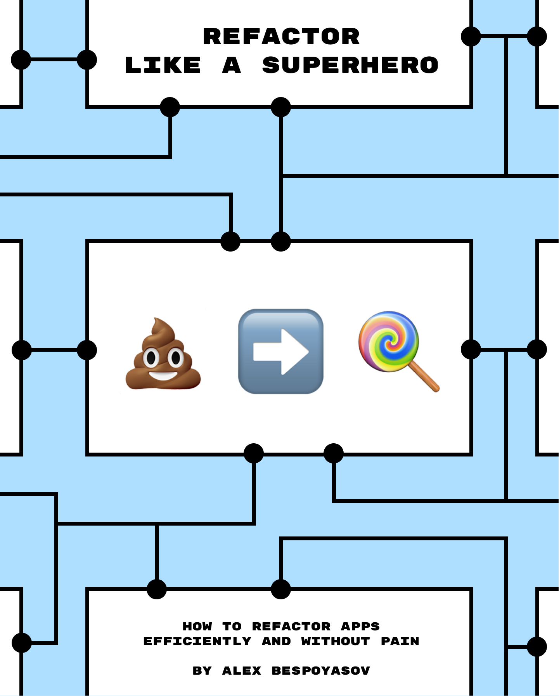

# Refactor Like a Superhero

<figure>
  
  <figcaption><em>“Refactor Like a Superhero” book cover</em></figcaption>
</figure>

---

It is a book about how to efficiently refactor code. In it, we'll discuss the benefits of refactoring for developers and business, how to search for problems in your code, and how to solve them.

## Manuscript

The book is currently available in 2 languages:

- [In English](./manuscript-en/README.md)
- [In Russian](./manuscript-ru/README.md)

If you are interested in translating it into other languages, please, contact me. I'll be happy to discuss details!

## License & Copyright

All materials are © 2022 Alex Bespoyasov.

This work is licensed under a [Creative Commons Attribution-NonCommercial-NoDerivatives 4.0 International License](http://creativecommons.org/licenses/by-nc-nd/4.0/).

