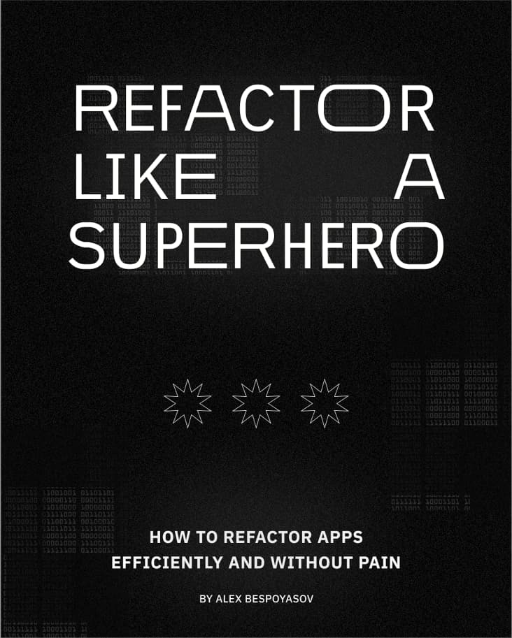

# Refactor Like a Superhero

<figure>
  
  <figcaption><em>Book cover</em></figcaption>
</figure>

---

It is a book about how to refactor code efficiently and without pain. In it, we'll discuss the benefits of refactoring for development and business, explore how to search for problems in your code, and investigate possible solutions for those problems.

We will use code examples primarily in JavaScript and sometimes in TypeScript. However, the techniques we're going to discuss can be used in other high-level languages as well. So if you don't code in JS/TS but feel comfortable around them, you might find something that you can adopt to your language too.

If you like the book, give it a ⭐️ on GitHub and share the link with other developers who might want to read it!

## Manuscript

The book is available in 2 languages:

- [In English](./manuscript-en/README.md)
- [In Russian](./manuscript-ru/README.md)

Currently WIP translations:

- [Spanish by @DavidRamiroBarragan](https://github.com/DavidRamiroBarragan/refactor-like-a-superhero-online-book)
- [Portuguese (pt-br) by @thiagodsti](https://github.com/thiagodsti/refactor-like-a-superhero-online-book)
- [French by @FlavienMacquignon](https://github.com/FlavienMacquignon/refactor-like-a-superhero)

If you are interested in translating it into other languages, please, contact me. I'll be happy to discuss details!

## Ebook and Web Version

You can also read the book online or download it as a PDF or Epub:

- [Read Online](https://refactor-like-a-superhero.vercel.app/en)
- [Download PDF (~10 MB)](./ebook/refactor-like-a-superhero-en.pdf)
- [Download Epub (~3 MB)](./ebook/refactor-like-a-superhero-en.epub)

## Errata and Feedback

If you found a typo or an error, please, open an issue or a pull request in this repository. I'll also be glad to hear your ideas and code snippets that can make the examples in the book more descriptive.

You can find all previous fixes and updates in the commit history of this repository.

## License & Copyright

All materials are © 2022 Alex Bespoyasov. The work is licensed under the [Creative Commons Attribution-NonCommercial-NoDerivatives 4.0 International License](http://creativecommons.org/licenses/by-nc-nd/4.0/).

