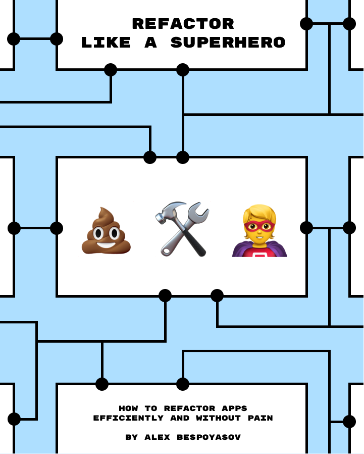

# Refactor Like a Superhero

<figure>
  
  <figcaption><em>“Refactor Like a Superhero” book cover</em></figcaption>
</figure>

---

It is a book about how to efficiently refactor code. In it, we'll discuss the benefits of refactoring for developers and business, how to search for problems in your code, and how to solve them.

## Manuscript

The book is currently available in 2 languages:

- [In English](./manuscript-en/README.md)
- [In Russian](./manuscript-ru/README.md)

Currently WIP translations:

- [Spanish by @DavidRamiroBarragan](https://github.com/DavidRamiroBarragan/refactor-like-a-superhero-online-book)
- [Portuguese (pt-br) by @thiagodsti](https://github.com/thiagodsti/refactor-like-a-superhero-online-book)

If you are interested in translating it into other languages, please, contact me. I'll be happy to discuss details!

## Errata and Feedback

If you found a typo or an error, please, open an issue or a pull request in this repository. I'll also be glad to hear your ideas and code snippets that can make the examples in the book more descriptive.

You can find all previous fixes and updates in the commit history of this repository.

## License & Copyright

All materials are © 2022 Alex Bespoyasov. The work is licensed under the [Creative Commons Attribution-NonCommercial-NoDerivatives 4.0 International License](http://creativecommons.org/licenses/by-nc-nd/4.0/).

