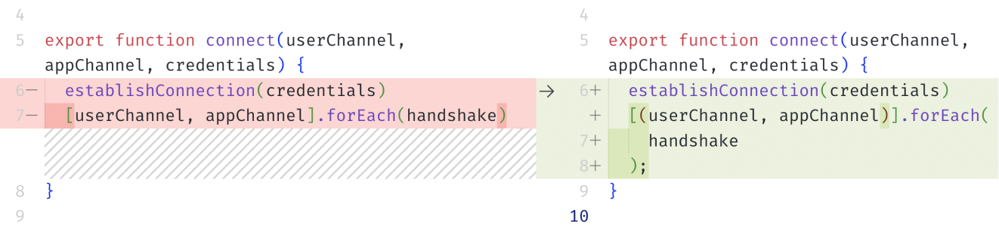

# Low-Hanging Fruit

Refactoring a piece of code can require various changes, and it can be challenging to choose how to start. To solve this, we can rank the changes from simple to complex and begin with the simplest ones. It helps to “blow the dust off the code” and start to see more severe problems in it.

By simple changes, we mean code formatting, linter errors, and replacing self-written code with features of the language or environment. In this chapter, we'll discuss these improvements and see why they're helpful at the beginning of refactoring.

## Code Formatting

Code formatting is a matter of taste, but it has one useful function. If the code in the project is _consistent_, it takes less time for readers to understand it. That's how habits work: the familiar “shapes” of code help us focus on the meaning instead of characters and words.

```
// Unformatted code.
// We have to focus harder to see its meaning:

function ProductList({ products }) {
   return <ul>{products.map((product) =><li key={product.name}>
       <Product product={product} /></li>)}</ul>}


// Formatted code makes it easier to read it:

function ProductList({ products }) {
  return (
    <ul>
      {products.map((product) => (
        <li key={product.name}>
          <Product product={product} />
        </li>
      ))}
    </ul>
  );
}
```

It's better to automate code formatting. In the example above, I used automatic code formatted called Prettier,[^prettier] but the particular tool is not as important here as the overall approach. If the team is not satisfied with Prettier, we can choose another formatter and use it. The point is to _automate the process_.

However, sometimes the formatter might break the code, for example, when it doesn't consider ASI (Automatic Semicolon Insertion)[^asijs] in JavaScript:

```
// Before applying formatter:

export function connect(userChannel, appChannel, credentials) {
  establishConnection(credentials)
  [userChannel, appChannel].forEach(handshake)
}

// After:

export function connect(userChannel, appChannel, credentials) {
  establishConnection(credentials)[(userChannel, appChannel)].forEach(
    handshake
  );
}
```

If we use git “tactically” and check all the changes since the previous commit, we may notice this error in the diff ourselves:

<figure>
  
  <figcaption><em>Git shows all changes the formatter caused</em><br><br></figcaption>
</figure>

...But looking for such errors only manually is unreliable, so it is better to automate this search as well.

The most reliable strategy is to cover the code with a set of tests before using the formatters. If the tests run beside the editor, we will instantly see what exactly was broken by the formatter. Then we will need to check the results of using automatic tools manually less often.

Applying a formatter can be a refactoring technique on its own so the result can be a commit or even a separate PR. Our main goal is to integrate the changes into the main branch as early as possible so we don't have to handle complex merge conflicts between our changed formatting and updates made by other developers.

## Code Linting

After turning linter “warnings” to “errors,” we might have a list of such errors. This list can be a task list for the current refactoring iteration.

I prefer to save the work on each linter rule as a separate commit or PR. For example, we could remove all unused code, make it a commit, and move on to the next problem on the list.

<figure>
  
  <figcaption><em>Linter highlights unused code that can be removed</em><br><br></figcaption>
</figure>

If the linter shows many errors, we can turn the rules one by one rather than all simultaneously. The smaller the steps, the easier it is to break the problem into several and solve each separately.

After fixing each rule, we'll need to check if the tests pass. In the future, I will stop emphasizing test-checking to shorten the text. Let's keep in mind that we check the tests after _each_ change.

## Language Features

Modern languages evolve and get new features. It is especially true for JavaScript since the ES specification is updated yearly.[^proposals]

Sometimes, a new language version feature can replace old self-written helper functions. Built-in language features are faster, more reliable, and easier to work with. So if there's a chance for replacement we can use it.

| By the way 🥫                                                                                                                   |
| :------------------------------------------------------------------------------------------------------------------------------ |
| On the frontend, we might need to ensure the feature has the necessary browser support. We can check it with Caniuse.[^caniuse] |

```js
// Self-written helper for checking the beginning of a string:
const startsWith = (str, chunk) => str.indexOf(chunk) === 0;
const yup = startsWith("Some String", "So");

// ...Can be replaced with the native string method:
const yup = "Some String".startsWith("So");
```

| However 💡                                                                                                                                                                                                                                             |
| :----------------------------------------------------------------------------------------------------------------------------------------------------------------------------------------------------------------------------------------------------- |
| If the self-written implementation differs from the native one and we can't replace it, I'd prefer to mention the difference in the documentation. That way, it will be clear why we're using a self-written function instead of the language feature. |

## Standard API Features

In addition to language features, it's helpful to keep in mind functions from the standard library and built-in APIs. The right function or data structure can make code more efficient, cleaner, and shorter.[^rightstructure][^formdata] For example, in the code snippet below, we can simplify self-written form serialization using `FormData`:

```js
// We can replace manual value extraction:
const username = form.querySelector('[name="username"]').value;
const password = form.querySelector('[name="password"]').value;
const data = { username, password };

// ...With a standard API call:
const data = Object.fromEntries(new FormData(form));
```

After the changes, there is less code, and it is now more resistant to changes. For example, after refactoring, we don't need to manually update serialization when adding a new field to the form:

```js
// Before, we needed to update the `data` object by hand:
// ...
const email = form.querySelector('[name="email"]').value;
const data = { username, email, password };

// Now `FormData` updates the data automatically,
// no need to change the code manually.
```

Removing code is beneficial: the less code there is, the fewer potential points of failure in the application. We can use the rule “give most of the work to the language or environment than write ourselves.” It's usually more reliable.

| Clarification 🤓                                                                                                                                                   |
| :----------------------------------------------------------------------------------------------------------------------------------------------------------------- |
| There are cases when we can't use only the standard APIs and have to reinvent the wheel. In these cases, we should document why the standard solutions do not fit. |
| We will discuss in detail how to make the documentation and comments more informative and useful in one of the following chapters.                                 |

## Environment Features

Along with the language features, we should also highlight the features of the text editor or IDE we're working with. If they have automated refactoring tools, it's worth learning them.

“Rename Symbol,” “Extract into Function,” and other tools speed up the work and reduce the cognitive load. For example, in VS Code, we can change the name of a function or variable everywhere by using the hotkeys:[^vscode]

<figure>
  
  <figcaption><em>“Rename Symbol” updates the variable name everywhere</em><br><br></figcaption>
</figure>

However, we should double-check the result of applying these tools. For example, Rename Symbol may “miss” some name or add unnecessary renaming:

```tsx
// For example, we want to replace `name`
// with `firstName` in the `AccountProps`:

type AccountProps = { name: string };
const Account = ({ name }: AccountProps) => <>{name}</>;

// After applying “Rename Symbol,”
// there might appear an “extra renaming”:

type AccountProps = { firstName: string };
const Account = ({ firstName: name }: AccountProps) => <>{name}</>;
```

To avoid this, we can use the benefits of “tactical” git again. We can study the diff from the latest commit and check what was renamed and how.

<figure>
  
  <figcaption><em>Git shows exactly what has changed since the latest commit</em><br><br></figcaption>
</figure>

A strategy of small steps helps simplify and maximize such checks' benefits. If we apply only one refactoring technique per commit, there's no noise in the diffs, and we can better see how the changes affect the code.

Linters and tests help us avoid name conflicts and other bugs. For example, we can set up rules that forbid identical variable names, so the linter will error if there's a name conflict. If the linter is running in the background with refactoring, we will see the error immediately and be able to fix it.

[^prettier]: Prettier, an opinionated code formatter, https://prettier.io
[^proposals]: List of EcmaScript Proposals, https://proposals.es
[^caniuse]: Can I use, support tables for the web, https://caniuse.com
[^vscode]: Refactoring Source Code in VSCode, https://code.visualstudio.com/docs/editor/refactoring
[^asijs]: “Automatic semicolon insertion in JavaScript” by Dr. Axel Rauschmayer, https://2ality.com/2011/05/semicolon-insertion.html
[^rightstructure]: “Use the Right Algorithm and Data Structure” by JC van Winkel, https://97-things-every-x-should-know.gitbooks.io/97-things-every-programmer-should-know/content/en/thing_89/
[^formdata]: “How to Convert HTML Form Field Values to a JSON Object” by Jason Lengstorf, https://www.learnwithjason.dev/blog/get-form-values-as-json
