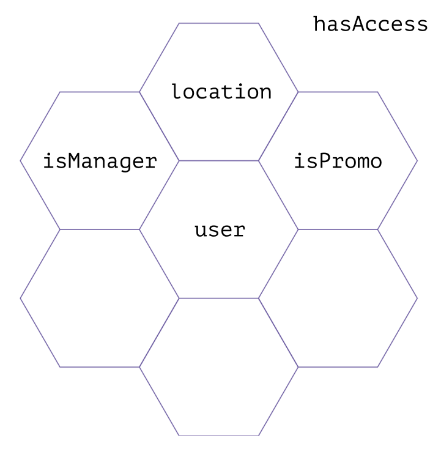
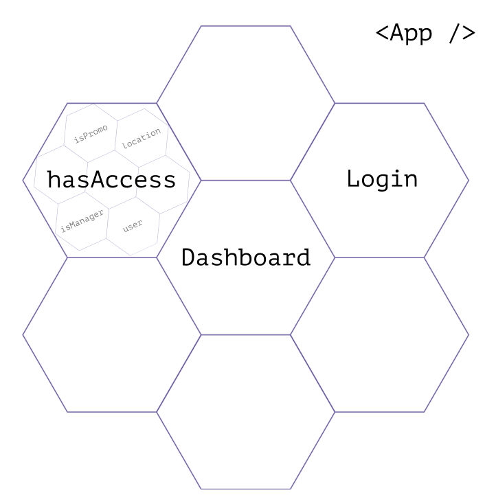
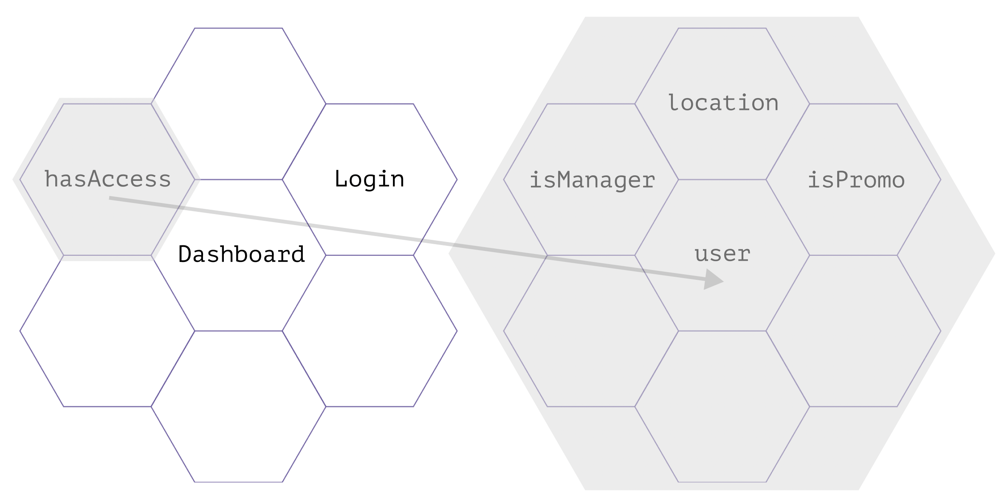

# Abstraction

Overly detailed code is “noisy” and difficult to fit in your head. It is overloaded with information and does so much that it's hard to understand what it does.

Generally, noisy code reflects a complex action with many steps. The more complex the action, the more details we need to consider, and the more steps have to describe. Together, these details overwhelm the reader and make the code complicated.

In this chapter, we'll discuss how to use abstraction to reduce noise in code and make it less complicated.

## Intent and Implementation

> Abstraction is the elimination of the irrelevant and the amplification of the essential[^abstractionquote]

In an example in the “Names” chapter, we've divided details of the function name into two groups: “important outside” and “important inside.” This way, we've simplified the name and balanced the amount of information in the function name and its body. We kept essential details in the name and hid the less important ones in the implementation. This details separation “by levels” is called abstraction.

Abstraction helps tame complexity by separating _intention_ and _implementation_. Intention describes _what_ we're going to do, and implementation describes _how_ we will do it. The intention is essential at the “top” level when describing an entity and its interaction with the environment. The implementation details are important at the level “below”, when we focus on the entity's internal processes.

```js
// Name and signature reflect the intention...
function isChild(user) {
  // ...And function body reflects the implementation.
  return user.age < 18;
}

// When we use the function with others,
// we care about its purpose and goals,
// not about its implementation details:
if (isChild(user)) toggleParentControl();
```

Our brain can only work with a limited amount of information at a time. Abstraction helps us focus on the details that are important _now_. This focus is especially needed when working with code where details from “different levels” are mixed.

Consider an example. Let's imagine we have a function, `subscribeToFeed`, which checks the validity of the given email at the start:

```js
function subscribeToFeed(email) {
  if (!email.includes("@") || !email.includes(".")) return false;

  const recipients = addRecipient(email);
  confirmFeedSubscription(recipients);
}
```

If we compare email validation with the other actions (`addRecipient`, `confirmFeedSubscription`), we'll see that it speaks in terms “too primitive” for this task.

While other functions speak in terms of “emails,” “feeds,” and “subscriptions,” the validation tells about `"@"` and `"."` characters. Because of this, we have to “jump” between the validation details and its purpose when we read the function.

The `subscribeToFeed` function wants to know if the address is valid. But it's not crucial how exactly we check the email to this function. These details aren't needed here.

We can extract (abstract) the email check into a separate function `isValidEmail`:

```js
function isValidEmail(email) {
  return email.includes("@") && email.includes(".");
}

function subscribeToFeed(email) {
  if (!isValidEmail(email)) return false;

  const recipients = addRecipient(email);
  confirmFeedSubscription(recipients);
}
```

The `isValidEmail` function name now reflects the entire “set of validation actions” as a single phrase. The name uses terms close to those used by the names of the functions around it. This closeness helps focus on the actions' goals rather than their internal processes.

| By the way 👀                                                                                            |
| :------------------------------------------------------------------------------------------------------- |
| This is a bit harder to achieve in code with side effects, but we'll discuss that in a separate chapter. |

When we _call_ the `isValidEmail` function, we focus on its name and intent. At this point, we care about how the function interacts with the entities around it, that is, “what happens if the email is invalid.”

If we care about validation rules, we study the body of the function—the implementation. At that point, we care about how the function decides whether to return `true` or `false`.

| By the way 🤖                                                                                                                                       |
| :-------------------------------------------------------------------------------------------------------------------------------------------------- |
| In languages with static typing, the function signature can also express the intention. We'll talk more about this in the chapter on static typing. |

Abstraction helps us to “dive” into complex concepts and processes gradually. It gives us information about the system in chunks. At each “level of detail,” we have only the information we need to understand the system at that level. Mark Seemann calls this fractal architecture, and I find this metaphor very useful.[^codethatfits]

## Fractal Architecture

Compared to a computer, our brains are computationally weak. It's difficult for us to multiply large numbers or hold more than ten concepts in our heads simultaneously.

When refactoring, we should keep an eye on how difficult it is to “fit a piece of code in our head.” If it's difficult to remember all the details, the code has a problem.

In good code, there's exactly as much information on the screen as the reader needs at any given moment. Mark Seemann suggests writing programs so that the number of constituent parts at each “level of detail” doesn't exceed some limit. We can use this heuristic to check if the code is overly detailed.[^codethatfits]

| By the way 🧠                                                                                                                                                                                                                                                  |
| :------------------------------------------------------------------------------------------------------------------------------------------------------------------------------------------------------------------------------------------------------------- |
| Mark suggests the number 7 as the limit. He relies on the premise that we can keep 7±2 objects in our heads.[^shorttermmemory][^thinkingfastandslow] He also says that the specific number is not crucial. The main goal is to have such a limit in principle. |

To visualize “levels,” he suggests using a grid of hexagons. Each hexagon is a part of the system, which can be detailed more profoundly. At each level of detail, we'll see no more than N parts important to that level. If we need to know how a particular part works, we can “zoom in” a hexagon and see what it consists of.

<figure>
  
  <figcaption><em>So the program breaks down into chunks, which break down into chunks, which break down into chunks...</em><br><br></figcaption>
</figure>

| Copyright note ©                                                                                 |
| :----------------------------------------------------------------------------------------------- |
| Picture above was generated by the tool from the article about Fractal Hex Flowers.[^hexflowers] |

Let's look at an example to understand how it helps us to refactor code. Consider an app where we show a dashboard for logged-in users and a login page for others.

The entry point to the application (the top level of detail) might look something like this:

```js
const App = () => {
  const user = currentUser();
  const isManager = hasManagerRole(user);
  const isPromoAccount = checkPromoAccount(location);

  const [email, setEmail] = useState("");
  const [password, setPassword] = useState("");
  const handleSubmit = () => {
    /*...*/
  };

  return isManager || isPromoAccount ? (
    <Dashboard />
  ) : (
    <form onSubmit={handleSubmit}>
      <input
        type="email"
        value={email}
        onChange={({ target }) => setEmail(target.value)}
      />
      <input
        type="password"
        password={password}
        onChange={({ target }) => setPassword(target.value)}
      />
      <button>Login</button>
    </form>
  );
};
```

It's quite possible to understand such code, but it will take a comparatively longer time because of the number of details. That's because the amount of information in this code is close to the limits of our working memory.

If we express this code on the hexagon diagram, we'll see that some parts just don't fit:

<figure>
  
  <figcaption><em>Objects and functions reflected on hex tiles; one of them doesn't fit</em><br><br></figcaption>
</figure>

The code would be much easier to explore and understand if, at the top level, we “prepared” the reader and told them _what_ the `App` component does. In that case, variable and subcomponent names would express the intent and add up to a “story”:

```js
const App = () => {
  const hasAccess = useHasAccess();
  return hasAccess ? <Dashboard /> : <Login />;
};

/**
 * If a user has access (`hasAccess`) to the control panel,
 * the application will show them the panel component (`Dashboard`).
 * If not, they will be prompted to log in (`Login`).
 */
```

The implementation of the corresponding functions and components would reflect the details of the “story.” For example, we could explain how to determine whether a user has access to the control panel through the implementation of the `useHasAccess` hook:

```js
function useHasAccess() {
  const user = currentUser();
  const isManager = hasManagerRole(user);
  const isPromoAccount = checkPromoAccount(location);
  return isManager || isPromoAccount;
}

/**
 * We'll check if the current user (`currentUser`)
 * is a manager (`hasManagerRole`).
 * We'll also check if the application is running under a promo account,
 * in which the control panel is available to everyone (`checkPromoAccount`).
 */
```

So at the top level of detail, we would see only three parts: `hasAccess`, `Dashboard`, and `Login`. This code is much easier to “load” in our heads and focus on the relationships between its parts.

<figure>
  
  <figcaption><em>Top layer of application detail in the form of hex tiles</em><br><br></figcaption>
</figure>

If we needed to detail a part of the “story,” we could “zoom in” one of the cells and examine its structure.

For example, in `useHasAccess` we can see how its four parts work together. At this level, it doesn't really matter what happens “level above” because we focus on the structure of the `useHasAccess`.

<figure>
  
  <figcaption><em>Detailed tiling of the <code>useHasAccess</code> hook</em><br><br></figcaption>
</figure>

It's called fractal architecture because we can nest one level of detail into another:

<figure>
  
  <figcaption><em>Levels of detail are nested in on another like a Russian doll</em><br><br></figcaption>
</figure>

...And switch our attention between levels at any moment:

<figure>
  
  <figcaption><em>Switching attention between levels</em><br><br></figcaption>
</figure>

Each of the cells can be “zoomed in” to its parts. And each of its parts can also be “zoomed in” further. This way we can go deeper and deeper into the system but control how much information we consume.

At each level, there's only a limited _comfortable_ amount of information waiting for us. Such code is much easier to “fit in one's head.”

Abstraction is at the core of this approach. We can “zoom out” to look at a module's interactions with others or “zoom in” to study the details of how it works.

| By the way 📚                                                                                                                        |
| :----------------------------------------------------------------------------------------------------------------------------------- |
| Fractal architecture is somewhat reminiscent of the Zoom World concept from “The Humane Interface” by Jeff Raskin.[^humaneinterface] |

## Separation of Concerns

Abstraction forces us to divide the code into parts, but it's not always obvious how to do this. To make this task easier, we can use the _Separation of Concerns, SoC_ principle.[^soc] It offers to divide the system into such parts, each of which is responsible for only one task.

“Responsibility” and “task” are somewhat vague terms. So we can understand them as a limited set of data and actions that are _related to each other more strongly than other_ data and actions.

| By the way 🔗                                                                                                                            |
| :--------------------------------------------------------------------------------------------------------------------------------------- |
| You might remember the term cohesion from that description.[^cohesion] We'll discuss it a bit more in the chapter on module integration. |

Parts of well-divided code do not overlap and do not duplicate each other's functionality. The work of such a system is then based on the composition of its parts. During design and refactoring, such a separation forces us to decompose complex tasks into simpler ones.

### Task Decomposition

When we see a large piece of code, we should first consider how many different tasks there are. To do this, we can count how many data sets and actions are in that code.

For example, let's look at the submitting login form function:

```js
async function submitLoginForm(event) {
  const form = event.target;
  const data = {};

  if (!form.email.value || !form.password.value) return;
  data.email = form.email.value;
  data.password = form.password.value;

  const response = await fetch("/api/login", {
    method: "POST",
    body: JSON.stringify(data),
  });
  return response.json();
}
```

It's pretty compact, only 13 lines, but we can count three tasks in it:

- Form serialization;
- Data validation;
- Network requests.

We can also count them by changing the conditions of a task and see _which code will change because of it_. For example, if we add a checkbox to the form, the serialization code will change:

```js
async function submitLoginForm(event) {
  // ...

  data.email = form.email.value;
  data.password = form.password.value;

  // New field will appear in the object:
  data.rememberMe = form.rememberMe.checked;

  // ...
}
```

And if we change the API scheme, only the network part will change:

```js
async function submitLoginForm(event) {
  // ...

  // Argument for `fetch` will change:
  const response = await fetch("/api/v2/login", {
    method: "POST",
    body: JSON.stringify(data),
  });

  // ...
}
```

Such a check helps count _reasons for change_ in the code and correlate fragments to them. The number of different reasons will tell us how many tasks the code solves.

| By the way 🧶                                                                                                                                                                                                        |
| :------------------------------------------------------------------------------------------------------------------------------------------------------------------------------------------------------------------- |
| Not always a large piece of code has many tasks. A complex algorithm implementation might be extensive but solve just one task. We can also check this by changing the task conditions and seeing what code changes. |

### Single Responsibility Principle

Code that changes for different reasons is best kept separate, and code that changes for the same reason is best kept together. It is known as the _Single Responsibility Principle, SRP_.[^srp][^singleresponsibility]

We can apply this principle to refactor the `submitLoginForm` function from the example above. Let's extract each task into a separate function and see how `submitLoginForm` code changes. Let's start with serialization:

```js
// Extract serialization into a separate function.
// Now it all is gathered here, and we know exactly
// where to look if we need to know its details.
function serializeForm(form) {
  const data = {};

  data.email = form.email.value;
  data.password = form.password.value;

  return data;
}

async function submitLoginForm(event) {
  const form = event.target;

  // Inside `submitLoginForm` we now focus
  // only on using the serialized data.
  const data = serializeForm(form);

  if (!form.email.value || !form.password.value) return;

  const response = await fetch("/api/login", {
    method: "POST",
    body: JSON.stringify(data),
  });
  return response.json();
}
```

Next, let's think about validation. We now see that validating the DOM object as before makes no sense. We need to validate the data, but it doesn't matter where we get it. By separating responsibility this way, we can get rid of unwanted coupling between tasks.

```js
// All validation is now gathered in the `isValidLogin` function.
// Inside it, we check the data, not the properties of the DOM object:
function isValidLogin({ email, password }) {
  return !!email && !!password;
}

async function submitLoginForm(event) {
  const form = event.target;
  const data = serializeForm(form);
  if (!isValidLogin(data)) return;

  const response = await fetch("/api/login", {
    method: "POST",
    body: JSON.stringify(data),
  });
  return response.json();
}
```

The API call can also be a separate function:

```js
// All the networking now is in the `loginUser` function.
async function loginUser(data) {
  const method = "POST";
  const body = JSON.stringify(data);

  const response = await fetch("/api/login", { method, body });
  return await response.json();
}

async function submitLoginForm(event) {
  const form = event.target;
  const data = serializeForm(form);
  if (!isValidLogin(data)) return;

  return await loginUser();
}
```

The resulting code is easier to modify because the extracted functions limit the “scopes of responsibility” between tasks. Changes within one of the functions are less likely to cause changes in other functions. For example, when updating validation rules, only the `isValidLogin` function code will change:

```js
function isValidLogin({ email, password }) {
  // Now checking that the email contains `@` character:
  return email.includes("@") && !!password;
}

// Function `serializeForm`, `loginUser`, and `submitLoginForm`
// are not changed.
```

This separation makes it easier to test and develop functions in isolation from each other. And the higher the isolation, the lower the chance of making an accidental mistake when updating the code.

## Encapsulation

The single responsibility principle helps to think of code parts (functions, modules, objects) as independent parts of an application.

The parts communicate through APIs (protocols, contracts, interfaces) and do not interfere with each other's inner details. We can call this relationship between entities _encapsulation_.[^encapsulation]

Encapsulation is often described as just concealing data or restricting access to it, but:

> The most important notion [of encapsulation] is that an object should guarantee that it'll never be in an invalid state... The [encapsulated] object knows best what “valid” means, and how to make that guarantee[^codethatfits]

Poor encapsulation leads to repeated checks in code and errors due to invalid data. It can be detected by leaky abstractions and high coupling between modules. In one of the following chapters, we'll discuss the coupling in more detail, but now let's focus on leaky abstractions.

Let's try to determine what's wrong with the `makePurchase` function in the example below:

```js
// purchase.js
import { createOrder } from "./order";

async function makePurchase(user, cart, coupon) {
  if (!cart.products.length) throw new Error("Cart is empty!");

  const order = createOrder(user, cart);
  order.discount = coupon === "HAPPY_FRIDAY" ? order.total * 0.2 : 0;

  await sendOrder(order);
}
```

The main problem with this code is that there's no guarantee that the `sendOrder` function will get a _valid_ order. The `makePurchase` function _changes_ the state of the `order` object created by _another_ module. It behaves as if it knows which state for the `order` object is valid and which is not. But:

---

**❗️ Making sure the data is valid is an internal task of a particular module**

---

Simply put, only the module that knows how to apply an order discount can do it correctly. In our case this is `order.js`—the order was created by it, so the discount should be applied by it as well:

```js
// order.js
export function createOrder() {
  /*...*/
}

export function applyDiscount(order) {
  const discount = coupon === "HAPPY_FRIDAY" ? order.total * 0.2 : 0;
  return { ...order, discount };
}

// purchase.js
import { createOrder, applyDiscount } from "./order";

async function makePurchase(user, cart, coupon) {
  if (!cart.products.length) throw new Error("Cart is empty!");

  const order = createOrder(user, cart);
  const discounted = applyDiscount(order, coupon);
  await sendOrder(discounted);
}

// Now making sure the order data is valid
// is an internal task of the `order` module,
// not the responsibility of the code that calls it.
```

| By the way 🥶                                                                                                                                                               |
| :-------------------------------------------------------------------------------------------------------------------------------------------------------------------------- |
| In some languages, we can disallow changing data after creating using immutable structures. They make it impossible to bring the data to an invalid state from the outside. |
| In JavaScript, we can make objects immutable with `Object.freeze`,[^objectfreeze] but this is often an overhead. Usually, it's enough to _treat_ the data as immutable.     |

The same problems apply to the cart emptiness check. Although the `makePurchase` function does not change the cart data, it still behaves as if it knows which cart state is valid and which is not.

It's better to leave the emptiness check to the module that creates the cart and knows how to keep it valid:

```js
// cart.js
export function isEmpty(cart) {
  return !cart.products.length;
}

// purchase.js
import { isEmpty } from "./cart";
import { createOrder, applyDiscount } from "./order";

async function makePurchase(user, cart, coupon) {
  if (isEmpty(cart)) throw new Error("Cart is empty!");

  const order = createOrder(user, cart);
  const discounted = applyDiscount(order, coupon);
  await sendOrder(discounted);
}
```

In the updated code, the `makePurchase` function doesn't change the order state directly and doesn't decide whether the cart is valid or not. Instead, it calls the _public API_ of other modules.

It doesn't mean that all errors will automatically disappear after this change—after all, other modules may contain errors themselves. But we've separated responsibilities between modules, so we'll know what to fix if there's an error with order data or cart validation.

We've also limited the scope of change in the code. While the public API of modules isn't changed, the updates and fixes of those modules _will be limited_ to their boundaries and won't go outside them.

Among other things, such code is easier to cover with tests and check against project requirements.

[^abstractionquote]: “Agile Principles, Patterns, and Practices in C#” by Robert C. Martin, https://www.goodreads.com/quotes/8806618-abstraction-is-the-elimination-of-the-irrelevant-and-the-amplification
[^codethatfits]: “Code That Fits in Your Head” by Mark Seemann, https://www.goodreads.com/book/show/57345272-code-that-fits-in-your-head
[^shorttermmemory]: Working memory, Capacity, Wikipedia, https://en.wikipedia.org/wiki/Working_memory#Capacity
[^thinkingfastandslow]: “Thinking, Fast and Slow” by Daniel Kahneman, https://www.goodreads.com/book/show/11468377-thinking-fast-and-slow
[^hexflowers]: “Fractal hex flowers” by Mark Seemann, https://observablehq.com/@ploeh/fractal-hex-flowers
[^humaneinterface]: “The Humane Interface” by Jef Raskin, https://www.goodreads.com/book/show/344726.The_Humane_Interface
[^soc]: Separation of Concerns, Wikipedia, https://en.wikipedia.org/wiki/Separation_of_concerns
[^cohesion]: Cohesion in Computer Science, Wikipedia, https://en.wikipedia.org/wiki/Cohesion_(computer_science)
[^singleresponsibility]: The Single Responsibility Principle by Robert C. Martin, https://97-things-every-x-should-know.gitbooks.io/97-things-every-programmer-should-know/content/en/thing_76/
[^srp]: Single Responsibility Principle, Principles of OOD, http://www.butunclebob.com/ArticleS.UncleBob.PrinciplesOfOod
[^encapsulation]: Encapsulation, Wikipedia, https://en.wikipedia.org/wiki/Encapsulation_(computer_programming)
[^objectfreeze]: `Object.freeze()`, MDN, https://developer.mozilla.org/ru/docs/Web/JavaScript/Reference/Global_Objects/Object/freeze
