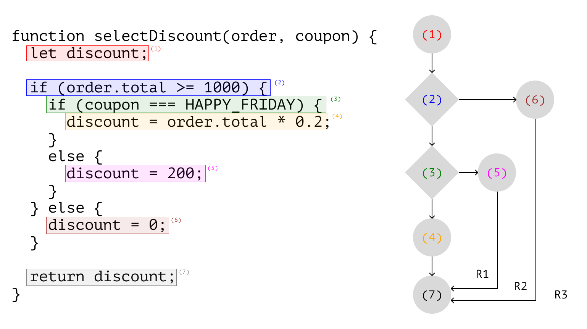
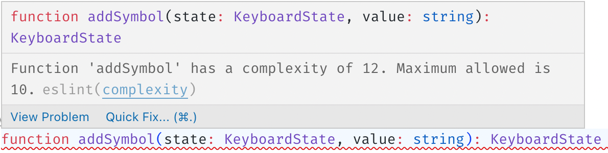
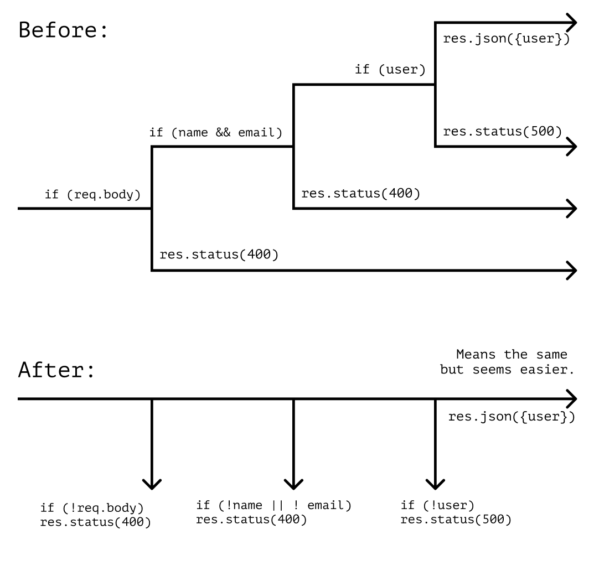

# Conditions and Complexity

The previous chapter discussed the benefits of the functional pipeline and linear code execution. In real-world applications, however, it isn't always obvious how to make code linear.

Big applications often have complex logic rules with multiple conditions. Conditions make the helpful app: they describe its behavior in different situations. But they also make the code more complicated.

This chapter will discuss unraveling complex conditions and what patterns can help.

## Cyclomatic and Cognitive Complexity

To understand how exactly conditions make code more complex, let's first try to define “complexity”.

One heuristic for finding complex code is paying attention to its nesting. The higher the nesting, the more complex the code. We can understand _what_ awaits us just by looking at a snippet with deeply nested code:

```
function doSomething() {
__while (...) {
____if (...) {
______for (...) {
________if (...) {
__________break;
________}
________for (...) {
__________if (...) {
____________continue
__________}
________}
______}
____}
__}
}
```

The empty space on the left side of the text shows how much information the snippet contains. The more space there is, the more details we have to keep in mind, and the more complicated the code.

| By the way 🫙                                                                                  |
| :-------------------------------------------------------------------------------------------- |
| In the book “Your Code as a Crime Scene” Adam Tornhill calls such a space “negative.”[^scene] |

When reading code, we build a model of how it works in our head. This model describes what happens to the data and how the instructions are executed.

Each condition and loop adds to the mental model a new “path.” These paths show how to go from the beginning of the code to its end. The more different “paths” there are, the harder it is to keep track of them all simultaneously. The number of “paths” we can take from the beginning of a function to its end is called the _cyclomatic complexity_ of the function.[^cyclomaticcomplexity]

We can visualize the number of “paths” in the function as a graph.[^controlflowgraph][^controlflowexample] Each new condition or loop adds a new “branch,” which makes the graph and the function more complex.

<figure>
  
  <figcaption><em>Graph of function with complexity 3. We can calculate the complexity as the difference between the graph nodes and edges or the number of regions on it</em><br><br></figcaption>
</figure>

The more “branches” the function has, the harder it is to work with.

| By the way 🧠                                                                                                                                                                                                      |
| :----------------------------------------------------------------------------------------------------------------------------------------------------------------------------------------------------------------- |
| In addition to cyclomatic complexity, there is also _cognitive complexity_.[^cognitivecomplexity]                                                                                                                  |
| Cyclomatic complexity counts the number of “different paths” in a function. Cognitive complexity counts the function's “breaks in the linear flow.”                                                                |
| Because of this, it's often said that the cyclomatic complexity shows how difficult a function is to test (how many branches to cover in tests), and cognitive complexity shows how difficult it is to understand. |
| We won't focus on the differences between the two because they won't be significant for this book. Later in the text, we'll use the term “complexity” as a synonym for both properties.                            |

An important feature of such properties is that they're _measurable_. We can choose _limits_ for measurable properties and automate their checks. For example, we can set up the linter to tell us when the code complexity exceeds the selected limit:

<figure>
  
  <figcaption><em>Linter errors when the complexity exceeds the limit</em><br><br></figcaption>
</figure>

The specific number depends on the property, the project, the language, and the team. For cyclomatic complexity, Mark Seemann in “Code That Fits in Your Head” suggests using the number 7.[^codethatfits] Wikipedia offers number 10.[^cyclomaticcomplexity] I usually use 10 in my projects because it's a “round” number, but all this is highly arbitrary.

## Flat Over Nested

Negative space and large nesting are a consequence of high code complexity. To make the code simpler, when refactoring, we can stick to this heuristic:

---

**❗️ Make the conditions flat. ...And then simplify the code even more**

---

Flat conditions “straighten out” the execution flow. They decrease the number of details that we need to keep track of at the same time. They help us see patterns in the code and simplify it even more. The flatter the code, the easier it is to understand the meaning of a function or a module.

| By the way 🐍                                                                                                                                           |
| :------------------------------------------------------------------------------------------------------------------------------------------------------ |
| It resembles a principle from Zen of Python: “Flat is better than nested.”[^zenpython] In my opinion, this only confirms that we're on the right track. |

## Early Return

The easiest and most common technique we can use to “flatten” code is the early return. It helps to filter out condition branches one by one and no longer keep them in our heads.

As an example, let's look at the `usersController` function. It creates a new user based on its arguments. The conditions in the function force us to keep _all of its branches_ in mind until the very end because they all contain some important behavior.

```js
function usersController(req, res) {
  if (req.body) {
    const { name, email } = req.body;
    if (name && email) {
      const user = createUser({ name, email });
      if (user) {
        res.json({ user });
      } else {
        res.status(500);
      }
    } else {
      res.status(400).json({ error: "Name and email required" });
    }
  } else {
    res.status(400).json({ error: "Invalid request payload." });
  }
}
```

Notice, however, that the code inside `else` blocks handles “edge cases”—errors and invalid data. We can simplify the function by “inverting” the condition and handling edge cases first, leaving only the “happy path” at the end:

```js
function usersController(req, res) {
  if (!req.body) {
    return res.status(400).json({ error: "Invalid request payload." });
  }

  const { name, email } = req.body;
  if (!name || !email) {
    return res.status(400).json({ error: "Name and email required" });
  }

  const user = createUser({ name, email });
  if (!user) return res.status(500);

  res.json({ user });
}
```

The total amount of information and cases the function handles hasn't changed. But we've reduced the number of branches that we need to _remember at the same time_.

We check the edge cases one by one and _terminate_ the function if we come across one of them. If the function continues to work, it means no edge cases have happened.

Filtering edge cases one by one allows us to forget the checked ones. They no longer take up our attention and working memory.

<figure>
  
  <figcaption><em>The condition becomes easier to understand because we don't need to remember so many details</em><br><br></figcaption>
</figure>

| However 🛡                                                                                                                                                                                       |
| :---------------------------------------------------------------------------------------------------------------------------------------------------------------------------------------------- |
| Early return may not be suitable for “defensive” programming: when we explicitly handle each branch of a condition.                                                                             |
| In my experience, there haven't been many projects that have required defensive programming. So I tend to use early return by default and switch to defensive programming in exceptional cases. |

### Component Rendering

Early return can be useful to simplify the rendering of React components. For example, the code of the `Cover` component below is relatively difficult to read because of the conditions:

```js
function Cover({ error, isLoading, data }) {
  if (!error && !isLoading) {
    const image = data.image ?? DEFAULT_COVER_IMAGE;
    return <Picture src={image} />;
  } else if (isLoading) {
    return <Loader />;
  } else {
    return <Error message={error} />;
  }
}
```

We can simplify it by “inverting” the condition and handling the “loading” and “error” states first:

```js
function Cover({ error, isLoading, data }) {
  if (isLoading) return <Loader />;
  if (error) return <Error message={error} />;

  const image = data.image ?? DEFAULT_COVER_IMAGE;
  return <Picture src={image} />;
}
```

We remember that the _number of branches_ in the condition remains the same after applying the early return. This means that the complexity of the code may still be high. We should look at the metrics and see if the code has become simpler.

If the complexity of the function is still high, we should check if it has issues with abstraction or separation of concerns. We'll probably notice that the function can be split into several:

```js
// In this case, we can separate the “rendering of the picture”
// and the “decision what component to render.”
//
// We'll extract the picture rendering in `CoverPicture` component
// and use it when the data is loaded without errors.

function CoverPicture(image) {
  const source = image ?? DEFAULT_COVER_IMAGE;
  return <Picture src={source} />;
}

// The `Cover` component will become an “entry point”
// and will decide what to show:
// `Loader`, `Error`, or `CoverPicture`.

function Cover({ error, isLoading, data }) {
  if (isLoading) return <Loader />;
  if (error) return <Error message={error} />;
  return <CoverPicture image={data.image} />;
}
```

After such refactoring, we should consider the names of the changed functions and components. The old names may become inaccurate after we improve the separation of their responsibilities. In the example above, we should think if the names `Cover` and `CoverPicture` adequately reflect the meaning of these components.

| By the way 🤖                                                                                                                                                                                              |
| :--------------------------------------------------------------------------------------------------------------------------------------------------------------------------------------------------------- |
| In general, finite state machines are better for working with UI than the early return.[^fsmfrontend] But if we can't implement them in our project, the early return can significantly simplify the code. |

Conceptually, early return inside a render function is similar to validating data at the beginning of a business workflow. We just filter out “wrong” UI states instead of invalid data.

## Variables, Predicates, and Boolean Algebra

We can't “invert” every condition. If the condition branches are tightly intertwined, we may not find where to start untangling them. To simplify such conditions, we need to find patterns in them.

The first thing we should do is extract repetitive condition parts into variables. Variable names will abstract the details and help focus on the condition's meaning. This will allow us to see if we can simplify the condition with boolean logic.

### De Morgan's Laws

_De Morgan's laws_ are a set of transformation rules that link logical operations through negation.[^demorganlaws] They can help us “unfold” parentheses in conditions:

```
!(A && B) === !A || !B;
!(A || B) === !A && !B;
```

We can use De Morgan's laws to make the condition less noisy. For example, the condition below has too much detail, and it's hard to see its meaning “through the characters”:

```js
if (user.score >= 50) {
  if (user.armor < 50 || user.resistance !== 1) {
  }
} else if (user.score < 50) {
  if (user.resistance === 1 || user.armor >= 50) {
  }
}
```

As a first step, we can extract repetitive expressions into variables:

```js
const hasHighScore = user.score >= 50;
const hasHeavyArmor = user.armor >= 50;
const hasResistance = user.resistance === 1;
```

...Then the condition will become a combination of these variables:

```js
if (hasHighScore) {
  if (!hasHeavyArmor || !hasResistance) {
  }
} else if (!hasHighScore) {
  if (hasResistance || hasHeavyArmor) {
  }
}
```

In such a condition, it's much easier to notice patterns within `if` blocks and simplify them. In particular, we can apply De Morgan's first law to simplify the combinations of the variables `hasHeavyArmor` and `hasResistance`:

```js
// Extract 2nd nested condition into a variable:
const hasAdvantage = hasHeavyArmor || hasResistance;

// Notice that the 1st nested condition
// can transform into `!hasAdvantage`
// according to the first De Morgan's law.
//
// !A || !B === !(A && B)
//
// A -> hasHeavyArmor
// B -> hasResistance
//
// !hasHeavyArmor || !hasResistance
//    === !(hasHeavyArmor && hasResistance)
//    === !hasAdvantage

// Then the whole condition becomes:
if (hasHighScore && !hasAdvantage) {
} else if (!hasHighScore && hasAdvantage) {
}
```

### Predicates

Not all conditions can be extracted into a variable. For example, extracting a condition is more difficult if it depends on other variables or dynamic data.

For such cases, we can use _predicates_—functions that take an arbitrary number of arguments and return `true` or `false`. The function `isAdult` in the snippet below is an example of a predicate:

```js
const isAdult = (user) => user.age >= 21;

isAdult({ age: 25 }); // true
isAdult({ age: 15 }); // false
```

We can store the condition “blueprint” in predicates. That is, describe the principle of comparison between different values in the function:

```js
// The condition in the example below compares variables
// with the same reference value—21:
if (user1.age >= 21) {
} else if (user2.age < 21) {
}

// We can put the “blueprint” of this comparison
// in the `isAdult` predicate and use it instead:
if (isAdult(user1)) {
} else if (!isAdult(user2)) {
}
```

Predicate names reflect the meaning of the performed check as a whole. They help to fix “leaky” abstractions and make the code less noisy. For example, in the snippet below, it's hard to tell the meaning of the condition check at first glance:

```js
if (user.account < totalPrice(cart.products) - cart.discount) {
  throw new Error("Not enough money.");
}
```

If we extract the comparison in the `hasEnoughMoney` predicate, it'll be easier to understand its meaning from the function name:

```js
function hasEnoughMoney(user, cart) {
  return user.account >= totalPrice(cart.products) - cart.discount;
}

if (!hasEnoughMoney(user, cart)) {
  throw new Error("Not enough money.");
}
```

In addition, predicates, like variables, help to notice patterns in complex conditions and simplify them with boolean logic.

## Primitive Pattern Matching

When refactoring, we should also consider multiple `else-if` statements. If such conditions select a value, more declarative constructions can replace them.

For example, let's look at the `showErrorMessage` function, which maps a validation error to a message for it:

```ts
type ValidationMessage = string;
type ValidationError = "MissingEmail" | "MissingPassword" | "TooShortPassword";

function showErrorMessage(errorType: ValidationError): ValidationMessage {
  let message = "";

  if (errorType === "MissingEmail") {
    message = "Email is required.";
  } else if (errorType === "MissingPassword") {
    message = "Password is required.";
  }

  return message;
}
```

The function is supposed to check all possible variants of `ValidationError` and choose a message, but it misses a message for `TooShortPassword`. Without special checks (e.g., exhaustiveness check[^exhaustivecheck]), the TypeScript compiler can't help us here. So it's relatively easy to miss something and not even notice it.

We can replace multiple conditions with more declarative constructions. For example, we can collect all error messages into a dictionary with error types as keys and messages as values. Selecting errors from such a dictionary may be more reliable because the compiler can spot missing keys:

```ts
function showErrorMessage(errorType: ValidationError): ValidationMessage {
  // In the `messages` variable type, we explicitly specify,
  // that all possible errors should be listed in it:
  const messages: Record<ValidationError, ValidationMessage> = {
    MissingEmail: "Email is required.",
    MissingPassword: "Password is required.",

    // If any key is missing, the compiler will tell us about it:
    // “Property 'TooShortPassword' is missing in type...”
  };

  return messages[errorType];
}
```

Conceptually, this is similar to pattern matching.[^patternmatching] We match `errorType` to the keys of the `messages` object and select the appropriate value by it.

This selection is somewhat similar to how `switch` works, only, in this case, type checking doesn't require additional actions (such as an exhaustiveness check). In TypeScript, this is probably the cheapest way to simulate type-safe “pattern matching” without third-party libraries.

| By the way 🔍                                                                                                                                                                                                       |
| :------------------------------------------------------------------------------------------------------------------------------------------------------------------------------------------------------------------ |
| It's worth noting that this technique is more suitable for simple cases and doesn't look as cool as real pattern matching in functional languages.[^patternmatchinghaskell]                                         |
| Native syntax for pattern matching in JS is still in Stage 1 at the time of writing.[^patternmatchingjs] We can use third-party libraries like `ts-pattern` for more complex cases.[^tspattern][^patternmatchingts] |

In JavaScript code, there isn't type checking, of course. But the declarative style of this approach also makes the manual search for errors easier. The more explicitly we match keys and values, the easier it is to spot mismatches.

| Read more 👓                                                                                    |
| :---------------------------------------------------------------------------------------------- |
| We'll talk about declarative style and its benefits in detail in one of the following chapters. |

## Strategy

Multiple `else-if` statements can choose not just a value but the program behavior. The choice of behavior among similar variants can indicate insufficient separation of concerns or poor polymorphism.[^polymorphism] One possible solution to this problem is identical to the refactoring techniques from the previous section.

Let's look at the `notifyUser` function, for example. It sends a message to a user in one of three possible ways. The choice of the particular notification option depends on the conditions within this function:

```ts
function notifyUser(message) {
  if (method === methods.popup) {
    const popup = document.querySelector(".popup");
    popup.innerText = message;
    popup.style.display = "block";
  } else if (method === methods.remote) {
    notificationService.setup(TOKEN);
    notificationService.sendMessage(message);
  } else if (method === methods.hidden) {
    console.log(message);
  }
}
```

The problem with the function is that it mixes different tasks. It chooses how to send a message _and_ sends the message. Adding a new notification option or changing an existing one will affect the whole function. Maybe even the parts that _aren't related to that change_.

Because of this, we can't use one of the notification options separately in the rest of the code. We can't test different options in isolation from each other, either. Also, if we add new options, the `notifyUser` function will become much bigger and more complex.

Instead, we can separate the _choice_ of the behavior from the _behavior_ itself:

```ts
// Let's extract each notification option into a separate function:
function showPopupMessage(message) {
  const popup = document.querySelector(".popup");
  popup.innerText = message;
  popup.style.display = "block";
}

// If the function signature is incompatible with the others:
function notifyUser(token, message) {
  notificationService.setup(token);
  notificationService.sendMessage(message);
}

// ...We can adapt it:
const showNotificationMessage = (message) => notifyUser(TOKEN, message);

// Next, we prepare a set of such functions,
// one for each value from `methods`:
const notifiers = {
  [methods.popup]: showPopupMessage,
  [methods.hidden]: console.log,
  [methods.remote]: showNotificationMessage,
};

// When using it, we choose the behavior
// depending on the `method` parameter:
function notifyUser(message) {
  const notifier = notifiers[method] ?? defaultNotifier;
  notifier(message);
}

// It's also possible to select the function beforehand,
// if `method` is known before `notifyUser` is executed.
```

This implementation makes it easier to add and delete notification options:

```ts
// To add a new option, we add a new function...
function showAlertMessage(message) {
  window.alert(message);
}

const notifiers = {
  // ...
  // ...And “register” it in the object:
  [methods.browser]: showAlertMessage,
};

// Other code is unchanged.
```

Changes to an individual function won't go beyond it and won't affect `notifyUser` or other functions. Testing and using such functions independently is much easier.

The separation of choice and behavior is essentially the “Strategy” pattern.[^strategy] It can be hard to recognize it in code without classes because examples of this pattern are most often shown in the OOP paradigm, but it is. The only difference is that while in OOP, every behavior strategy is a class, in our example, it's a function.

## Null-Object

“The same but slightly different” functionality can also cause unnecessary checks and conditions.

For example, let's say we create a mobile app for iOS, Android, and the web. In the mobile version, we want to add lock-screen widgets. Both iOS and Android have native APIs for making such widgets. Let's pretend we have JS adapters for such APIs.

The `Device` interface describes the adapters' functionality. Adapters contain a platform identifier and a method to update the widget:

```ts
interface Device {
  platform: Platform;
  updateWidget(data: WidgetData);
}
```

There are no widgets on the web, so we decide to disable this functionality for the web app. One way to do this is to detect the platform and enable the feature by condition:

```ts
const iosDevice: Device = {
  platform: Platform.Ios,
  updateWidget: (data) => {}, // Bridge to the native iOS API...
};

const androidDevice: Device = {
  platform: Platform.Android,
  updateWidget: (data) => {}, // Bridge to the native Android API...
};

function update(device: Device, data: WidgetData) {
  if (
    device.platform === Platform.Android ||
    device.platform === Platform.Ios
  ) {
    // Calling `updateWidget` only on iOS and Android devices:
    device.updateWidget(data);
  }
}
```

It's not a problem if we have one or two such checks. But the more features we detect this way, the more conditions will appear in our code. If we feel that such checks are used too often, we can use the second option to solve the problem.

Let's add a “dummy device object” for the web app that will implement the `Device` interface but won't do anything in response to an `updateWidget` call:

```ts
const webDevice: Device = {
  platform: Platform.Web,
  updateWidget() {},
};
```

Such “dummy objects” are called _null objects_.[^nullobject] They are usually used where we need a method call but don't need the implementation of that call.

When using a null object, we no longer need to check the type of the device—we just need to call the method. If the current device is a web browser, the method call will pass without doing anything:

```ts
function update(device: Device, data: WidgetData) {
  device.updateWidget(data);

  // webDevice.updateWidget();
  // void;

  // The condition is no longer needed.
}
```

The null object is sometimes considered **antipattern**.[^nullobjectcriticism] It's better to decide if it's appropriate to use it depending on the task, ways of use, and team preferences. It's best to consult with other developers before using it and make sure no one has any reasons against it.

[^scene]: “Your Code As a Crime Scene” by Adam Tornhill, https://www.goodreads.com/book/show/23627482-your-code-as-a-crime-scene
[^cyclomaticcomplexity]: Cyclomatic Complexity, Wikipedia, https://en.wikipedia.org/wiki/Cyclomatic_complexity
[^controlflowgraph]: Control-Flow Graph, Wikipedia, https://en.wikipedia.org/wiki/Control-flow_graph
[^controlflowexample]: Control flow graph & cyclomatic complexity for following procedure, Stackoverflow, https://stackoverflow.com/a/2670135/3141337
[^codethatfits]: “Code That Fits in Your Head” by Mark Seemann, https://www.goodreads.com/book/show/57345272-code-that-fits-in-your-head
[^demorganlaws]: De Morgan's Laws, Wikipedia, https://en.wikipedia.org/wiki/De_Morgan%27s_laws
[^strategy]: Strategy Pattern, Refactoring Guru, https://refactoring.guru/design-patterns/strategy
[^exhaustivecheck]: `switch-exhaustiveness-check`, ES Lint TypeScript, https://typescript-eslint.io/rules/switch-exhaustiveness-check/
[^patternmatching]: Pattern Matching, Wikipedia, https://en.wikipedia.org/wiki/Pattern_matching
[^patternmatchinghaskell]: Pattern matching in Haskell, Learn You Haskell, http://learnyouahaskell.com/syntax-in-functions#pattern-matching
[^patternmatchingjs]: ECMAScript Pattern Matching Proposal, https://github.com/tc39/proposal-pattern-matching
[^tspattern]: `ts-pattern`, Library for Pattern Matching in TypeScript, https://github.com/gvergnaud/ts-pattern
[^patternmatchingts]: “Bringing Pattern Matching to TypeScript” by Gabriel Vergnaud, https://dev.to/gvergnaud/bringing-pattern-matching-to-typescript-introducing-ts-pattern-v3-0-o1k
[^nullobject]: Introduce Null Object, Refactoring Guru, https://refactoring.guru/introduce-null-object
[^nullobjectcriticism]: Null object pattern, Criticism, Wikipedia, https://en.wikipedia.org/wiki/Null_object_pattern#Criticism
[^fsmfrontend]: “Application State Management with Finite State Machines” by Alex Bespoyasov, https://bespoyasov.me/blog/fsm-to-the-rescue/
[^cognitivecomplexity]: “Cognitive Complexity. A new way of measuring understandability” by G. Ann Campbell, SonarSource SA, https://www.sonarsource.com/docs/CognitiveComplexity.pdf
[^zenpython]: The Zen of Python, https://peps.python.org/pep-0020/#the-zen-of-python
[^polymorphism]: Polymorphism, Wikipedia, https://en.wikipedia.org/wiki/Polymorphism_(computer_science)
