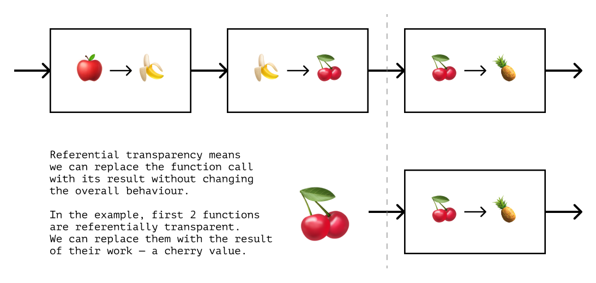
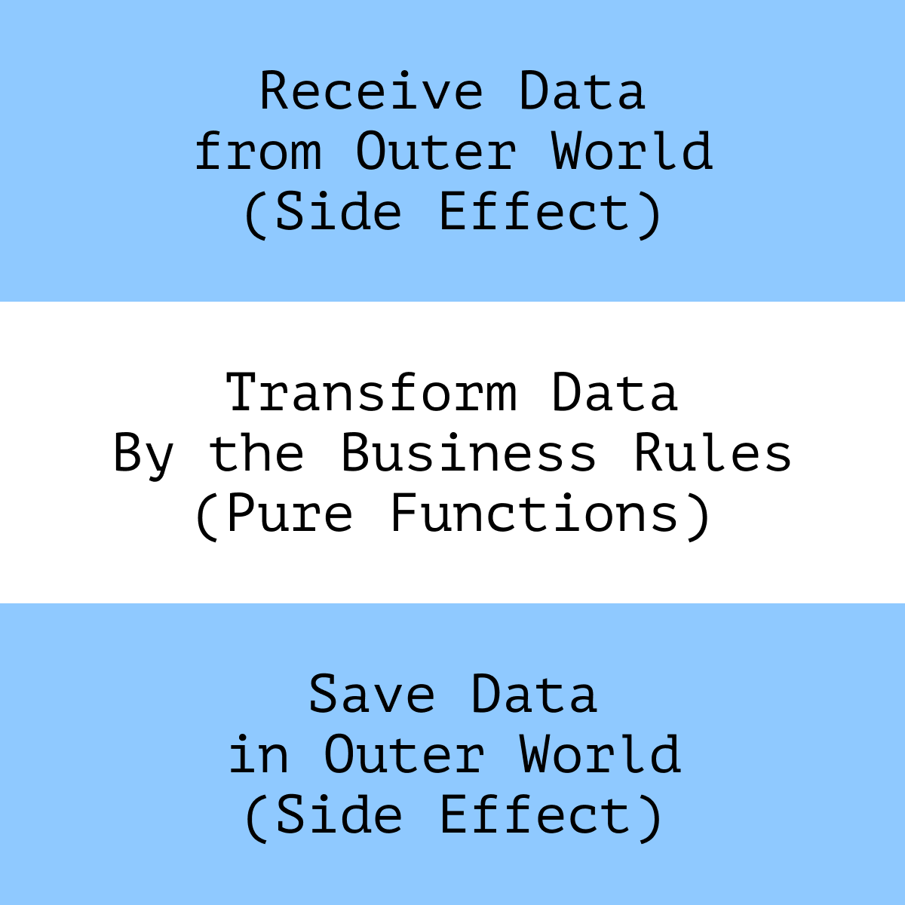

# Side Effects

Any interaction between an app and the real world is a side effect. Saving data on the server, rendering components in the UI, or accessing the browser API—all these are side effects. They're necessary for a useful application but are hard to reason about and can cause errors.

In this chapter, we'll discuss how to design programs and refactor code so that effects don't make the code more complicated and error-prone. We'll explore the benefits of functional programming and immutable data structures. We'll also discuss how to organize an app's effects and the difference between CQS and CQRS.

## Pure Functions

The main problem with effects is that they're _unpredictable_. They change the state, so we can't be sure that the result of the code will always be the same.

On the other hand, _pure functions_ don't produce effects, don't depend on the state, and always return the same result when given the same arguments. It makes their results predictable and reproducible.

When refactoring, we'll try to use pure functions more often and express more functionality with them. But to understand the benefits of this approach, let's first discuss the nature of pure functions.

### Referential Transparency

It's easier to see the advantage of pure functions during debugging. We can use binary search to speed up the search for bugs in the problematic code snippet. Using it, we divide the snippet into two halves, detect an error in one of them and then look for bugs only in that half:

```
Let's say this is the problematic piece of code.
The error in it is marked with “X”:

[....................X...........]

1.
To find the error in this snippet,
we divide the functionality in half
and check each half:

[...............|....X...........]

2.
If the left half works fine,
the error is in the right one:

[               |....X...........]

3.
We split the right part in half
and check each half in it:

[               |....X..|........]

4.
The right part works okay,
so the error is in the left one:

[               |....X..|        ]

5.
We again divide the problematic part in half and repeat the search.
We do this until we find the exact spot with the error:

[               |...|X..|        ]
[                   |X..|        ]
[                   |X|.|        ]
[                   |X|          ]

With each iteration, the problematic code area is halved.
This approach saves a lot of time when debugging.

In general, after 3-6 iterations, it becomes clear,
what the problem is and where it is.
```

| By the way 🔪                                                                                              |
| :--------------------------------------------------------------------------------------------------------- |
| Sometimes, such a binary search process is called bisection by analogy with the bisection in git.[^bisect] |

In a sequence of pure functions, the data flows from one function to another, being passed as arguments. The advantage of such a sequence is that we can “cut” it _anywhere_. The functions after the “cut” don't care what functions have been called before them. They'll work the same way if given the same arguments.

We can literally replace the _calls_ of functions before the “cut” with _their results_, and the program's behavior won't change. Such a property is called _referential transparency_,[^referentialtransparency] and makes searching for errors and testing much more straightforward.

<figure>
  
  <figcaption><em>Referential transparency allows us to replace a function call with its result</em><br><br></figcaption>
</figure>

With side effects, this is much harder to achieve. So when refactoring, we'll try and reduce the number of effects and use pure functions as often as possible.

## Immutable by Default

As we said earlier, code with effects is less predictable. When refactoring, we should first check if we can rewrite it without effects. In practice, this most often means replacing the “shared state” with a chain of data transformations.

For example, look at the `prepareExport` function, which prepares store order data for export. It calculates the totals and the latest shipping date for each item.

```js
function prepareExport(items) {
  let latestShipmentDate = 0;

  for (const item of items) {
    item.subtotal = item.price * item.count;

    if (item.shipmentDate >= latestShipmentDate) {
      latestShipmentDate = item.shipmentDate;
    }
  }

  for (const item of items) {
    item.shipmentDate = latestShipmentDate;
  }

  return items;
}
```

The `subtotal` calculation within the function changes the `items` array. However, other calculations also depend on this array, and changing it will affect them too.

It means that when calculating `subtotal` we'll have to consider how it will affect the `shipmentDate` calculation. The more extensive the function, the more actions will be affected, and the more details we must keep in mind.

Moreover, since `items` is an array, its changes will be visible _outside_ the `prepareExport` function. They might affect code that we may know nothing about. In this case, it'll be impossible to predict potential problems.

Instead of keeping track of the effects, we can try to avoid them. Let's rewrite the code not to change the shared state but to express the problem as a sequence of steps.

The result of each step will be a _new_ set of data. The steps themselves won't depend on any shared variables so that they won't affect each other's work:

```js
function prepareExport(items) {
  // 1. Calculate the subtotals.
  //    The result is a new array.
  const withSubtotals = items.map((item) => ({
    ...item,
    subtotal: item.price * item.count,
  }));

  // 2. Calculate the shipment date.
  //    The result of the previous step is the input.
  let latestShipmentDate = 0;
  for (const item of withSubtotals) {
    if (item.shipmentDate >= latestShipmentDate) {
      latestShipmentDate = item.shipmentDate;
    }
  }

  // 3. Append the date to each position.
  //    The result is yet another new array.
  const withShipment = items.map((item) => ({
    ...item,
    shipmentDate: latestShipmentDate,
  }));

  // 4. Return the result of step 3,
  //    as the result of the function.
  return withShipment;
}
```

We also can extract the steps into separate functions and, if necessary, refactor each one separately:

```js
function calculateSubtotals(items) {
  return items.map((item) => ({ ...item, subtotal: item.price * item.count }));
}

function calculateLatestShipment(items) {
  const latestDate = Math.max(...items.map((item) => item.shipmentDate));
  return items.map((item) => ({ ...item, shipmentDate: latestDate }));
}
```

Then the `prepareExport` function will look like the result of a data transformation sequence:

```js
function prepareExport(items) {
  const withSubtotals = calculateSubtotals(items);
  const withShipment = calculateLatestShipment(withSubtotals);
  return withShipment;
}

// items -> withSubtotals -> withShipment
```

Or even like this, if we use the Hack Pipe Operator, which at the time of writing is in Stage 2:[^hackpipe]

```js
const prepareExport =
  items |> calculateSubtotals(%) |> calculateLatestShipment(%);
```

It's not always necessary to extract the steps into separate functions, but it's convenient in several cases:

- If we need to test each step in isolation from the others.
- If we want to use data transformations elsewhere in the application.
- If we want to make each data state of the sequence more explicit.

Note that in the new implementation, the `prepareExport` function _doesn't change_ the original data. Instead, it _creates a copy_ of the data and changes it. The `items` array stays untouched, which prevents errors in the code outside the function.

The steps inside `prepareExport` are now connected only by their _input and output data_. They have no shared state that can affect their operation. It makes it easier for us to build a mental model of how the `prepareExport` function works. The function becomes a chain of data transformations, each of which is isolated from the others and can't be impacted from the outside.

| Abstraction and encapsulation 👀                                                                                                                                                                                                                                                                                                          |
| :---------------------------------------------------------------------------------------------------------------------------------------------------------------------------------------------------------------------------------------------------------------------------------------------------------------------------------------- |
| By abstracting each step into a separate function with a clear name, we make the meaning of the whole chain more explicit. It helps to focus on the individual steps without worrying about the others. Isolation helps to ensure the data validity at each step because it prevents the function from being affected “from the outside.” |

Immutability can be demanding on memory and cost performance. It isn't usually a problem on the frontend, but it's still worth knowing the potential issues. A mutable approach might be a better fit if we're chasing performance.

| By the way 🚜                                                                                                                                       |
| :-------------------------------------------------------------------------------------------------------------------------------------------------- |
| In JavaScript, real immutability is difficult to achieve. For truly immutable objects, we'd need `Object.freeze`, which is rarely used.             |
| But “real” immutability isn't always needed. Most of the time, it's enough to _write and treat_ the code as if it were working with immutable data. |

## Functional Core in Imperative Shell

Immutability and pure functions are nice, but as we mentioned, we can't create a helpful app without any effects. Interactions with the outside world—receiving and saving data or rendering it in the UI—are always effects. Without these interactions, the application is useless.

Since the problem with effects is that they're unpredictable, our main concern with them is to:

---

**❗️ Minimize the number of effects and isolate them from other code**

---

There's a technique for managing effects called the _functional core in an imperative shell_ or _Impureim Sandwich_.[^fcis][^impureim] Using this approach, we describe the application logic as pure functions and “push” all interaction with the outside world _to the edges of the application_.

<figure>
  
  <figcaption><em>An “impureim sandwich”: impure effect for reading the data, pure logic, impure effect for saving the data</em><br><br></figcaption>
</figure>

Consider an example. The `updateUserInfo` function mixes transforming data with saving and reading it in the DOM:

```js
function updateUserInfo(event) {
  const { email, birthYear, password } = event.target;
  const root = document.querySelector(".userInfo");

  root.querySelector(".age").innerText = new Date().getFullYear() - birthYear;
  root.querySelector(".password").innerText = password.replace(/./g, "*");
  root.querySelector(".login").innerText = email.slice(
    0,
    email.lastIndexOf("@")
  );
}
```

Let's try to separate logic from effects. First, we can do this right inside the function by grouping the code into “sections”:

```js
function updateUserInfo(event) {
  // Read data:
  const { email, birthYear, password } = event.target;

  // Transform data:
  const age = new Date().getFullYear() - birthYear;
  const username = email.slice(0, email.lastIndexOf("@"));
  const hiddenPassword = password.replace(/./g, "*");

  // “Save” data, in our case, render it in the UI:
  const root = document.querySelector(".userInfo");
  root.querySelector(".age").innerText = age;
  root.querySelector(".password").innerText = hiddenPassword;
  root.querySelector(".login").innerText = username;
}
```

Then we can extract the data transformation into a separate function. It would know nothing about reading and saving data and would only deal with the logic of transformation:

```js
function toPublicAccount({ email, birthYear, password, currentYear }) {
  return {
    age: currentYear - birthYear,
    username: email.slice(0, email.lastIndexOf("@")),
    hiddenPassword: password.replace(/./g, "*"),
  };
}
```

Then we can use the `toPublicAccount` function inside `updateUserInfo` like this:

```js
function updateUserInfo(event) {
  // Read data:
  const { email, birthYear, password } = event.target;
  const currentYear = new Date().getFullYear();

  // Transform:
  const { age, username, hiddenPassword } = toPublicAccount({
    email,
    birthYear,
    password,
    currentYear,
  });

  // “Save”:
  const root = document.querySelector(".userInfo");
  root.querySelector(".age").innerText = age;
  root.querySelector(".password").innerText = hiddenPassword;
  root.querySelector(".login").innerText = username;
}
```

To check if the code has gotten better, we can try and write tests for data transformation logic.[^testingprinciples] In the first version of the code, the test would look like this:

```js
// 1. In the case of `updateUserInfo`,
//    we need to create mocks for DOM and Event:
const dom = jsdom(/*...*/);
const event = {
  target: {
    email: "test@test.com",
    password: "strong-password-1234",
    birthYear: 1994,
  },
};

// We also need to mock the current date,
// so that the test results are reproducible:
jest.useFakeTimers().setSystemTime(new Date("2022-01-01"));

// Mocks and timers need to be reset after each test,
// so not to affect other tests:
afterAll(() => jest.useRealTimers());

describe("when given a user info object", () => {
  it("should calculate the user age", () => {
    updateUserInfo(event);

    // The result is checked by the DOM-node contents:
    const node = dom.document.querySelector(".userInfo .age");

    // It loses the data type
    // because DOM nodes contain only strings:
    expect(node.innerText).toEqual("28");
  });
});
```

Now let's write a test for the `toPublicAccount` function and compare it with the previous one:

```js
// 2. In the case of `toPublicAccount`, we don't need mocks.
//    For testing it, we only need input data
//    and the expected result.

describe("when given a user info object", () => {
  it("should calculate the user age", () => {
    const { age } = toPublicAccount({
      email: "test@test.com",
      password: "strong-password-1234",
      birthYear: 1994,
      currentYear: 2022,
    });

    // We can test the function by direct comparison,
    // no information is lost, including the data types:
    expect(age).toEqual(28);
  });
});
```

In the first case, the `updateUserInfo` function handles different tasks: transforming data and interacting with the UI. Its tests confirm this—they check how the data has changed and use DOM mocks.

If another similar function appears in its tests, we'll have to mock the DOM _again_ to check for changes in the data. It should become a concern because there's obvious duplication with no additional benefits.

The test is much easier in the second case because we don't need to create mocks. We only need the input data and the expected result to test pure functions. (This is why it's often said that pure functions are intrinsically testable.)

Interacting with the DOM becomes a separate task. The mocks for the DOM will appear in the tests for the module that deals with UI interactions and nowhere else.

This way, we simplify the function code and improve the separation of concerns between the different parts of the application.

| By the way 🔌                                                                                                                                           |
| :------------------------------------------------------------------------------------------------------------------------------------------------------ |
| Here, we don't imply that “mocks are always bad.” Sometimes mocks are the only way to test the desired effect, such as in adapters.[^testingprinciples] |
| The point is that if we have to write a mock to test _logic_, there's likely a better way to organize the code.                                         |

After refactoring, we can see that the task of the `updateUserInfo` function has turned into a “composition” of other functions' functionality. It now brings together reading data, transforming it, and saving it in storage.

The structure of the function has begun to resemble the sandwich with effects and logic. With an adequate separation of responsibility, the “layers” of the sandwich become completely independent. It makes the data transformations predictable and isolated from the effects.

### Adapters for Effects

Separating logic and effects helps to detect duplication in code that reads and saves the data. It can be noticeable by identical mocks in tests or similar code in the effects themselves.

If different parts of an app interact with the outside world similarly, we can extract that interaction to a separate entity, the _adapter_. Adapters reduce duplication, decouple the application code from the outside world, and make testing of the effects easier:

```js
// If we notice the same functionality
// when reading or saving data:

function updateUserInfo(user) {
  // ...

  if (window?.localStorage) {
    window.localStorage.setItem("user", JSON.stringify(user));
  }
}

function updateOrder(order) {
  // ...

  if (window?.localStorage) {
    window.localStorage.setItem("order", JSON.stringify(order));
  }
}

// We can extract it into an adapter:

const storageAdapter = {
  update(key, value) {
    if (window?.localStorage) {
      window.localStorage.setItem(key, JSON.stringify(value));
    }
  },
};

// And then use only the adapter
// in the other app code:

function updateUserInfo(user) {
  // ...
  storageAdapter.update("user", user);
}

function updateOrder(order) {
  // ...
  storageAdapter.update("order", order);
}

// This way, all the logic of interacting
// with the storage is described in the `storageAdapter`.
//
// If we need to test that interaction, we only need to test the adapter's methods,
// without running additional checks in functions like `updateUserInfo`.
```

| In detail 👀                                                                   |
| :----------------------------------------------------------------------------- |
| We will discuss adapters in more detail in a separate chapter on architecture. |

## Commands and Queries

When we have pushed interaction with the outside world to the edges of the application, we can think about how exactly they affect the world. Different effects have different consequences:

- Some effects only _read_ information and don't change the state of the world.
- Other effects _change_ (add, update, and delete) the state.

The principle that divides the code responsible for these tasks is called _Command-Query Separation (CQS)_.[^cqs]

According to CQS, _queries_ only return data and don't change the state, while _commands_ change the state and return nothing. The purpose of CQS is to:

---

**❗️ Keep reading and changing data separate**

---

Mixing commands and queries makes the code complicated and unsafe. It's difficult to predict the result of a function if it can change the data during its call. For this reason, when refactoring, we should pay attention to the effects that violate CQS.

For example, let's look at the signature of the `getLogEntry` function:

```ts
function getLogEntry(id: Id<LogEntry>): LogEntry {}
```

From the types, we can assume that this function somehow _gets_ data from the logs. It can become a surprise if, in the implementation, we see:

```ts
function getLogEntry(id: Id<LogEntry>): LogEntry {
  const entry =
    logger.getById(id) ?? logger.createEntry(id, Date.now(), "Access");

  return entry;
}
```

The problem with the function is its unpredictability. We can't know in advance what result we'll get after the function call. We can try to solve this problem by adding details to the function name:

```ts
function getOrCreateLogEntry(id: Id<LogEntry>): LogEntry {}
```

There's more information now, but we still have no idea what the function will do. It can still either read an existing log entry or create a new one.

The less predictable a function is, the more problems we'll have debugging it. Debugging is faster when we have to check fewer assumptions. When we can't predict the behavior of a function, we need to _test more assumptions_. The debugging of such a function will take longer.

Also, unpredictable effects are much harder to test.[^testingprinciples] For example, to test the `getOrCreateLogEntry` function, we would have to write a test somewhat like this one:

```ts
afterEach(() => jest.clearAllMocks());
afterAll(() => jest.restoreAllMocks());

describe("when given an ID that exists in the service", () => {
  it("should return the entry with that ID", () => {
    jest.spyOn(logger, "getById").mockImplementation(() => testEntry);
    const result = getOrCreateLogEntry("test-entry-id");
    expect(result).toEqual(testEntry);
  });
});

describe("when given an ID of an entry that doesn't exist", () => {
  it("should create a new entry with the given ID", () => {
    jest.spyOn(logger, "getById").mockImplementation(() => null);
    const spy = jest.spyOn(logger, "createEntry");

    const result = getOrCreateLogEntry("test-entry-id");
    expect(spy).toHaveBeenCalledWith("test-entry-id", timeStub, "Access");

    expect(result).toEqual({
      createdAt: timeStub,
      id: "test-entry-id",
      type: "Access",
    });
  });
});
```

From the number of mocks, we can assume that the function does “too much.” If not written carefully, the mocks themselves may affect each other's functionality, making tests unreliable and fragile.

And finally, creation and reading data are conceptually different operations. Their reasons to change are different, so they better be kept separate.

Let's split this function into two:

```ts
function readLogEntry(id: Id<LogEntry>): MaybeNull<LogEntry> {}
function createLogEntry(id: Id<LogEntry>): void {}
```

According to the signatures, we now see that the first function returns a result, while the second function _does something and returns nothing_. The signature already implies that the second function _changes_ the state, so it's an effect.

```ts
function readLogEntry(id: Id<LogEntry>): MaybeNull<LogEntry> {
  return logger.getById(id) ?? null;
}

function createLogEntry(id: Id<LogEntry>): void {
  logger.createEntry(id, Date.now(), "Access");
}
```

The code has become more predictable because the function signature no longer deceives us. On the contrary, it now helps us predict behavior before considering the implementation.

The tests for both functions now are independent. We don't need to mock the internal functionality of the `logger` service anymore to test the details of each effect. It's enough to check that the functions call the correct methods with the required data:

```ts
// readLogEntry.test.ts

describe("when given an ID", () => {
  it("should call the logger service with that ID", () => {
    const spy = jest.spyOn(logger, "getById");
    readLogEntry("test-entry-id");
    expect(spy).toHaveBeenCalledWith("test-entry-id");
  });
});

// createLogEntry.test.ts

describe("when given an ID", () => {
  it("should call the logger service createEntry with that ID and default entry data", () => {
    const spy = jest.spyOn(logger, "createEntry");
    createLogEntry("test-entry-id");
    expect(spy).toHaveBeenCalledWith("test-entry-id", timeStub, "Access");
  });
});
```

| Simplification 🚧                                                                                                                                                                                                           |
| :-------------------------------------------------------------------------------------------------------------------------------------------------------------------------------------------------------------------------- |
| Often, for adapters, we also need to check if they correctly convert data between the service and our app (a.k.a “adapt the interface”). But in this particular example, I didn't find it necessary and didn't focus on it. |

### CQS and Generated IDs

In the backend development, there's a typical pattern that contradicts CQS. Imagine an app where the database module returns a generated ID in response to creating an entity. The “create” action is a command and shouldn't return anything but returns an ID, so it violates the CQS.

In general, I don't find this violation fatal. After all, CQS is a recommendation. Its applicability should be evaluated on a case-by-case basis. If returning the ID is a common pattern in the project, there's nothing wrong with using it. We just should be consistent with it and document the reasons behind it.

But if we don't want to deviate from CQS, we can pass the ID along with the data we want to save. It won't fit every project, but it might be a valuable option to consider.

| Read more 👀                                                                                                                                                                                         |
| :--------------------------------------------------------------------------------------------------------------------------------------------------------------------------------------------------- |
| This solution is well described in the article “CQS versus server-generated IDs” by Mark Seemann.[^cqsvsid] He explains the solution itself, its variations, applicability, and drawbacks in detail. |

### CQRS

Speaking of the backend, it's worth mentioning the CRUD operations and CQRS.[^crud][^cqrs] When designing an API, we may want to use the same data types for reading and writing data:

```ts
type UserModel = {
  id: Id<User>;
  name: FullName;
  birthDate: DateTime;
  role: UserRole;
};

function readUser(id: Id<User>): UserModel {}
function updateUser(user: UserModel): void {}
```

In most cases, such a solution is sufficient and will not cause problems. However, it can become a problem if we read and write data differently. For example, if we want to update the user data only partially.

The `updateUser` function requires the entire `UserModel` object as input, so we cannot update individual fields. We have to pass the whole updated object into the function.

If a project encounters such a problem, the _Command-Query Responsibility Segregation, CQRS_ might help.[^cqrs] This principle extends the idea of CQS by suggesting using different types (also called “models”) for reading and writing data.

Continuing with the `UserModel` example, we can express the essence of CQRS this way:

```ts
// For reading we use one type, `ReadUserModel`:
function readUser(id: Id<User>): ReadUserModel {}

// For writing we use another type, `UpdateUserModel`
function updateUser(user: UpdateUserModel): void {}
```

Independent models make it explicit what data to provide when writing and what data to expect when reading. For example, we can describe the `ReadUserModel` type as a set of mandatory fields that are guaranteed to exist in the data when reading:

```ts
type ReadUserModel = {
  id: Id<User>;
  name: FullName;
  birthDate: DateTime;
  role: UserRole;
};
```

For updates, we can use a different type:

```ts
type UpdateUserModel = {
  // ID is mandatory to make it clear,
  // which user's data to update:
  id: Id<User>;

  // Everything else is optional,
  // to update only what we need:
  name?: FullName;
  birthDate?: DateTime;

  // The role, for example, cannot be updated at all,
  // that is why this field doesn't exist here.
};
```

This way, neither of the types prevents us from declaring _different_ expectations for reads and writes.

| Be careful 🚧                                                                                                                                                                                                             |
| :------------------------------------------------------------------------------------------------------------------------------------------------------------------------------------------------------------------------ |
| CQRS increases the amount of code (models, objects, types) in the project. It's worth discussing the approach with the team before using it and ensuring there are no arguments against it.                               |
| The main reasons to use CQRS are the differences in types for reading and writing and the difference in the backend load for reading and writing operations that sometimes leads to separate scaling of reads and writes. |
| In other cases, using a generic model will probably be easier and cheaper.                                                                                                                                                |

[^referentialtransparency]: Referential Transparency, Haskell Wiki, https://wiki.haskell.org/Referential_transparency
[^hackpipe]: “A pipe operator for JavaScript” by Axel Rauschmayer, https://2ality.com/2022/01/pipe-operator.html
[^fcis]: “Functional Core in Imperative Shell” by Gary Bernhardt, https://www.destroyallsoftware.com/screencasts/catalog/functional-core-imperative-shell
[^impureim]: “Impureim Sandwich” by Mark Seemann, https://blog.ploeh.dk/2020/03/02/impureim-sandwich/
[^cqs]: “Command-Query Separation” by Martin Fowler, https://martinfowler.com/bliki/CommandQuerySeparation.html
[^cqsvsid]: “CQS versus server generated IDs” by Mark Seemann, https://blog.ploeh.dk/2014/08/11/cqs-versus-server-generated-ids/
[^cqrs]: “Command-Query Responsibility Segregation” by Martin Fowler, https://martinfowler.com/bliki/CQRS.html
[^crud]: Create, Read, Update, and Delete, Wikipedia, https://en.wikipedia.org/wiki/Create,_read,_update_and_delete
[^bisect]: git-bisect, Use binary search to find the commit that introduced a bug, https://git-scm.com/docs/git-bisect
[^testingprinciples]: “Unit Testing: Principles, Practices, and Patterns” by Vladimir Khorikov, https://www.goodreads.com/book/show/48927138-unit-testing
