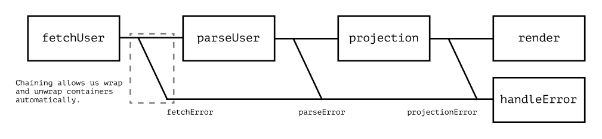
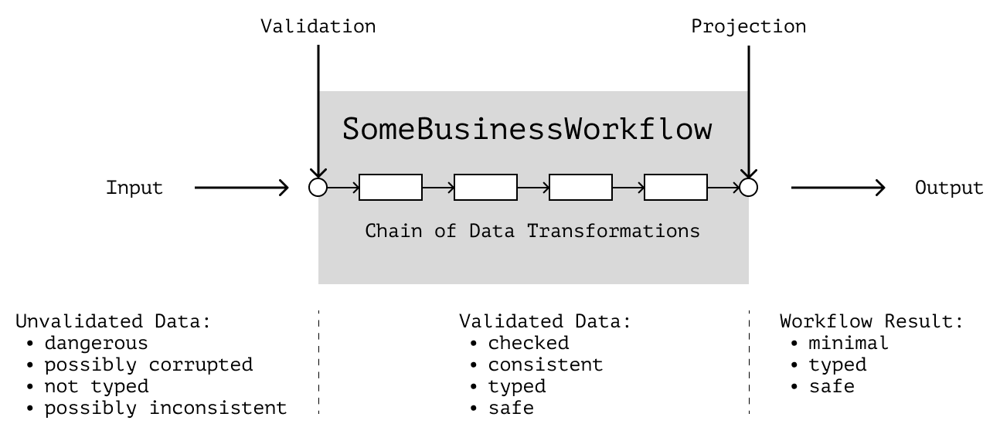

# Error Handling

Error handling is a big topic. We can do it in many ways, and details will depend on the project, its constraints, the code style, and often the team preferences.

In this chapter, we won't try to cover every possible way to handle errors. Instead, we'll look at general refactoring techniques that are appropriate for _some_ projects and can help improve the code.

| Clarification 🎯                                                                                                                                                                                                                                                                  |
| :-------------------------------------------------------------------------------------------------------------------------------------------------------------------------------------------------------------------------------------------------------------------------------- |
| In the text, I don't want to “sell” any particular way to handle errors. Instead, I want to show what I focus on when refactoring the code. I plan to discuss how to deal with various project constraints and limitations that can make it difficult to refactor error handling. |
| **I can be wrong**. These techniques help _me_ but this doesn't mean they're universally applicable. I recommend studying how error handling works in your project before using them. Discuss the ideas with your team and ensure everyone is okay with them.                     |

Proper error handling helps cope with abnormal situations in an application and debug problematic code. We can achieve it in many ways, but most often, when refactoring, we can focus on three heuristics:

- If an error makes the correct code execution impossible, we should handle it instead of trying to continue working “normally.”
- We should make error handling centralized but not mix different kinds of errors.
- We must not silently “swallow” any errors, especially unhandled ones.

In this chapter, we'll see how each point of the list is practical and how to implement them in our code. But before we get down to refactoring, let's agree on the terms and discuss the types of errors.

## Types of Errors

In “Domain Modeling Made Functional,” Scott Wlaschin divides errors into three types:[^dmmf]

- _Domain errors_. These errors are expected in the business workflows, their cause lies in the application domain, and we know how to handle them. (For example, dividing by 0 in a calculator app is a domain error because this operation constraint is a part of the maths domain.)
- _Infrastructural errors_. These are also expected, and we know how to handle them, but they're related to the infrastructure, not the business logic. (For example, a failed network request is an infrastructural error because we expect that it might happen, but it's not a part of the domain.)
- _Panics_. These are unexpected errors. We don't know how to handle them and recover the app after they happen. (For example, getting `null` where we shouldn't have is a panic because we don't know how to make the application state valid again.)

| By the way 🙅                                                                                                                                                                              |
| :----------------------------------------------------------------------------------------------------------------------------------------------------------------------------------------- |
| I don't use the term “exceptions” because in different sources, “exceptions” and “errors” mean exactly the opposite.[^errorsexceptions][^errormodel] I will use the term “panics” instead. |

We will often refer to this list during refactoring. It'll help us to choose appropriate handling techniques for specific cases.

## Handling Techniques

As we said, error handling techniques depend on the specific language, project limitations, and team preferences. But most often, error handling is done using these techniques:

- Throwing panics;
- Using result containers;
- Combining panics and containers;
- Combining containers and functional binding.

We won't “rate” them “good or bad.” Instead, we'll investigate the pros and cons of each of them and study what project limitations can force us to use a particular technique.

For example, first, we'll discuss how to refactor code in a project where we can only use panics. Then we'll discuss how result containers can be helpful and when to use them. Closer to the end of the chapter, we'll see how to combine the different techniques.

| Be careful 🚧                                                                                                                                   |
| :---------------------------------------------------------------------------------------------------------------------------------------------- |
| The techniques in the book are ideas, not rules. The decision to apply them should be made case-by-case, in consultation with other developers. |

## Throwing Panics

The most common way to deal with errors in JavaScript code is to throw a panic with a native `throw new Error()` statement. It's usually the first thing that pops into the head when we want to “indicate that something went wrong.” And it's reasonable since the `Error` object works natively out of the box and doesn't require any additional tools.

| By the way 👀                                                                                                                                             |
| :-------------------------------------------------------------------------------------------------------------------------------------------------------- |
| Besides `Error`, there's also `Promise.reject`, but it's more related to asynchronous operations. For example, in business logic, it's almost never used. |

The main problem is that panics are more suitable for unexpected errors than expected ones. They describe situations that lead the program to an inconsistent state that _can't be recovered from_.

Expected errors, however, are recoverable, and we know how to handle them. In business logic, for example, most of the errors are recoverable. It's even recommended to avoid panics in the business logic because it should work even after removing all the panics.[^replacethrow][^pragmaticprogrammer]

In practice, however, this separation isn't always maintained. There are projects where panics and errors are mixed. In such projects, it's often difficult to introduce new methods of error handling, and we might have to deal with errors only using panics. But even in such projects, we can still improve the code.

Consider an example. Let's say we have a function `getUser` that calls the backend API to fetch data about a user. Once it gets a response, it parses it and stores the result in the storage.

```js
async function getUser(id) {
  const dto = await fetchUser(id);
  const user = dto ? parseUser(dto) : null;
  if (user) storage.setUser(user);
  else storage.setError("Something went wrong.");
}
```

The `fetchUser` function requests the network and returns the DTO from the server or `null` if the server responds with an error:

```js
async function fetchUser(url) {
  const response = await fetch(url);
  const { value, error } = await response.json();
  if (error) return null;
  return value;
}
```

The `parseUser` function parses the server response and returns the user object or `null` if the DTO is invalid:

```js
function parseUser(dto: UserDto): User {
  if (!dto || !dto.firstName || !dto.lastName || !dto.email) return null;
  return { ...dto, fullName: `${firstName} ${lastName}` };
}
```

To understand how to start refactoring this code, let's first identify the problems in it:

- There's no error handling as such. We return `null` from the functions when something goes wrong, but we _swallow_ the error reasons and don't handle them in any way.
- Because of `null` in the results of `fetchUser` and `parseUser`, we lose the context of the error. So we have to _check the data for the same errors again_ at the level above. Duplicate checks make the code noisy.
- The `fetchUser` function addresses _only some_ problems, and there's no explicit delegation of unexpected errors to other modules. It makes the code “unsafe” because the app can crash anytime.
- We _don't distinguish_ between infrastructural and domain errors. We might need this information to find bugs in the app faster when analyzing issues and bug reports.

Let's try to fix these problems.

### Unexpected Errors and Missing Context

One of the reasons for refactoring error handling is the uncertainty of what errors we will catch. If we miss an error it might crash the app when we don't expect it to happen.

For example, if an unexpected error occurs inside the `fetchUser` function, the application will crash:

```js
async function fetchUser(url) {
  const response = await fetch(url);

  // Let's say, after unpacking JSON, we got `null` instead of an object.
  // The next line will then throw `null is not an object`:
  const { value, error } = await response.json();
  // ...
}
```

We can solve this by adding `try-catch` at the level above. Then the `getUser` function will catch the thrown error, and we'll be able to handle it:

```js
async function getUser(id) {
  try {
    const dto = await fetchUser(id);
    const user = dto ? parseUser(dto) : null;
    if (user) storage.setUser(user);
    else storage.setError("Something went wrong.");
  } catch (error) {
    storage.setError("Couldn't fetch the data.");
  }
}
```

However, if we throw panics to handle _all_ errors, we can accidentally mix expected and unexpected errors. For example, if we also handle validation errors of `parseUser` this way:

```js
function parseUser(dto: UserDto): User {
  if (!dto) throw new Error("Missing user DRO.");

  const { firstName, lastName, email } = dto;
  if (!firstName || !lastName || !email) throw new Error("Invalid user DRO.");

  return { ...dto, fullName: `${firstName} ${lastName}` };
}
```

Then `try-catch` at the level above will catch them, but we won't be able to distinguish between network errors and validation errors:

```js
async function getUser(id) {
  try {
    // ...
  } catch (error) {
    // Is `error` a network error or a validation error?
    // Is it expected or not?
    //
    // We can distinguish errors by the message
    // that was passed to the `Error` constructor,
    // but this is unreliable.
  }
}
```

| Why difference matters 🤔                                                                                                                                                                                                                                                                                                                                    |
| :----------------------------------------------------------------------------------------------------------------------------------------------------------------------------------------------------------------------------------------------------------------------------------------------------------------------------------------------------------- |
| We want to distinguish between errors and panics because they may need to be handled differently. Depending on the project requirements, we may want, for example, to log panics in an alert monitoring service and log expected errors in the analytics service. The easier it is to distinguish them, the less code we'll need to handle those separately. |

We can use different error types to distinguish panics from domain and infrastructure errors.

### Different Error Types

In the case of JavaScript, an “error type” is a separate class that extends `Error`. In such extensions, we can specify the name and kind of the error and some additional information in separate fields.

For example, to distinguish between network errors and validation errors, we can create such types:

```js
// Validation errors:
class InvalidUserDto extends Error {
  constructor(message) {
    super(message ?? "The given User DTO is invalid.");
    this.name = this.constructor.name;
  }
}

// API errors:
class NetworkError extends Error {
  constructor(message, status, traceId) {
    this.name = this.constructor.name;
    this.message = message ?? messageFromStatus(status);

    // We can extend the type with additional fields for logging:
    this.status = status;
    this.traceId = traceId;
  }
}
```

| By the way 👀                                                                                                                                                                          |
| :------------------------------------------------------------------------------------------------------------------------------------------------------------------------------------- |
| If we need to throw several errors at once during validation instead of throwing one at a time, we can extend classes with additional fields or use `AggregateError`.[^aggregateerror] |

Then when catching, we can understand what exactly happened from the type:

```js
async function getUser(id) {
  try {
    // ...
  } catch (error) {
    if (error instanceof InvalidUserDto) {
    } else if (error instanceof NetworkError) {
    } else throw error;
  }
}
```

### Fail Fast

This way of error handling has many disadvantages: it uses panics in the business logic code and violates LSP[^lsp] inside the `catch` block. But despite this, it has an advantage: when an error occurs, we don't try to continue working but go on to handle it.

We don't want to continue working because an error is an _inconsistent state_ of the application. In such a state, we cannot guarantee that the application data is valid, and then we can continue working with it.

If we terminate execution at this point and move on to handling the error, we protect ourselves from further errors that could damage the data even more. In addition, we clean up the domain model code, removing unnecessary checks from it.

<figure>
  
  <figcaption><em>Code execution becomes linear. All error branches lead immediately to error handling</em><br><br></figcaption>
</figure>

### Rethrow

You might notice that in the last example, on the last line of the `catch` block, a new expression `else throw error` appeared. It is a so-called _rethrow_. We use it as a mechanism that helps us _not to swallow_ errors that we can't handle.

If the current error handler checked the error for all known types and couldn't determine what to do with it, it can rethrow it to a level above. On that level, the error will be handled by “someone smarter, who knows what to do.”

| However ❓                                                                                                                  |
| :-------------------------------------------------------------------------------------------------------------------------- |
| This, of course, raises the question of who will handle it on the level above. We'll answer this at the end of the chapter. |

After the refactoring, the functions start looking linear, and the number of checks for `null` decreases:

```js
async function getUser(id) {
  try {
    const dto = await fetchUser(id);
    const user = parseUser(dto);
    storage.setUser(user);
  } catch (error) {
    if (error instanceof InvalidUserDto || error instanceof NetworkError) {
      storage.setError(error.message);
    } else throw error;
  }
}
```

### Advantages

We have achieved some improvements. Although they are few, they can simplify working with the code:

- Execution has become more _linear_. We stopped re-checking the data for errors already checked, so the code flow became more “straightforward.”
- The code moves on to error handling as soon as _normal execution_ becomes impossible. We stop the error at the beginning, preventing it from bringing the application to an inconsistent state.
- The _context of the errors is saved_, so we have full information about what happened when processing begins.

### Problems

However, throwing has its problems as well:

- A thrown error can crash the app at the run time if it isn't handled.
- Yet there are no tools in the language that _force us_ to handle the potential errors, so it's easy to forget or skip handling them.
- There's almost no syntactic difference between errors and panics in the code, which makes it hard to separate them from each other.
- At the same time, using panics in the domain code is a smell because domain errors aren't panics; we expect them.
- Checking for all potential errors is possible, but it looks ugly because of `instanceof`.
- We can avoid the use of `instanceof` with error subclasses for each “application layer,” but this makes the error model more complex.
- Function signatures don't tell us that the functions may throw an error; we can only learn about the errors from the source code.
- It isn't clear _who_ should handle a thrown error. Relying on “conventions” isn't safe because there are no tools in the language to enforce conventions.
- There are no explicit rules for wrapping “low-level” code (`fetch`, Browser API, etc.) in `try-catch`.
- Performance may suffer because each `Error` object collects stack and other information.

If a project can use _only_ panics, that's probably the maximum we can do. In a good way, we should avoid using panics in business logic. But if there are some constraints in the project that force us to do so, it makes sense to make the error handling look roughly like this.

However, there are other ways to handle errors besides throwing panics. If we examine the project and see something that resembles _result containers_ in the code, we can improve the `getUser` function further.

## Result Containers

As we mentioned before, some errors are expected. For example, we can expect the API to return “404” in response to a request for a non-existing page. This situation is non-standard, but we know how to handle it.

It might be convenient to use _result containers_ to handle expected errors. A container is a type that lives in one of two states: either the result of a successful operation or the occurred error.

```ts
// The container is a “box” that can be in 1 of 2 states:
// - `Success`, for returning a result
// - `Failure`, for returning an error

type Result<TOk, TErr> = Success<TOk> | Failure<TErr>;
type Success<T> = { ok: true; value: T };
type Failure<E> = { ok: false; error: E };
```

| Clarification 🦄                                                                                                                                                                                                               |
| :----------------------------------------------------------------------------------------------------------------------------------------------------------------------------------------------------------------------------- |
| The implementation of `Result` in the example is intentionally approximate and incomplete so as not to pretend to be “canonical.”                                                                                              |
| Implementing your own container from scratch is an interesting task, but I'd recommend using solutions known to the community in production. For example, `Either` from the fp/ts library would be good for such tasks.[^fpts] |
| If your project already uses some implementation of containers, study its capabilities. It probably already has everything you need.                                                                                           |

Using a container, we could rewrite the `parseUser` function something like this:

```ts
type MissingDtoError = "MissingDTO";
type InvalidDtoError = "InvalidDTO";
type ValidationError = MissingDtoError | InvalidDtoError;

function parseUser(dto: UserDto): Result<User, ValidationError> {
  if (!dto) return Result.failure("MissingDTO");

  const { firstName, lastName, email } = dto;
  if (!firstName || !lastName || !email) {
    return Result.failure("InvalidDtoError");
  }

  return Result.success({ ...dto, fullName: `${firstName} ${lastName}` });
}
```

The function now returns a _“box” with either result or error_. This “box” encapsulates information about what happened and returns all of it to a higher level.

### More Accurate Signature

With a container, we see possible errors right in the function signature. We don't need to examine the source code to know what errors we expect. _All of the expected outcomes_ of the operation are reflected in the returned type.

Using containers has a downside, of course. To use data from the result at the level above, we have to “unpack” the container:

```ts
async function getUser(id) {
  try {
    const { value: dto, error: networkError } = await fetchUser(id);
    const { value: user, error: parseError } = parseUser(dto);
    storage.setUser(user);
  } catch (error) {
    // ...
  }
}
```

If there is an error, the `value` field will be empty when unpacking. That way, passing the data to the next function won't be possible. So further work is possible _only_ if there are no errors or if they are handled. This way, the container signature forces us to remember potential errors and handle them:

```ts
async function getUser(id) {
  try {
    const { value: dto, error: networkError } = await fetchUser(id);
    // Handle the `networkError`...

    const { value: user, error: parseError } = parseUser(dto);
    // Handle the `parseError`...

    storage.setUser(user);
  } catch (error) {
    // Handle unexpected situations...
  }
}
```

Containers are probably a better solution for describing expected errors than panics. They are syntactically different from panics, which may help to think of them as _expected_. Also, we don't need to _throw_ containers, which means they won't break the application while we unpack them correctly.

| By the way 📦                                                                                                                                      |
| :------------------------------------------------------------------------------------------------------------------------------------------------- |
| In Node.js, in the days of callbacks, unsafe operations returned a container—a tuple of error and value:[^errnode]                                 |
| `function errorFirstCallback(err, value) {}`                                                                                                       |
| If there were an error, the `err` field would contain it. If there were no errors, `err` would be empty. It's also known as error-first callbacks. |

### Explicit Handling

When unpacking the containers, we can set up error handling so that when an error occurs, we interrupt the “normal” execution and handle the error:

```ts
async function getUser(id) {
  try {
    const { value: dto, error: networkError } = await fetchUser(id);
    if (networkError) return handleError(networkError);
    // Or `throw new Error(networkError)` and handle it later.

    const { value: user, error: parseError } = parseUser(dto);
    if (parseError) return handleError(parseError);

    storage.setUser(user);
  } catch (error) {
    // ...
  }
}
```

This approach is also known as “Fail Fast.”[^failfast]

<figure>
  
  <figcaption><em>The results chain breaks where an error occurs, and the code starts handling the error</em><br><br></figcaption>
</figure>

| Clarification 🔗                                                                                                                                                                                        |
| :------------------------------------------------------------------------------------------------------------------------------------------------------------------------------------------------------ |
| In imperative code with many operations, it will look cumbersome. But if the number of operations is small (1-2), it's not so terrible. We'll talk about how to unpack containers more elegantly later. |

### Centralized Handling

Despite the need to handle errors explicitly, we can still set up centralized error handling. We can use a separate function for handling use case errors like this:

```ts
type ValidationError = MissingDtoError | InvalidDtoError;
type NetworkError = BadRequest | NotFound | ServerError;
type UseCaseError = ValidationError | NetworkError;

// The `handleGetUserErrors` function handles errors in the `getUser` use case:
function handleGetUserErrors(error: UseCaseError): void {
  const messages: Record<UseCaseError, ErrorMessage> = {
    MissingDTO: "The user DTO is required.",
    InvalidDTO: "The given DTO is invalid.",
    // `Record<UseCaseError, ErrorMessage>` will make sure
    // we've covered all the expected errors.
  };

  // If the error is unexpected, rethrow:
  const message = messages[error];
  if (!message) throw new Error("Unexpected error when getting user data.");

  // If we expect it, we handle it:
  storage.setError(message);

  // If necessary, we can add some infrastructure stuff:
  logger.logError(error);
  analytics.captureUserActions();
}
```

### Panics are Separated

Since the “low-level” code doesn't return the container but throws panics, we need to wrap such operations in `try-catch` to return the container in case of a problem:

```ts
type NetworkError = BadRequest | NotFound | InternalError;

async function fetchUser(url) {
  try {
    const response = await fetch(url);
    const { value, error } = await response.json();
    return error ? Result.failure("BadRequest") : Result.success(value);
  } catch (error) {
    //
    // If we expected the problem, wrap it in the container:
    const reason = errorFromStatus(error);
    if (reason) return Result.failure(reason);
    //
    // If not, rethrow:
    else throw new Error("Unexpected error when fetching user data.");
  }
}
```

We would need to wrap _every_ call to the “low-level” API—in our case, every request to the network. It may increase the amount of code. However, if the scheme of working with these APIs is the same, we can reduce duplication by using decorators:

```ts
// The decorator will accept the “unsafe” function,
// and call it inside `try-catch`.
// When an error occurs, it will check,
// if the error is expected and returns the container
// or rethrow the error.

function robustRequest(request) {
  return async function perform(...args) {
    try {
      return await request(...args);
    } catch (error) {
      const reason = errorFromStatus(error);
      if (reason) return Result.failure(reason);
      else throw new Error("Unexpected error when making a request.");
    }
  };
}

// We can use such a decorator like this:

const safeFetchUser = robustRequest(fetchUser);
const safeCreatePost = robustRequest(createPost);
```

### Multiple Errors

We can store additional data in the `error` field of the container. We can pass objects, arrays, or even `Error` instances into this field. For example, it can be helpful for validation errors containing a list of invalid fields.

| By the way 🤙                                                                                                                                    |
| :----------------------------------------------------------------------------------------------------------------------------------------------- |
| We can handle multiple errors with the Notification pattern.[^replacethrow][^notificationpattern] It can also be considered a sort of container. |

### Unpacking

The main problem, of course, still persists. We still have to unpack containers and interrupt code execution manually. It's not hard to do it a couple of times, but more frequent manual unpacking can make the code noisy. In this situation, functional binding can help us.

## Binding Results

| Before start 🚂                                                                                                                                                                |
| :----------------------------------------------------------------------------------------------------------------------------------------------------------------------------- |
| The essence of functional binding is well written in “Railway Oriented Programming” by Scott Wlaschin.[^railwayprogramming] I suggest you read that article before continuing. |

| Also 🙃                                                                                                                                                                          |
| :------------------------------------------------------------------------------------------------------------------------------------------------------------------------------- |
| If your project uses manual unpacking and you're okay with it, it isn't necessary to use the functional binding. It's only needed if you feel like manual unpacking is tiresome. |

The main idea behind binding is to make the _container_ take care of calling several functions one after the other. Right now, we can't call functions directly one by one—their inputs and outputs aren't compatible with each other:

```ts
function fetchUser(id: UserId): Result<UserDTO, FetchUserError> {}
function parseUser(dto: UserDTO): Result<User, ParseUserError> {}

// We want to call them in a chain like this:
// fetchUser -> parseUser -> storage.setUser

// But we can't do it now because the output of one function
// doesn't match the input type of the following function.
//
// The `fetchUser` function returns `Result<UserDTO, FetchUserError>`,
// but `parseUser` needs just `UserDTO`.
```

We can think of binding as “adapting” the input-output types of functions so that they can be chained together. If we were to do it manually, we'd do something like:

```ts
function parseUser(
  result: Result<UserDTO, FetchUserError>
): Result<User, ParseUserError> {}
```

But it's not an option because we don't want a function to depend on the result of a previous operation. Instead, we want this “adaptation” to happen automatically.

For this, “railway-oriented programming” suggests using special functions-adapters. Depending on the implementation, these adapters can be either functions or container methods. The details aren't that important; the main point is the idea of “automating the adaptation”:

```ts
// The implementation is schematic!

const Result = {
  // ...

  // If the current container is in the `Success` state,
  // we “unpack” the value and pass it to the input of the `fn` function.
  // If the container is in the `Failure` state,
  // we return a new container `Failure<E>` with `error`,
  // which was in that container.
  bind: (fn) => (ok ? fn(value) : failure(error)),

  // At the end of the execution chain
  // we need to handle `error` or a result:
  match: (handleError, handleValue) =>
    ok ? handleValue(value) : handleError(error),
};

// The `bind` method is going to be used to chain functions;
// and the `match` method will “unpack” the final results of the hole chain.
//
// In the `match` method, there are two arguments:
// - the first function is an error handler that should handle errors of the function chain;
// - the second function is the result handler.
```

Now, we can bind functions in a chain like this:

```ts
async function getUser(id) {
  (await fetchUser(id))
    .bind(parseUser)
    .match(handleGetUserErrors, storage.setUser);
}
```

An error in any of the steps immediately breaks the execution of such a function. After that, the `handleGetUserErrors` function starts to handle it. In combination with Exhaustiveness Check[^exhaustivecheck] we can safely handle all the errors for `getUser` without having to unpack containers manually.

| By the way ⛓                                                                                                                                                                                                                                 |
| :------------------------------------------------------------------------------------------------------------------------------------------------------------------------------------------------------------------------------------------- |
| Binding can look differently depending on the style and paradigm of the project. It can be done with methods, or it can be a function like `pipe`,[^pipe] which “pushes” the results from one function to another.                           |
| If your project has containers, take a closer look at their implementation. Maybe they have the binding too. If not, look at existing solutions like fp/ts or sweet-monads and pick the one you like best.[^fpts][^sweetmonads][^neverthrow] |

So the point of binding is to _automate_ the chaining and unpacking of results. It's like we link all results into a sequence of “forks.” An error from any function travels down the fork to the “error track” and goes along it all the way to the end. It's similar to connecting railroad tracks—that's why the programming is “railway oriented” 😃

<figure>
  
  <figcaption><em>Binding helps to adapt function inputs and outputs</em><br><br></figcaption>
</figure>

<details>
  <summary>What about native binding in JavaScript?</summary>

JavaScript, in fact, has a native implementation of containers that can be bound. It's `Promise`. A promise can be in one of several states and can be bound in a chain via `then`:

```js
fetchPosts()
  .then(validatePosts)
  .then((posts) => keepOnlyAuthoredBy(user, posts))
  .then(dashboardPostsProjection)
  .catch(handleGetPostsError);
```

In general, it's possible to use promises for building chains of transformations but they're usually used for asynchronous operations. I haven't seen promises being used as a result container in the business logic and wouldn't do it in production.

</details>

### Problems

Despite being attractive, the functional binding also has problems:

- The code gets more complex. This can increase the entry threshold into a project.
- The approach requires conventions. We must check how the containers and wrappers for low-level functions are used. (And if they're used at all).
- In non-functional code, such code can look questionable and ambiguous.
- JavaScript lacks native pattern matching for easier use of such ideas.

### When to Prefer Panics

Containers can't wholly replace panics. They're slightly different tools. Therefore, panics can be helpful when working with containers, too.

For example, a container might not be necessary if it doesn't matter what error occurred. You can find a good checklist of choosing between containers and panics in the article “Against Railway-Oriented Programming” by Scott Wlaschin.[^againstrailway]

## Cross-Cutting Concerns

When error handling is consistent throughout the project, it's easier for us to track down the bugs in the code by, for example, a bug report. But apart from that, centralized error handling allows us to compose cross-cutting concerns like logging conveniently.[^crosscutting]

If error handlers are isolated, they can be _decorated_ with additional functionality.[^codethatfits][^decorator] For example, we can add logging to error handlers with decorators:

```ts
// services/logger.js
// Logging service provides a function
// for sending a new event:

const logEvent = (entry: LogEntry) => {};

// infrastructure/logger.js
// To avoid adding logs to each handler separately,
// we can create a decorator that takes a function,
// calls it and logs the result of the call:

const withLogger =
  (fn) =>
  (...args) => {
    const result = fn(...args);
    const entry = createEntry({ args, result });
    logEvent(entry);
  };

// network.js
// To use it, it'll be enough to wrap
// the handler with the logging decorator:

const handleNetworkError = (error: NetworkError) => {};
const errorHandler = withLogger(handleNetworkError);
```

In general, it's convenient to compose cross-cutting concerns with decorators. Decorators make the “service” functionality isolated from the application code, and they're easy to “inject” into different parts of the code.

| Clarification 🖼                                                                                                                                                                                    |
| :------------------------------------------------------------------------------------------------------------------------------------------------------------------------------------------------- |
| Decorators have limitations. They won't fit in all cases. For example, if we need to send a message to the log in the middle of a function, it would probably be hard to do that with a decorator. |
| Though in such cases, it's usually worth considering why we need to log something _in the middle_ of a function. Maybe it's better to split the function into several ones.                        |

## So Many Different Handlers

Potentially dangerous functions may be different and may be associated with different APIs. The requirements to error handling in such functions may differ. For example, some APIs require specifying the `.onerror` property or listening for an error event instead of using `try-catch`.

Centralized handling helps to solve this problem too because it decouples the _handlers themselves_ from the _place where they're used_. One handler becomes possible to use with different APIs and handle errors from different modules with it.

| By the way 🔌                                                                                                                  |
| :----------------------------------------------------------------------------------------------------------------------------- |
| If the signature of the error handler and service API are incompatible, we can use an adapter to solve this problem.[^adapter] |

## Error Handling Hierarchy

Earlier, we mentioned rethrowing errors. It's delegating an error to a handler “above” if the current one doesn't know how to handle it.

Delegation creates a hierarchy of handlers. As with any hierarchy, it's best to keep it flat. It isn't always possible to achieve this, but the flatter the hierarchy, the easier it is to handle. One convenient way of organizing handlers consists of 3 levels:

### Wrappers for “Low-Level” Code

At the “low” level we wrap in `try-catch` browser APIs, functions for working with the network, communicating with the device, etc.

Wrapper functions catch low-level code panics. Depending on the error handling style, they further convert the panics into containers or rethrow them.

### Use Case Handlers

At this level, we handle use case errors: business logic errors and expected low-level infrastructure errors.

| By the way 🍰                                                                                                                          |
| :------------------------------------------------------------------------------------------------------------------------------------- |
| Such handlers can catch errors in a single use case or a set of related features. The latter can be called application slice handlers. |

Signaling the user of problems is usually easiest at this level because there's access to services that can, for example, display a message on the screen or send a request to the alert monitor. It won't be the best place in all cases, but most of the time, it's convenient to build the heavy lifting of error handling at this level.

### Last Resort Handlers

At the entire application or web page level, we catch all the errors and panics not handled before.

Here it's useful to log the error in the alert monitoring tool for future analysis. Panics are the easiest to work with at this level because they have a stack trace that makes it easier to search for the cause of the problem when analyzing the error.

| For example 📌                                                                                                                                                                                                                     |
| :--------------------------------------------------------------------------------------------------------------------------------------------------------------------------------------------------------------------------------- |
| In React, Error Boundaries can be handy in use case handlers and last resort handlers.[^errorboundaries] Error Boundaries errors during rendering and render a separate UI where developers can inform the user about the problem. |

| By the way 🗑                                                                                                                                                                                                                                                                                                        |
| :------------------------------------------------------------------------------------------------------------------------------------------------------------------------------------------------------------------------------------------------------------------------------------------------------------------ |
| In JavaScript, we can catch unhandled errors at the global object level with special events.[^eventerror][^eventrejection][^unhandlederrors] These events usually contain information about why and where the error occurred, so it is practical to combine their handling with logging and alert monitoring tools. |

## Data Prevalidation

In the chapter on the functional pipeline, we mentioned data prevalidation at the input to the application. We can also think of it as a part of error handling because it interrupts program execution when invalid data appear.

Prevalidation cleans the business logic code from irrelevant checks and allows us to focus on data transformations in the business workflows. With prevalidation, all validation errors are collected in one place, and their handling becomes more flexible. For example, prevalidation makes it easier to bundle validation errors into sets and handle them all at once rather than one at a time.

When refactoring error handling, we can take advantage of this idea and move the data checks closer to the input of the application:

<figure>
  
  <figcaption><em>Outside data is dangerous, inside data is safe; invalid data will terminate execution and pass control to the error handler</em><br><br></figcaption>
</figure>

| Read more 🛟                                                                                                            |
| :--------------------------------------------------------------------------------------------------------------------- |
| We will talk more about prevalidation, postvalidation, selectors, and data security in the chapter about architecture. |

[^dmmf]: “Domain Modeling Made Functional” by Scott Wlaschin, https://www.goodreads.com/book/show/34921689-domain-modeling-made-functional
[^errorsexceptions]: “Errors Are Not Exceptions” by swyx, https://www.swyx.io/errors-not-exceptions
[^errormodel]: “The Error Model” by Joe Duffy, http://joeduffyblog.com/2016/02/07/the-error-model/
[^replacethrow]: “Replacing Throwing Exceptions with Notification in Validations” by Martin Fowler, https://martinfowler.com/articles/replaceThrowWithNotification.html
[^pragmaticprogrammer]: “The Pragmatic Programmer” by Andy Hunt, https://www.goodreads.com/book/show/4099.The_Pragmatic_Programmer
[^notificationpattern]: “Notification” by Martin Fowler, https://martinfowler.com/eaaDev/Notification.html
[^aggregateerror]: `AggregateError`, MDN, https://developer.mozilla.org/en-US/docs/Web/JavaScript/Reference/Global_Objects/AggregateError
[^fpts]: fp/ts, Typed functional programming in TypeScript, https://github.com/gcanti/fp-ts
[^failfast]: Fail-fast, Wikipedia, https://en.wikipedia.org/wiki/Fail-fast
[^railwayprogramming]: “Railway Oriented Programming” by Scott Wlaschin, https://fsharpforfunandprofit.com/rop/
[^exhaustivecheck]: `switch-exhaustiveness-check`, ES Lint TypeScript, https://typescript-eslint.io/rules/switch-exhaustiveness-check/
[^pipe]: `pipe`, fp/ts, https://gcanti.github.io/fp-ts/modules/function.ts.html#pipe
[^sweetmonads]: sweet-monads, Easy-to-use monads implementation with static types definition, https://github.com/JSMonk/sweet-monads
[^neverthrow]: neverthrow, Type-Safe Errors for JS & TypeScript, https://github.com/supermacro/neverthrow
[^againstrailway]: “Against Railway-Oriented Programming” by by Scott Wlaschin, https://fsharpforfunandprofit.com/posts/against-railway-oriented-programming/
[^crosscutting]: Cross-Cutting Concern, Wikipedia, https://en.wikipedia.org/wiki/Cross-cutting_concern
[^decorator]: Decorator Pattern, Refactoring Guru https://refactoring.guru/design-patterns/decorator
[^codethatfits]: “Code That Fits in Your Head” by Mark Seemann, https://www.goodreads.com/book/show/57345272-code-that-fits-in-your-head
[^errorboundaries]: Error Boundaries, React Docs, https://reactjs.org/docs/error-boundaries.html
[^errnode]: Error-first callbacks, Node.js Documentation, https://nodejs.org/api/errors.html#error-first-callbacks
[^lsp]: “A behavioral notion of subtyping” by Barbara H. Liskov, Jeannette M. Wing, https://dl.acm.org/doi/10.1145/197320.197383
[^adapter]: Adapter Pattern, Refactoring Guru, https://refactoring.guru/design-patterns/adapter
[^eventerror]: Window: `error` event, MDN Web Docs, https://developer.mozilla.org/en-US/docs/Web/API/Window/error_event
[^eventrejection]: Window: `unhandledrejection` event, MDN Web Docs, https://developer.mozilla.org/en-US/docs/Web/API/Window/unhandledrejection_event
[^unhandlederrors]: “Dealing with Unhandled Exceptions”, by Alexander Zlatkov https://blog.sessionstack.com/how-javascript-works-exceptions-best-practices-for-synchronous-and-asynchronous-environments-39f66b59f012#ecc9
