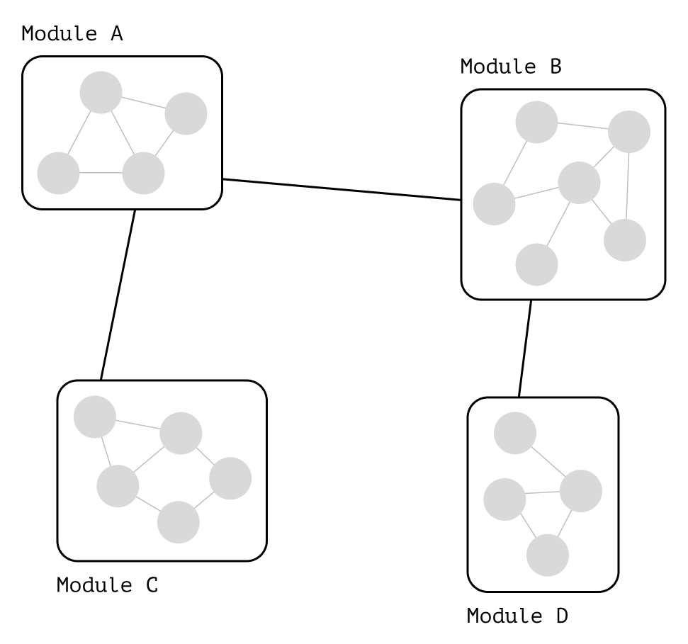
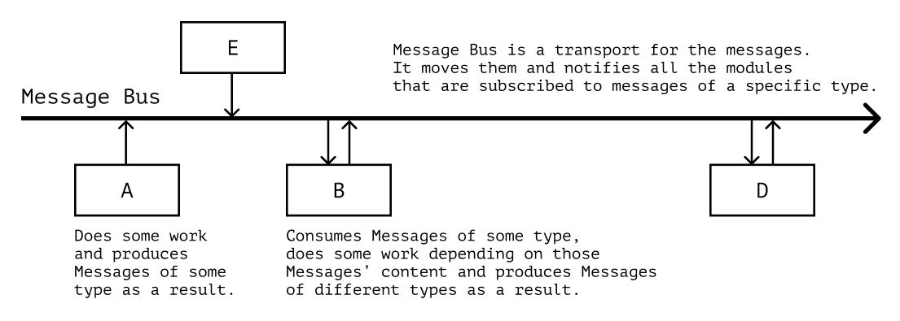

# Module Integration

Complex applications consist of many parts. The interaction between the parts affects the organization and complexity of the code. The simpler and more obvious the interaction, the easier it is to read and modify the code. In this chapter, we'll discuss how to spot overly convoluted code organization and how to simplify the interaction between application parts.

## Coupling and Cohesion

Complicated code can cause fear of changing it. If we feel like “everything will fall apart” or “we'll have to update a lot of code” after making a change, we don't want to touch it because we don't feel safe doing so. Such feelings appear when application modules know too much about each other.

| By the way 🧩                                                                                                                                                              |
| :------------------------------------------------------------------------------------------------------------------------------------------------------------------------- |
| By a _module_ we mean an isolated part of an application responsible for a specific task that communicates with the outside world or other modules through the public API. |

When a module directly affects the code of other modules, its changes will also spread to the other modules. Stopping the propagation of changes in such a code base becomes difficult. Changes related to a particular task begin to affect code that isn't related to it. As a result, making changes in the code becomes scary because anything can break, and we must retest the whole application afterward.

The degree to which one module knows about the structure of other modules is called _coupling_.[^coupling] The higher the coupling, the harder it is to make changes in isolation to a particular module.

### Separation of Concerns

In a well-organized application, working on a task causes changes only in the code related to that task. This principle is known as _Separation of Concerns, SoC_.[^soc]

SoC helps limit the spread of changes across the code base. If all the code responsible for one task is located in one module, the changes for this task will affect only that module. Everything that isn't related to the task is outside the module and won't affect its code.

The degree to which the code is related to the task is called _cohesion_.[^cohesion] The higher the cohesion, the closer a module's code is related to the task it was written for. With higher cohesion, it's easier to find the module related to a particular task in the code base.

### Integration Rule

The first and foremost thing we should check when analyzing the interaction of modules during refactoring is the integration rule:

---

**❗️ Low coupling, high cohesion**

---

A program composed according to this rule looks like “islands of cohesive functionality” connected by “bridges” of public APIs, events, or messages:

<figure>
  
  <figcaption><em>“Islands” in the code are responsible for related domain tasks and communicate with each other via “bridges” of public APIs</em></figcaption>
</figure>

### Task Decomposition

Let's look at an example to understand how to find weak module separation during refactoring. The `purchase` module from the snippet below is heavily coupled with the `cart` module. It uses the internal details of the cart object (object structure and `products` field type) to check if it's empty:

```ts
// purchase.ts

async function makePurchase(user, cart) {
  if (!cart.products.length) throw new Error("Cart is empty!");

  const order = createOrder(user, cart);
  await sendOrder(order);
}
```

The problem with this code is the encapsulation violation. The `purchase` module _doesn't and shouldn't know_ how to check if the cart is empty properly.

The details of checking the cart aren't part of the “making a purchase” task. The _fact_ that the cart isn't empty is important to it, but it doesn't matter _how_ that fact is determined. Implementing the validation is the task of the cart module because it's the one that creates that object and knows how to keep it valid:

```ts
// cart.ts
// Extract the emptiness check into the `cart` module:
export function isEmpty(cart) {
  return !cart.products.length;
}

// purchase.ts
import { createOrder } from "./order";
import { isEmpty } from "./cart";

async function makePurchase(user, cart) {
  if (isEmpty(cart)) throw new Error("Cart is empty!");

  const order = createOrder(user, cart);
  await sendOrder(order);
}
```

Now, if the internal structure of the cart changes for some reason, the changes will be limited to the `cart` module:

```ts
// cart.ts
type Cart = {
  // Was `products`, became `items`:
  items: ProductList;
};

export function isEmpty(cart) {
  // The only place that requires updates:
  return !cart.items.length;
}

// purchase.ts
async function makePurchase(user, cart) {
  if (isEmpty(cart)) throw new Error("Cart is empty!");
  // Other places in the code stay intact.
  // We've limited the changes propagation.
}
```

Modules that use the `isEmpty` function from the public API will remain unchanged. If modules were to use the cart's internal structure directly, they would all have to be updated when the property changes.

### Search for Cohesion

It's often not clear whether a task belongs to a specific module or not. To determine it, we can look at the data the module or function uses.

The “data” is the _input and output parameters_, and the _dependencies and context_ that the module uses. The less the data of one module is similar to the data of another, the more likely it's that they relate to different tasks. If, for example, a function often works with data from a neighboring module, it most likely should be part of that module.

| By the way 🦨                                                          |
| :--------------------------------------------------------------------- |
| We may know this problem as the Feature Envy code smell.[^faetureenvy] |

Let's imagine we're refactoring a finance management application that can track user expenses. Suppose we see code like this in the module responsible for the budget:

```js
// budget.js

// Creates a new budget:
function createBudget(amount, days) {
  const daily = Math.floor(amount / days);
  return { amount, days, daily };
}

// Calculates how much was spent in total:
function totalSpent(history) {
  return history.reduce((tally, record) => tally + record.amount, 0);
}

// Adds a new expense, decreasing the current money amount
// and adding a new spending record in the history:
function addSpending(record, { budget, history }) {
  const newBudget = { ...budget, amount: budget.amount - record.amount };
  const newHistory = [...history, record];

  return {
    budget: newBudget,
    history: newHistory,
  };
}
```

The `budget` module is responsible for data transformations of the _budget_. However, we see functions that don't work only with it:

- The `totalSpent` function doesn't work with the budget at all, it works with the history of expense records;
- The `addSpending` function works with the budget but also uses the expense history.

From the data that these functions work with, we can conclude that they aren't so much about `budget`. For example, `totalSpent` is more related to the history, while `addSpending` is more like an “Add Spending” use case functionality.

Let's try to break up the code by features, separating history and the use case into separate modules:

```js
// budget.js
// Here's only the code related to the budget:

function createBudget(amount, days) {
  const daily = Math.floor(amount / days);
  return { amount, days, daily };
}

function decreaseBy(budget, record) {
  const updated = budget.amount - record.amount;
  return { ...budget, amount: updated };
}

// history.js
// Here's only the code related to the expense history:

function totalSpent(history) {
  return history.reduce((tally, record) => tally + record.amount, 0);
}

function appendRecord(history, record) {
  return [...history, record];
}

// addSpending.js
// Here's the “Add Spending” use case:
// - decrease the budget amount,
// - add the new history record.

function addSpending(spending, appState) {
  const budget = decreaseBy(state.budget, spending);
  const history = appendRecord(state.history, spending);
  return { budget, history };
}
```

Such strict separation of modules and features may not be necessary for simple applications. But if the application needs to scale and more use cases need to be added, the functionality of different modules will probably need to be composed in various ways. Unclear module separation can lead to implicit dependencies between the modules, which makes it harder to compose and reuse functionality.

For scaling, we should keep an eye on coupling and cohesion. If we're sure we'll be extending and reusing functionality, it's better to divide the code into modules so that there are a minimum of implicit dependencies between them.

## Contracts

The public API of a module can be called a _contract_.[^designbycontract] Contracts fixate guarantees of one entity over others: they require certain arguments and obligate functions to return a specific result. They allow other parts of the program to rely not on the module's entity but only on its “promises” and to base their work on them.

Let's look at an example to see why this is useful. In the code below, we rely on the structure of the `api` module, thereby increasing the coupling:

```ts
// ...
await api.post(api.baseUrl + "/" + api.createUserUrl, { body: user });
// ...
await api.post(api.baseUrl + "/posts/" + api.posts.create, post);
```

The `api` module doesn't explicitly promise how it will work. So when we use it, we _need to know how_ it works. But the direct dependence on the `api` module details increases the coupling: if we now change the `api` module, we have to change the code which uses it. High coupling slows down app development.

Instead, the `api` module could declare a _contract_, a set of guarantees describing how it'll work:

```ts
type ApiResponse = {
  state: "OK" | "ERROR";
};

interface ApiClient {
  createUser(user: User): Promise<ApiResponse>;
  createPost(post: Post): Promise<ApiResponse>;
}
```

Then we would implement this contract inside the `api` module, only exposing the public API and not revealing any extra details:

```ts
const client: ApiClient = {
  createUser: (user) =>
    api.post(api.baseUrl + "/" + api.createUserUrl, { body: user }),

  createPost: (post) =>
    api.post(api.baseUrl + "/posts/" + api.posts.create, post),
};
```

And then we would use the `api` module, relying only on its contract:

```ts
// ...
await client.createUser(user);
// ...
await client.createPost(post);
```

| Clarification 📑                                                                                                                                                                                                                                                     |
| :------------------------------------------------------------------------------------------------------------------------------------------------------------------------------------------------------------------------------------------------------------------- |
| In a formal definition, contracts are pre- and post-conditions in the form of prescribed verifiable specifications.[^designbycontract] In practice, I've rarely seen contracts in this form, only in the form of fixed guarantees instead.                           |
| Guarantees aren't necessarily a type signature or an interface. They can be sound or written agreements, DTOs, message formats, etc. The important thing is that these agreements _should declare and fixate the behavior_ of parts of the system toward each other. |

Different modules can fulfill the same “promises.” So if we rely on “promises,” implementation becomes easier to change, e.g., during testing:

```ts
// Describe the “contract” of using storage.
// In the interface, we specify which method can be used,
// what it takes as an argument and what it returns as a result:

interface SyncStorage {
  save(value: string): void;
}

// In the argument of `saveToStorage`, specify not a concrete entity,
// but “something that implements the `SyncStorage` interface”:

function saveToStorage(value: string, storage: SyncStorage) {
  if (value) storage.save(value);
}

// ...

describe("when given a non-empty value", () => {
  // In tests, we describe the storage mock
  // as “something that implements the `SyncStorage` interface”:
  const mock: SyncStorage = { save: jest.fn() };

  it("should save it into the given storage", () => {
    // Then, during the tests, we can replace
    // storage implementation with the mock:
    saveToStorage("Hello World!", mock);
    expect(mock.save).toHaveBeenCalled();
  });
});
```

This way, we even can replace one algorithm or piece of the application with another at the run time:

```js
// Save settings to cookies or local storage
// depending on the user settings:

const storage = preferences.useCookie ? cookieAdapter : localStorageAdapter;
const saveCurrentTheme = () => saveToStorage(THEME, storage);

// While `cookieAdapter` and `localStorageAdapter` both implement `SyncStorage`,
// we can use either of them in the `saveToStorage` function.
```

| By the way 🔁                                                                                                                        |
| :----------------------------------------------------------------------------------------------------------------------------------- |
| The idea of the module replacement is the basis of the “Strategy” pattern and dependency injection.[^strategy][^di][^ditsinpractice] |

### Events and Messages

The lower the coupling, the more module interaction resembles sending messages. Server-client communication via REST is an example of such communication.[^rest] The client and server know nothing about each other's structure and communicate only by a pre-defined contract—messages of a certain kind with data inside.

Messages can be sent either directly from one module to another via a public API or a special entity—a _message bus_. In the second case, the modules know nothing about each other and are coupled only through the message bus:

<figure>
  
  <figcaption><em>Communication comes down to sending and receiving messages from the bus</em><br><br></figcaption>
</figure>

| Clarification 📧                                                                                                                                                                                                                                                                                                                                          |
| :-------------------------------------------------------------------------------------------------------------------------------------------------------------------------------------------------------------------------------------------------------------------------------------------------------------------------------------------------------- |
| There's a difference between a “message bus,” a “message queue,” an “event bus,” and a “message broker.”[^messagebroker][^messagebus][^messagequeue] However, it isn't critical for this chapter, so I didn't focus on a particular term. I use “message bus” in the text as a general synonym for all those, even though it's not “technically correct.” |

| By the way 📆                                                                                                                                                                                                                                                             |
| :------------------------------------------------------------------------------------------------------------------------------------------------------------------------------------------------------------------------------------------------------------------------ |
| Communication via events can be called “perfect communication” between modules because it only couples modules via message structure and sending protocols. However, setting up such communication is often resource-intensive and can be an overhead for small projects. |

Sending events and messages is usually associated with microservice architecture, but their benefits can be used in regular applications as well. If the application is large, and it's necessary to build communication between its parts without coupling, a message bus can help to solve this problem.

We can use the “Observer” pattern as a primitive message bus.[^observer] In this pattern, modules subscribe to certain kinds of messages and react to them when they appear:

```ts
// The observer will react to messages:

type Observer = (message: Message) => void;

// The observable allows observers to subscribe to the messages
// and notifies them about all new incoming messages:

type Observable = {
  subscribe: (listener: Observer) => void;
  notifyAll: (message: Message) => void;
};

// The implementation here is an object with two methods
// and a list of listeners:

const listeners = [];
const bus: Observable = {
  subscribe: (listener) => listeners.push(listener),
  notifyAll: (message) => listener.forEach((listener) => listener(message)),
};

// The observer knows that it'll be given an object
// of type `Message` as an argument—this is the contract.
// From the message kind, it'll know if it should handle the message:

const onUserUpdated = ({ type, payload }) => {
  if (type === "updateUser") {
    // If the type is correct, react to the message.

    const [firstName, lastName] = payload;
    // ...
  }
};

// We can subscribe the observer to messages
// with the `subscribe` method:

bus.subscribe(onUserUpdated);

// When a new message arrives,
// the observable will notify the subscribed observers:

bus.notifyAll({
  type: "updateUser",
  payload: ["Alex", "Bespoyasov"],
});
```

| Clarification 🌊                                                                                                                                                |
| :-------------------------------------------------------------------------------------------------------------------------------------------------------------- |
| In production, you probably won't need to write your own implementation of “Observer.” There are many solutions to work with this pattern, such as RxJS.[^rxjs] |

Fully decoupled communication isn't always needed but can be useful when _different parts of the system should respond to the same messages_, but we don't want to increase the coupling between those parts.

## Dependencies

Speaking of coupling and module integration, it's worth mentioning dependency management. By _dependencies_, we'll mean any code that ours use for simplicity. For example, in the function `randomInt`, we use the method `Math.random` in addition to the two arguments—this is a dependency:

```ts
function randomInt(min, max) {
  return Math.random() * (max - min) + min;
}
```

| By the way 👻                                                                                                                                                                                                                                                                                        |
| :--------------------------------------------------------------------------------------------------------------------------------------------------------------------------------------------------------------------------------------------------------------------------------------------------- |
| The `Math` dependency in the example above is _implicit_, because `Math` is used directly in the function's body and isn't designated as an argument. Such implicit dependencies increase the coupling. If we try to test the `randomInt` function, we must make a global mock of the `Math` object. |

We can manage dependencies in different ways. It depends on the paradigm and style of the code. However, it's usually convenient to separate the dependencies which produce effects from the rest. This separation helps to bring the code to the Impureim-styled structure, which we discussed in the chapter on side effects earlier. Let's look at examples of such refactoring in code written in different paradigms.

### Object Composition

In object-oriented programming, the unit of composition is the object. Objects can mix data and actions (state and methods), so it's usually more challenging to compose objects than functions. In particular, most design patterns and SOLID principles address the problems of object composition.[^solid]

| By the way 👀                                                                                                                                                                                                                                                   |
| :-------------------------------------------------------------------------------------------------------------------------------------------------------------------------------------------------------------------------------------------------------------- |
| It's worth noting that OOP code _can_ be written to avoid these problems by separating data and actions. Although, in functional programming, it's the paradigm itself that pushes this separation, while in OOP, we have to make an effort to keep it in mind. |

For example, let's look at the code of a finance management app:

```ts
class BudgetManager {
  constructor(private settings: BudgetSettings, private budget: Budget) {}

  // The main problem with the code is the CQS violation: here, effects are mixed with logic.
  // This class simultaneously validates the data and updates the budget value...
  checkIncome(record: Record): MoneyAmount | boolean {
    if (record.createdAt > this.budget.endsAt) return false;

    const saving = record.amount * this.settings.piggyBankFraction;
    this.budget.topUp(record.amount - saving);

    return saving;
  }
}

// ...But this isn't visible on the higher level of the composition.
// We won't be able to tell that there's any effect,
// until we look inside the `BudgetManager' code.
class AddIncomeCommandHandler {
  constructor(private manager: BudgetManager, private piggyBank: PiggyBank) {}

  execute({ record }: AddSpendingCommand) {
    const saving = this.manager.checkIncome(record);

    if (!saving) return false;
    this.piggyBank.add(saving);
  }
}
```

| By the way 💉                                                                                                                                                                                                    |
| :--------------------------------------------------------------------------------------------------------------------------------------------------------------------------------------------------------------- |
| In the example, I imply that we use _Dependency Injection, DI_ through class constructors.[^di] We won't discuss it separately, but I'll leave some links with more info about it.[^diindotnet][^ditsinpractice] |

In the example above, because of the CQS violation, it's not clear to us _how many_ effects actually occur when the `execute` method is called. We saw 2, but there's no guarantee that `this.budget.topUp` doesn't change anything other than the `budget` object.

The composition of side effects negates the point of abstraction: the more effects there are, the more overall state we have to keep in mind—it's hard to work with. If side effect composition can be avoided, it's better to avoid it.

Instead, we could extract the data transformations and push the effects to the edges of the application. It would keep effects and logic separate:

```ts
// Extract validation into a separate entity.
// This class will only handle validation.
class AddIncomeValidator {
  constructor(private budget: Budget) {}

  // If necessary, the `canAddIncome` method can be made completely pure,
  // if we pass the value of `endsAt` as an argument.
  canAddIncome(record: Record) {
    return record.createdAt <= this.budget.endsAt;
  }
}

// At the top level, we separate logic and effects.
// We strive for the Impureim sandwich we talked about earlier:
// - Impure effects for getting data (for example, working with the database on the backend);
// - Pure data transformation logic (domain functions, creating entities);
// - Impure effects for saving data (or displaying it on the screen).
class AddIncomeCommandHandler {
  constructor(
    // The same technique will allow us to see the problems with coupling.
    // If the class accumulates too many dependencies,
    // we should probably think about improving its design.
    private settings: BudgetSettings,
    private validator: AddIncomeValidator,
    private budget: Budget,
    private piggyBank: PiggyBank
  ) {}

  execute({ record }: AddSpendingCommand) {
    // Validation:
    if (!this.validator.validate(record)) return false;

    // Pure(-ish because of injected settings) logic.
    // It can be extracted into a separate module,
    // but I decided to keep it here for clarity:
    const saving = record.amount * this.settings.piggyBankFraction;
    const income = record.amount - saving;

    // Effects of saving the data:
    this.budget.topUp(income);
    this.piggyBank.add(saving);
  }
}
```

#### Separate Data and Behavior

The next step could be to separate data from behavior. The `budget` and `piggyBank` objects would become “data containers”—_entities_ in DDD terms,[^ddd][^dddclassification] and data transformation would be handled by “services”:

```ts
class AddIncomeCommandHandler {
  constructor(
    private settings: BudgetSettings,
    private validator: AddIncomeValidator,
    private budgetRepository: BudgetUpdater,
    private piggyBankRepository: PiggyBankUpdater
  ) {}

  // The `budget` and `piggyBank` objects now contain no behavior, only data:
  execute({ record, budget, piggyBank }: AddSpendingCommand) {
    if (!this.validator.validate(record, budget)) return false;

    // Data transformation, business logic:
    const saving = record.amount * this.settings.piggyBankFraction;
    const income = record.amount - saving;

    // Updated data objects:
    const newBudget = new Budget({ ...budget, income });
    const newPiggyBank = new PiggyBank({ ...piggyBank, saving });

    // “Services” for effects with saving the data:
    this.budgetRepository.update(newBudget);
    this.piggyBankRepository.update(newPiggyBank);
  }
}
```

Separating data and behavior helps to separate code that changes quickly (behavior) from code that changes slowly (data). In this way, changes _take fewer files_, and this limits their spread across the codebase.[^pitsofsuccess]

#### Interface Segregation Principle

When describing behavior, we can use CQS,[^cqs] as an “integration linter.” For example, if we describe a service as a set of commands, a type signature difference can indicate a CQS violation:

```ts
interface BudgetUpdater {
  updateBalance(balance: MoneyAmount): void;
  recalculateDuration(date: TimeStamp): void;

  // Oops! This method returns something.
  // It's a query, not a command!
  currentBalance(): MoneyAmount;
}
```

Then we can apply the _Interface Segregation Principle, ISP_[^solid] and decompose the problem:

```ts
// Extract the query into a separate “reading data service”:
interface BudgetSource {
  currentBalance(): MoneyAmount;
}

// While the older service only contains
// commands for changing the data now:
interface BudgetUpdater {
  updateBalance(balance: MoneyAmount): void;
  recalculateDuration(date: TimeStamp): void;
}
```

| By the way 👓                                                                                                                                                                                                                                                      |
| :----------------------------------------------------------------------------------------------------------------------------------------------------------------------------------------------------------------------------------------------------------------- |
| The separation of data reading and writing services is one of the ways of applying the ISP. It depends on the task whether to separate the services at the class level but separating them at the interface level helps to express the difference in their intent. |

### Functional Composition

In projects with “slightly more functional” code, we also can find “dependency injection” made by partial application of functions. The benefit of this “injection” is that it makes _implicit_ dependencies _explicit_.

For example, take a look at the `listingQuery` function. It outputs a list of Markdown files from a specified folder:

```ts
const listingQuery = (query) => {
  return fs
    .readdirSync(query)
    .filter((fileName) => fileName.endsWith(".md"))
    .map((fileName) => fileName.replace(".md", ""));
};

const projectList = listingQuery("projects");
```

It implicitly depends on the `fs` module, which gives access to the filesystem. In general, this isn't bad, but such a function is inconvenient to test.[^testingprinciples] The tests would require a global mock for `fs`.

With the partial application, we can create a “factory function.” It would take `dependencies` as an argument and return `listingQuery` function as a result:

```ts
/**
 * 1. Inject the `system` “service”;
 * 2. Pass the actual arguments;
 * 3. Use the `system` “service”;
 *    to get the desired effects.
 */
const createListingQuery =
  ({ system }) =>
  (query) =>
    system
      .readdirSync(query)
      .filter((fileName) => fileName.endsWith(".mdx"))
      .map((fileName) => fileName.replace(".mdx", ""));

// When using it, we would first create the function
// with “injected” `system` service:
const listingQuery = createListingQuery({ system: fs });

// ...And then would use that function:
const projectList = listingQuery("projects");
```

This approach isn't very “functional,” but it's okay to work with if we don't have trouble “injecting” dependencies for each such factory, and using them doesn't cause problems with the shared state and its effects.

#### Dependency Rejection

In “more hardcore” functional programming, changing state and producing side effects isn't common. The concept of “dependencies” in its usual sense doesn't really fit there. Instead of “dependencies” that “expose methods” and effects, FP offers the functional core in an imperative shell.

| By the way 🙅                                                                                                                                                                                          |
| :----------------------------------------------------------------------------------------------------------------------------------------------------------------------------------------------------- |
| I like what Mark Seemann calls this concept—_dependency rejection_.[^dependencyrejection] It's like we move away from the concept of dependencies in general and try to solve the problem differently. |

In this approach, all the work with the state is pushed to the edges of the application. It means that we can read and write (or render) data only at the beginning and end of the module. All work between these points is based on pure data transformations.

That is, we first get all the data we need from the “impure” world, pass it as arguments to the chain of transformations, and then save the result:

```ts
// Extract the function with
// the “File names to Post names” transformation:
const listingQuery = (fileNames) =>
  // Notice, there's no dependency on `fs`,
  // we work only with the pure data here:
  fileNames
    .filter((fileName) => fileName.endsWith(".mdx"))
    .map((fileName) => fileName.replace(".mdx", ""));

// “Composition” now is a separate function:
// - It first calls the effect to read the data.
// - Then, it runs it through a chain of transformations.
// - At the end, it returns the result or calls the effect to save the data.
const listingQueryComposition = (query) => {
  // Inside, we follow the Impureim sandwich structure.
  //
  // 1. Read data effect.
  //   (Because of the effects, the composition context
  //    and the composition function itself are considered “impure.”)
  const files = fs.readdirSync(query);

  // 2. Data transformation logic in the form of a sequence of pure functions.
  return listingQuery(files);

  // 3. Write (save / render) data effect.
  //   (Here, we return the result from the function.
  //    But if we weren't, we would call an effect to saving the result.)
};
```

At first glance, it seems to become worse: tests for the function now need global mocks, and with “dependency injection,” we could just replace the services with stubs. However, in this concept, unit tests should test only the functional core—the `listingQuery` function.

The `listingQuery` function is pure, so the tests for it wouldn't require any mocks at all. As for composition, in simple cases, we may skip testing it since it just “gathers” the functionality together. In more complex cases, we should use integration or E2E tests.

When using integration tests, such a composition forces the “Ports-Adapters” architecture, which also helps reduce the number of mocks, making the tests less “fragile.”[^testingprinciples]

| By the way 🔌                                                                     |
| :-------------------------------------------------------------------------------- |
| We'll talk more about the Ports-Adapter architecture in a separate chapter later. |

We'll still need the mocks, for example, for testing the adapters. But in this case, we'd write only one adapter for each service, meaning we'd only need to mock that service once.

```ts
interface System {
  readDirectory(directory: DirectoryPath): List<FileName>;
}

const createAdapter = (service): System => ({
  readDirectory(directory) {
    /*...*/
  },
});

//  test.js

describe("when asked to read the given directory", () => {
  it("should trigger the `readdirSync` method on the service", () => {
    const mock = { readdirSync: jest.fn() };
    const adapter = createAdapter(mock);

    adapter.readDirectory("testdir");
    expect(mock.readdirSync).toHaveBeenCalledWith("testdir");
  });
});
```

In the case of “dependency injection,” we'd have to mock the service _for each function_ where the service is used.

#### Other Dependency Management Options

Dependency rejection isn't always the best option. If a project is heavy on I/O operations, then “dependency injection” through the partial application is probably a better fit.

However, even if we're going to “inject” services, it'll be much easier if we separate logic and effects first. So in functional code, separating logic and effects is the first refactoring worth doing.

| By the way 🦄                                                                                                                                                                                                                                   |
| :---------------------------------------------------------------------------------------------------------------------------------------------------------------------------------------------------------------------------------------------- |
| There are also various advanced dependency management techniques that are used in FP.[^readermonadfordi][^freemonadsfordi] Although in JavaScript, I've only seen them being used once.                                                         |
| A good overview of all the techniques for working with dependencies in FP is described in the article series “Six approaches to dependency injection” by Scott Wlaschin.[^fpdependencies] I highly recommend at least the first three articles. |

## Integrity and Consistency

In stateful applications, we should also keep an eye on the _integrity and consistency_ of the data. These properties ensure that the user sees and works with the application in a valid state.

| Read more 📚                                                                                                                                      |
| :------------------------------------------------------------------------------------------------------------------------------------------------ |
| Scott Wlaschin has written about this in detail in “Domain Modeling Made Functional” in the section about aggregates and data consistency.[^dmmf] |

### Aggregates

Data consistency is easier to achieve if we use immutable data structures and ensure adequate encapsulation.

Consider an example. Imagine that in the code of an online store, the shopping cart must always have the correct `total`:

```ts
// cart.ts
type Cart = {
  items: ProductList;
  total: MoneyAmount;
};

function totalPrice(products: ProductList) {
  return products.reduce(
    (tally, { price, count }) => tally + price * amount,
    0
  );
}

function createCart(products: productList): Cart {
  return {
    items: products,
    total: totalPrice(products),
  };
}
```

By improperly changing the cart object, we can make the data inconsistent. Suppose some extraneous code added a new product to the list:

```ts
// The outside code doesn't know that after adding a product
// it must also recalculate the total price:
userCart.products.push(appleJuice);

// Now the `cart.total` field shows an incorrect value,
// because it wasn't recalculated after adding the product.
```

A piece of data that must be updated “as a whole” is an _aggregate_. Data immutability can help keep aggregates consistent. It forces the updating of an aggregate to happen _starting at the aggregate root_:

```ts
// cart.ts
// ...

function addProduct(cart: Cart, product: Product): Cart {
  const products = [...cart.products, product];
  const total = totalPrice(products);
  return { products, total };
}

// ...

addProduct(userCart, appleJuice);
```

The `addProduct` function guarantees consistency because it knows what data to update and from where to update it to keep it valid. Correct updates are its area of responsibility. Aggregate is its area of influence.

### Input Prevalidation

Aggregates and immutability help keep data valid and consistent _inside_ a part of the application. But to _prevent_ invalid data from getting there, we need prevalidation.

| Read more 👀                                                                                                                                                  |
| :------------------------------------------------------------------------------------------------------------------------------------------------------------ |
| In DDD terms, we'd call such an application part a bounded context. We discussed this topic in more detail earlier in the chapter on the functional pipeline. |

With prevalidation, in the `Cart` component, instead of ad-hoc checks on the required fields:

```js
function Cart({ items }) {
  return (
    !!items && (
      <ul>
        {items.map((item) =>
          item && item.product ? (
            <li key={item.id}>
              {item.product?.name ?? "—"}: {item.product?.price} ×{" "}
              {item.product?.count ?? 0}
            </li>
          ) : null
        )}
      </ul>
    )
  );
}
```

...We would first validate the data and handle potential errors:

```js
function hasCorruptedItem(item) {
  return !item || !item.product;
}

function validateCart(cart) {
  if (!cart || !cart.items) return Result.failure("EMPTY_CART");
  if (cart.items.some(hasCorruptedItem))
    return Result.failure("CORRUPTED_ITEM");

  // There's also an option to use panics instead of `Result`.
  // We talked more about error handling in the previous chapter.

  // An alternative to errors could be a “fallback default” cart object as a result of validation,
  // but it seems to me that a violation of the API contract is a sufficient reason for an error.

  return cart;
}
```

...And inside the component, we'd use _already valid and tested_ data:

```js
// ...

function Cart({ items }) {
  return (
    <ul>
      {items.map(({ id, product }) => (
        <li key={id}>
          {product.name}: {product.price} × {product.count}
        </li>
      ))}
    </ul>
  );
}
```

[^pitsofsuccess]: “Functional architecture: The pits of success” by Mark Seemann, https://youtu.be/US8QG9I1XW0
[^cqs]: “Command-Query Separation” by Martin Fowler, https://martinfowler.com/bliki/CommandQuerySeparation.html
[^coupling]: Coupling, Wikipedia, https://en.wikipedia.org/wiki/Coupling_(computer_programming)
[^soc]: Separation of Concerns, Wikipedia, https://en.wikipedia.org/wiki/Separation_of_concerns
[^cohesion]: Cohesion, Wikipedia, https://en.wikipedia.org/wiki/Cohesion_(computer_science)
[^faetureenvy]: Feature Envy, Refactoring Guru, https://refactoring.guru/smells/feature-envy
[^designbycontract]: “Design By Contract”, c2.com, https://wiki.c2.com/?DesignByContract
[^strategy]: Strategy Pattern, Refactoring Guru, https://refactoring.guru/design-patterns/strategy
[^rest]: REpresentational State Transfer, REST, https://restfulapi.net
[^messagebroker]: Message Broker, Microsoft Docs, https://docs.microsoft.com/en-us/previous-versions/msp-n-p/ff648849(v=pandp.10)
[^messagebus]: Message Bus, Microsoft Docs, https://docs.microsoft.com/en-us/previous-versions/msp-n-p/ff647328(v=pandp.10)
[^messagequeue]: Message Queue, Wikipedia, https://en.wikipedia.org/wiki/Message_queue
[^observer]: Observer Pattern, Refactoring Guru, https://refactoring.guru/design-patterns/observer
[^rxjs]: RxJS, Reactive Extensions Library for JavaScript, https://rxjs.dev
[^solid]: The Principles of OOD, Robert C. Martin, http://www.butunclebob.com/ArticleS.UncleBob.PrinciplesOfOod
[^di]: “Inversion of Control Containers and the Dependency Injection pattern” by Martin Fowler, https://martinfowler.com/articles/injection.html
[^diindotnet]: “Dependency Injection in .NET” by Mark Seemann, https://www.goodreads.com/book/show/9407722-dependency-injection-in-net
[^ditsinpractice]: “Dependency Injection with TypeScript in Practice” by Alex Bespoyasov, https://bespoyasov.me/blog/di-ts-in-practice/
[^ddd]: “Domain-Driven Design” by Eric Evans, https://www.goodreads.com/book/show/179133.Domain_Driven_Design
[^dddclassification]: “Evans Classification” by Martin Fowler, https://martinfowler.com/bliki/EvansClassification.html
[^dependencyrejection]: “Dependency Rejection” by Mark Seemann, https://blog.ploeh.dk/2017/02/02/dependency-rejection/
[^readermonadfordi]: “Dependency Injection Using the Reader Monad” by Scott Wlaschin, https://fsharpforfunandprofit.com/posts/dependencies-3/
[^freemonadsfordi]: “Dependency Interpretation” by Scott Wlaschin, https://fsharpforfunandprofit.com/posts/dependencies-4/
[^fpdependencies]: “Six approaches to dependency injection” by Scott Wlaschin, https://fsharpforfunandprofit.com/posts/dependencies/
[^dmmf]: “Domain Modeling Made Functional” by Scott Wlaschin, https://www.goodreads.com/book/show/34921689-domain-modeling-made-functional
[^testingprinciples]: “Unit Testing: Principles, Practices, and Patterns” by Vladimir Khorikov, https://www.goodreads.com/book/show/48927138-unit-testing
