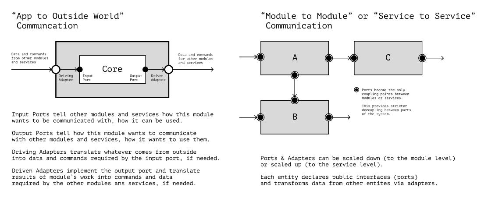

# App Architecture

Poor architecture can make successful refactoring difficult. Tight coupling between code parts and uncontrolled dependencies can prevent us from finding “seams” in the code and isolating the changes. Non-obvious interactions between the modules can make the code confusing and difficult to read.

In this chapter, we'll talk about simplifying refactoring when dealing with a big chunk of an application. We'll discuss the notion of architecture, its goals, and its benefits. We'll talk about the application domain model and its interaction with the outside world. We'll also discuss the difference between business logic and UI logic.

| Caution 🚧                                                                                                                                                                                                                                |
| :---------------------------------------------------------------------------------------------------------------------------------------------------------------------------------------------------------------------------------------- |
| Most of my experience comes from developing user applications with rich domain models. So I'll talk about such an average application.                                                                                                    |
| The development of other apps may differ; hence the approaches to the architecture may vary. Even in user applications, enough edge cases may force us to write the code differently. Please, keep this in mind when reading the chapter. |

## Not About File Structure

Architecture is the interaction of system parts, the top level of application detail, and the identification and prioritization of app requirements.[^architectureinpractice][^integrationpatterns]

There is no one-size-fits-all solution in application design because each project's requirements are unique. Two similar applications can be designed differently because of their constraints and requirements.

| Clarification 🔬                                                                                                                                                                                                                                                                    |
| :---------------------------------------------------------------------------------------------------------------------------------------------------------------------------------------------------------------------------------------------------------------------------------- |
| By requirements, we'll mean functional, system, business, and other requirements.[^architectureinpractice][^softwarerequirements][^qualityattributes]                                                                                                                               |
| We won't investigate all types of requirements, how to collect, analyze, and prioritize them—that's a separate big topic. Instead, I'll leave links to books and articles describing how and why to do it.[^ddia][^architectureinpractice][^cleanarchitecture][^fromfailure][^dmmf] |

The techniques in this chapter aren't a set of mandatory practices. Instead, it's a palette from which we can choose the most suitable tool for a particular task. There can be nothing “mandatory” in architecture; each project is a unique set of constraints and compromises, the balance of which depends on many factors.

We emphasize the notion of requirements to focus on the idea:

---

**❗️ App design doesn't equal project file structure**

---

The file structure is just a way to explore the code and open files in the IDE conveniently. Much more important is what requirements are critical for the app and how to make sure that the code organization doesn't interfere with the development.

The requirements give us an understanding of how the system must behave under different conditions. This understanding hints at the details of code organization:

- How program parts should interact with each other.
- How modules should depend on each other.
- What level of code coupling is acceptable.

The goals of good architecture are to:

- Not interfere with development and not block changes to the program;
- Reduce the number of decisions we have to make at the moment;
- Standardize engineering practices and the process of adding features;
- Be flexible and leave room for future changes.

Not every application needs sophisticated architecture. Spending time improving the architecture of a prototype that will be abandoned makes no sense. However, if an application needs to live a long time, and we don't want the code organization to slow down with the development, we can try to put some time into architectural improvements.

| However 💰                                                                                                                                                                                                                                                                                  |
| :------------------------------------------------------------------------------------------------------------------------------------------------------------------------------------------------------------------------------------------------------------------------------------------ |
| There's no guarantee that these attempts will improve things. Sometimes it is easier to rewrite the application from scratch, taking into account the experience we gained over the project's lifetime. But we'll discuss the “refactor or rewrite” decision separately in a later chapter. |

| Clarification 🛠                                                                                                                                                                                                                             |
| :------------------------------------------------------------------------------------------------------------------------------------------------------------------------------------------------------------------------------------------ |
| In this chapter, we won't discuss “how to build an architecture from scratch” or “what to do in really bad cases.” Instead, we'll discuss tricks that can relatively cheaply help fix the most common problems in an “average” application. |

## Business Workflow Modeling

The main value of an application is in its business logic. Business logic is the processes that bring profit. The description of such processes in the code is called the _domain model_.

When refactoring an application, we should consider how clearly and unambiguously this model is defined. Can different developers tell from a piece of code what it's about? How accurately can they do this? How much variation will there be in their opinions?

The clearer the domain model is stated, the more unambiguous the developers will perceive it. A clear model will help them communicate more effectively with each other and the business when discussing tasks and project requirements.

### Ubiquitous Language

In the chapter on variable names, we mentioned the _ubiquitous language_.[^ddd][^ubiquitouslanguage] It's the set of terms used by “business people” when describing business workflows.

When refactoring, we should ensure that the terms in the code are consistent with this language. The ubiquitous language reduces controversies in the code because it creates unambiguous relationships between a term and an entity that the term describes.

In the example below, the code doesn't follow the ubiquitous language and uses different terms for the user of the online store:

```jsx
const isMerchant = (user) => user.role === "seller";
const SellerPanel = ({ user }) => isMerchant(user) && <main>{/*...*/}</main>;
```

In the snippet above, it's not clear from the context how the terms “seller” and “merchant” differ. Is there a difference between the entities they describe? If so, what's the difference?

If the terms mean the same thing, choosing and keeping only one of them is better. Preferably, choose the one used by the product owners or stakeholders.

```jsx
// Product owners use the term “seller,” so should we:

const isSeller = (user) => user.role === "seller";
const SellerPanel = ({ user }) => isSeller(user) && <main>{/*...*/}</main>;
```

If the terms mean different things, it's a reason to check whether the code correctly reflects the domain. For example, if the term “merchant” has something to do with the user's _company_, it should raise the question of whether the `SellerPanel` component really needs to check the _user_ role.

### Domain Model

As mentioned earlier, the domain model is data transformations that reflect business workflows. It's convenient to represent domain logic as separate functions, which we can combine into chains of data transformations.

| Read more ⛓                                                                             |
| :-------------------------------------------------------------------------------------- |
| We talked more about data transformation chains in the chapter on functional pipelines. |

To see why it's beneficial, consider an example. Let's say we have an online auction site function in front of us. The function creates a new auction object, but it tries to put in it _everything that might happen_ to the auction during its lifetime:

```js
function composeAuction(user, from, to, products, startPrice, invited) {
  return {
    created: true,
    author: user,
    timeRange: { from, to },
    lots: products.map(lotFromProduct),
    price: startPrice,
    participants: invited.filter(accepted),
    winners: [],
    bids: [],
    bestBid: null,
    open: false,
    expired: false,
    cancelled: false,
    closedLots: null,
  };
}
```

The problem with the `composeAuction` function is that it doesn't differentiate between the different stages of the auction lifecycle. The freshly created object is in an _undetermined_ state. Its structure doesn't unambiguously reflect the lifecycle stage it is in.

The created object has excessive, mutually exclusive, or contradictory fields. For example, as long as the auction hasn't started, it probably doesn't make sense to add bid history or the current lot. Or, the `open` and `expired` flags are mutually exclusive, but because they're in the object simultaneously, it seems they're not.

The structure of the created object is unfriendly to the reader. Without additional context, we can't understand the rules by which the object's fields work and change. We need documentation to understand how such an auction object lives and evolves.

When refactoring, we should remember to represent the domain model as a set of distinct operations in the code. We can first identify all the possible states the data goes through and then describe the transformations that will bring the data to those states. For example:

```js
// First, we create a new auction:
function createAuction(user, from, to, lots, startPrice) {
  return {
    author: user,
    timeRange: { from, to },
    lots: products.map(lotFromProduct),
    price: startPrice,

    // The `status` field will help validate the object
    // and check what operations can be performed on it:
    status: STATUS.created,

    // Different lifecycle states will be _unambiguously_ marked by this field.
    // We can't create an auction that has different statuses at the same time,
    // it's either `STATUS.created`, or `STATUS.expired`, or something else.
  };
}

// Suppose inviting participants is a separate workflow,
// then, we'll have a separate function for it:
function inviteParticipants(auction, participants) {
  return {
    ...auction,
    participants,
    status: STATUS.inviting,
  };
}

// This function will check if an auction can start:
function canStart(auction) {
  const moment = Date.now();
  const { from, to } = auction.timeRange;
  return moment >= from && moment <= to;
}

// When the auction starts, it contains only the participants,
// who have accepted the invitation:
function startAuction(auction) {
  return {
    ...auction,
    participants: auction.participants.filter(accepted),
    currentLot: auction.lots.find(available),
    status: STATUS.active,
  };
}

// Each new bid will be appended to the history.
// (The implementation might defer depending on the concurrency requirements.)
function addBid(auction, bid) {
  return { ...auction, bids: [...auction.bids, bid] };
}

// When the auction expires, it changes the status:
function expireAuction(auction) {
  const { currentLot, ...rest } = auction;

  return {
    ...rest,
    closedLots: auction.lots.filter(isClosed),
    status: STATUS.expired,
  };
}

// When defining the winners, check who won at least one lot:
function defineWinners(auction) {
  return { ...auction, winners: participants.filter(ownsLot) };
}

// ...And so on for all the business workflows.
```

Functions from the domain model should be able to “play” business workflows from beginning to end, transforming data. If we can do this, we've wholly and adequately reflected the domain in the code.

Yes, there's more code now. But at the same time, there's more _information_ about the domain. We express more knowledge about how the domain works and what data is involved in the business workflows. There are also more _constraints_ that the application has to consider. For example, we explicitly say that there can be no winners in an ongoing auction, and that's why the `winners` field doesn't exist in the auction until it's finished.

The more information about the domain we express in the code, the more errors we'll find _at the design stage_. The more inconsistencies we resolve in the design before starting to code, the less inconsistency will be there in the code.

In languages with static typing, when refactoring, we can also explicitly describe data states as types:

```ts
type CreatedAuction = {
  author: User;
  timeRange: LimitedTimeFrame;
  lots: ReadonlyList<Lot>;
  price: MonetaryValue;
  status: "created";
};

type PendingAuction = {}; // ...
type ActiveAuction = {}; // ...
type ExpiredAuction = {}; // ...
type FinishedAuction = {}; // ...

// When using `Result` to handle errors,
// we can also describe all potential problems as types:

type ExpiredInvitation = "...";
type CantAddParticipantsAfterStart = "...";
type CantModifyExpiredAuction = "...";
// ...

type DomainError =
  | ExpiredInvitation
  | CantAddParticipantsAfterStart
  | CantModifyExpiredAuction;
// ...
```

This way, we'll notice the objects and processes that don't contain enough data or contain unnecessary data more quickly.

### Dependency Direction

The domain model is the most critical part of the application. It describes the key features of the project and carries its business value. The rest of the code must serve it and help connect it to the outside world.

Application use cases should be “built around” the domain transformations. We can achieve this with the Impureim sandwich code style.[^impureim] In this kind of organization, we first get the data from impure sources, then run it through a chain of transformations and then save it or render it on the screen.

| In detail 🥪                                                                                                                             |
| :--------------------------------------------------------------------------------------------------------------------------------------- |
| In more detail, we discussed Impureim-sandwich and the “functional core in an imperative shell” approach in the chapter on side effects. |

## Interaction with the World

When refactoring a large chunk of an application, we should pay attention to the coupling between the app and the outside world. The coupling can be explicit when we use a third-party service directly in our code. But also, the coupling can be implicit.

For example, in an online store, the server requires an object with the `products` field in the client's request to create an order. Let's say the client code uses some object that contains the `products` field. It's tempting to use this object directly when sending the order:

```js
function createOrder(user, products) {
  return { user, products };
}

// ...

async function sendOrder(order) {
  const response = await fetch("/api/orders/", {
    method: "POST",
    body: JSON.stringify(order),
  });
}

// ...
const order = createOrder(currentUser, productList);
await sendOrder(order);
```

It looks handy, but it creates a coupling point with the server. Now, we can't change the structure of the `order` object inside `createOrder` because that would break compatibility with the server.

Such coupling can be no problem for small projects that rarely change data structures or APIs. But if we care about app scalability or API flexibility, or if we often change object fields in the client code, this will become a problem.

In such situations, we can add an _Anti-Corruption Layer, ACL_[^acl][^dmmf], a set of transformations responsible for compatibility between the API and our code.

| Be careful 🚧                                                                                                                                   |
| :---------------------------------------------------------------------------------------------------------------------------------------------- |
| Anti-Corruption Layer should not be confused with Access Control List.[^accesslist] Both concepts are abbreviated as ACL but differ in meaning. |

The Anti-Corruption Layer can be a single-function adapter, like `toServerOrder` in the example below:

```js
function toServerOrder(clientOrder) {
  // const serverOrder = ...

  // Here go the transformations required
  // for creating a compatible data structure.

  return serverOrder;
}

async function sendOrder(order) {
  const dto = toServerOrder(order);
  // ...Prepare the object first
  // and then send it to the server.
}
```

...Or it can be a separate module. For example, suppose the frontend has to work with several incompatible API versions simultaneously. In that case, such a module can contain the logic for mapping the correct data structures to a particular API version.

```js
function toServerOrder(clientOrder, config) {
  const dataAdapter = orderAdapters[config.currentApiVersion];
  const serverOrder = dataAdapter(clientOrder);
  return serverOrder;
}
```

It frees the frontend from constantly checking the data against the server structure _inside the client application_. We now have a single place where the data is being prepared before sending. The rest of the code is free to change data structures and object fields how it wants. The client becomes _uncoupled_ from the server.

With static typing, all data conversions can be expressed explicitly with types, so that the difference between structures is more noticeable:

```ts
type Order = {
  user: User;
  products: List<Product>;
};

type ServerOrderDto = {
  userId: EntityId<User>;
  orderItems: List<OrderLine>;
};

type ServerOrderSelector = (clientOrder: Order) => ServerOrderDto;
```

The anti-corruption layer can increase code complexity though. It's usually worth adding if we assume that the data or API might change. For example, it's helpful in analytics, logging, interaction with the user's device storage, etc.

| By the way 📜                                                                                                                                                                                                                                                                                                                                                 |
| :------------------------------------------------------------------------------------------------------------------------------------------------------------------------------------------------------------------------------------------------------------------------------------------------------------------------------------------------------------ |
| To understand where we might need an anti-corruption layer, it's handy to use the repository history. We can collect information from the repository about what project code changed and how often. With this data, we can assume what might change in the future. These stats can help us avoid huge code rewrites and compatibility problems in the future. |
| The technique of “metadata mining” is well described in “Your Code as a Crime Scene” by Adam Tornhill.[^scene]                                                                                                                                                                                                                                                |

### Ports and Adapters

Since we already mentioned adapters, the “Ports and Adapters” architecture pattern is worth discussing.[^portsadapters][^portsadaptershgraca]

An _adapter_ is an entity that converts one module's incompatible interface to another's requirements. A _port_ is a specification of how a module wants to be communicated.

| For example 💬                                                                                                                                                                                                                                                      |
| :------------------------------------------------------------------------------------------------------------------------------------------------------------------------------------------------------------------------------------------------------------------ |
| A module declares _ports_ to signal other modules how they can communicate with it. If module A wants to talk to module B, but their ports are incompatible, module A creates an _adapter_. The adapter makes the interfaces compatible and communication possible. |

With the “Ports and Adapters” architectural style, the module communication comes down to connecting the ports of some modules with the adapters of others. In this way, we make the modules unaware of each other's structure, which reduces the coupling between them.

<figure>
  
  <figcaption><em>When using “Ports and Adapters,” module interaction comes down to connecting adapters to ports of other modules</em><br><br></figcaption>
</figure>

Using “Ports and Adapters” automatically forces the “Impureim sandwich” code style because it pushes “interaction with the world” to the edges of the application.

It also helps reduce the number of mocks in tests. If we use _a single_ adapter for network requests, we need to test _only_ it instead of mocking every network request. It reduces the number of tests to update after code changes, lowering the test-induced damage.[^testinduceddamage]

Finally, ports and adapters limit the propagation of changes within the module. The adapter serves as a barrier where the change should stop preventing it from propagating throughout the code base.

| However 👀                                                                                                                                                              |
| :---------------------------------------------------------------------------------------------------------------------------------------------------------------------- |
| Not every project may need this architectural style. In simple applications that aren't going to scale, ports and adapters can add extra work with no apparent benefit. |

### All Kinds of Architecture

We're not going to study all the ways to design apps. Instead, I'll leave some links to articles and books which I find the most useful.[^ddia][^architectureinpractice][^cleanarchitecture][^architecturecronicles][^pitsofsuccess]

For the frontend, though, it's worth separately mentioning Feature-Sliced.[^featuresliced] It's a methodology for frontend application design that tries to collect developer experience and practices not only from the frontend but from the backend as well. The people behind it are doing a great job, which in my opinion, isn't appreciated enough.

## UI Logic

Developing user interfaces is rather a chaotic task. On average, the UI changes faster and more often than the domain code, but the user needs to see consistent and valid data in the interface. To keep this true, when working with user interfaces, we can use the rule:

---

**❗️ Always keep UI logic and business logic separate**

---

Even if the data in the UI looks the same as the domain model data, it's better to think of them as _different_ data. The UI changes faster than the domain model, so sooner or later, these data sets will start to differ. If we don't distinguish between the business and UI logic, we can miss this moment, and domain objects will end up containing data from UI.

For example, let's imagine we need to render a shopping cart. In the UI, it has two views: compact and expanded. A flag that determines the view may accidentally “leak” into the domain model:

```js
const cart = {
  products: [chocolateBar, sodaCan, teslaCar],
  user: someUser,

  // Only needed in the UI:
  isExpanded: true,
};
```

The problem with this “leaking” is that the `cart` object now contains data from different levels of abstraction and different tasks. This means that testing the application with this data and preparing it to be sent to the server will be more difficult. Also, changes in the UI now may cause unnecessary changes to the entire application.

Finally, if we keep ignoring data separation, the UI data can “metastasize” to other objects as well:

```js
const cart = {
  // “Zoom in” to the user object...
  user: {
    name: "Pippi Longstocking",
    role: "buyer",

    // ...And more fields are related only to the UI:
    theme: SITE_THEME.light,
  },

  products: [chocolateBar, sodaCan, teslaCar],
  isExpanded: true,
};
```

To solve these problems, it's worth separating the UI logic from the domain logic:

```js
// The separation can be done like this:

const cart = {
  user: someUser,
  products: [chocolateBar, sodaCan, teslaCar],
};

const cartView = {
  isExpanded: true,
};

// Or like this:

const cartUi = {
  model: cart,
  view: cartView,
};

// Or like this:

const cartUi = {
  cart,
  ...cartView,
};

// Or even like this,
// if `cart` and `cartView`
// are created separately from each other:

const cartUi = {
  ...cart,
  ...cartView,
};
```

How exactly to separate the objects depends on the task. The main idea is that the business logic data _should, in principle, be separated_ from the presentation layer data. We want to decouple the UI from the domain and allow them to evolve independently of each other.

### Reactivity

When it comes to UI logic, it's worth mentioning reactivity. _Reactive interfaces_ instantly map changes from UI to the data model and back.[^reactiveprogramming] With reactive interfaces, the temptation to merge domain data with UI data is even higher because reactivity creates the illusion that these data sets are identical.

When working with reactive interfaces, it's convenient to use the MVVM pattern.[^mvvm][^viewmodel] In this pattern, the view-model works as a mediator between UI and business logic, separating them and not allowing them to mix.

In addition, it's useful to use tools for _reactive data mapping_ with selectors. These can be used to “compile” the final data for the presentation layer. The Effector library handles this very well:[^effector]

```ts
// We can separately declare domain logic types:
export type ConverterState = {
  unit: Unit;
  value: TimeStamp;
};

// ...And separately declare the types of data that the UI should display:
export type UiRepresentation = {
  date: StringRepresentation;
  stamp: NumberRepresentation;
  open: boolean;
};

// We can keep these states and their logic separate and independent:
const $converter = createStore<ConverterState>({ unit, value });
const $isOpen = createStore<boolean>(false);

// And for the UI, we can map domain data to the UI:
const $representation = combine<UiRepresentation>(
  $converter,
  $isOpen,
  (converter, isOpen) => ({
    stamp: toMilliseconds(converter.unit, converter.value),
    date: toDateString(converter.value),
    open: isOpen,
  })
);
```

As a result, the business logic becomes isolated, and the data gets into the UI through data selectors. It decouples UI from the rest of the code, making it easier to evolve independently.

## Testing

From the architecture point of view, we can evaluate the result of the refactoring by how easy it is to test the code. We'll borrow a heuristic for it from “The Grand Unified Theory of Clean Architecture and Test Pyramid”:[^testingpyramid]

- If we can test business logic with unit tests;
- And we can test adapters with integration tests;
- And we can test application use cases with E2E tests...

...Then the architecture works. The code is sufficiently decoupled, the UI doesn't get mixed with the business logic, and it takes less time and resources to test and maintain the tests.[^testingprinciples]

[^architectureinpractice]: “Software Architecture in Practice” by L. Bass, P. Clements, R. Kazman, https://www.goodreads.com/book/show/70143.Software_Architecture_in_Practice
[^integrationpatterns]: “Enterprise Integration Patterns” by Gregor Hohpe, https://www.goodreads.com/book/show/85012.Enterprise_Integration_Patterns
[^qualityattributes]: List of System Quality Attributes, Wikipedia, https://en.wikipedia.org/wiki/List_of_system_quality_attributes
[^softwarerequirements]: Software Requirements, Wikipedia, https://en.wikipedia.org/wiki/Software_requirements
[^ddia]: “Designing Data-Intensive Applications” by Martin Kleppmann https://dataintensive.net
[^dmmf]: “Domain Modeling Made Functional” by Scott Wlaschin, https://www.goodreads.com/book/show/34921689-domain-modeling-made-functional
[^fromfailure]: “What I've Learned From Failure” by Reg Braithwaite, https://leanpub.com/shippingsoftware/read
[^cleanarchitecture]: “Clean Architecture” by Robert C. Martin, https://www.goodreads.com/book/show/18043011-clean-architecture
[^ddd]: “Domain-Driven Design” by Eric Evans, https://www.goodreads.com/book/show/179133.Domain_Driven_Design
[^ubiquitouslanguage]: “Ubiquitous Language” by Martin Fowler, https://martinfowler.com/bliki/UbiquitousLanguage.html
[^impureim]: “Impureim Sandwich” by Mark Seemann, https://blog.ploeh.dk/2020/03/02/impureim-sandwich/
[^acl]: Anti-corruption Layer Pattern, Microsoft Docs, https://docs.microsoft.com/en-us/azure/architecture/patterns/anti-corruption-layer
[^accesslist]: Access Control List, Wikipedia, https://en.wikipedia.org/wiki/Access-control_list
[^scene]: “Your Code As a Crime Scene” by Adam Tornhill, https://www.goodreads.com/book/show/23627482-your-code-as-a-crime-scene
[^portsadapters]: “Functional Architecture is Ports and Adapters” by Mark Seemann, https://blog.ploeh.dk/2016/03/18/functional-architecture-is-ports-and-adapters/
[^portsadaptershgraca]: “Ports & Adapters Architecture” by Herberto Graça, https://herbertograca.com/2017/09/14/ports-adapters-architecture/
[^testinduceddamage]: “Test-Induced Design Damage” by David Heinemeier Hansson, https://dhh.dk/2014/test-induced-design-damage.html
[^architecturecronicles]: “The Software Architecture Chronicles” by Herberto Graça, https://herbertograca.com/2017/07/03/the-software-architecture-chronicles/
[^pitsofsuccess]: “Functional architecture: The pits of success” by Mark Seemann, https://youtu.be/US8QG9I1XW0
[^featuresliced]: Feature-Sliced Design, Architectural methodology for frontend projects, https://feature-sliced.design
[^reactiveprogramming]: Reactive programming, Wikipedia, https://en.wikipedia.org/wiki/Reactive_programming
[^mvvm]: Model-View-ViewModel, Wikipedia, https://en.wikipedia.org/wiki/Model–view–viewmodel
[^viewmodel]: View Models, Reactive UI, https://www.reactiveui.net/docs/handbook/view-models/
[^testingpyramid]: “The Grand Unified Theory of Clean Architecture and Test Pyramid” by Guilherme Ferreira, https://youtu.be/gHSpj2zM9Nw
[^effector]: Effector, Business logic with ease, https://effector.dev
[^testingprinciples]: “Unit Testing: Principles, Practices, and Patterns” by Vladimir Khorikov, https://www.goodreads.com/book/show/48927138-unit-testing
