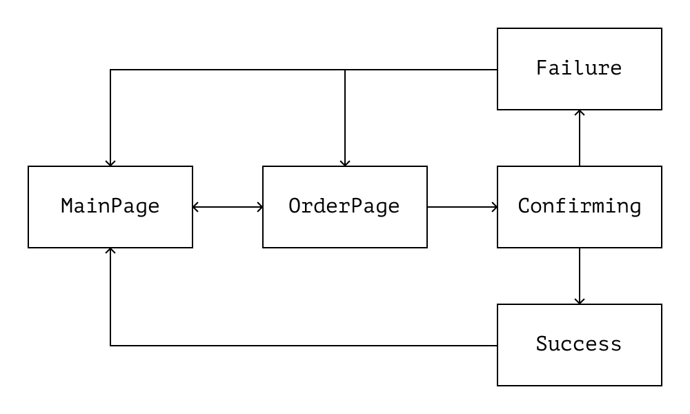

# Declarative Style

In the chapter about abstraction, we discussed how to decompose tasks and why separating the intent from implementation in code is beneficial. We looked at how to improve code readability and emphasize details that are important at a particular moment.

In this chapter, we'll extend the ideas of abstraction and talk about declarative code style. We'll discuss the notion of declarative code, its benefits, and its advantages compared to imperative-style code.

## Readability

To better understand the benefits of declarative style, let's first discuss the difference between declarative and imperative code. Consider the two snippets below:

```js
// 1.

function keepEvenNumbers(array) {
  const result = [];

  for (const x of array) {
    if (x % 2 === 0) {
      result.push(x);
    }
  }

  return result;
}

// 2.

function keepEvenNumbers(array) {
  return array.filter((x) => x % 2 === 0);
}
```

Both functions filter the given array of numbers, keeping only even ones. The difference between them is how they do it. The first function describes _how_ to solve the problem as a set of instructions:

- Create an empty array `result`.
- Iterate over the `array` argument.
- For each element, check if it's even.
- If yes, add it to `result`.

On the other hand, the second function describes _what_ needs to be done. It focuses on the filtering _criteria_, not the details of the filtering algorithm.

This is the difference between the imperative and declarative styles. Declarative code describes _what_ to do, while imperative code describes _how_ to do it.

Imperative style is often harder to read because it mixes intent and implementation details. The declarative style, on the contrary, encourages us to decompose tasks and split the code by levels of abstraction. The names of functions and variables in declarative code convey more information, making the code easier to read.

For example, look at the `validate` function in the code snippet below. The function body contains too many details, and its name says little about its purpose. This code is hard to understand at a glance:

```js
function validate(user, cart) {
  return (
    !!cart.items.length &&
    user.account >= cart.items.reduce((tally, item) => tally + item.price, 0)
  );
}
```

To solve this problem, we can decompose it and split function steps by levels of abstraction. For example, we can extract validation checks into separate functions, the names of which will reflect the purpose of those checks:

```js
// cart.js
function isEmpty(cart) {
  return !cart.products.length;
}

function totalPriceOf(cart) {
  return cart.items.reduce((tally, item) => tally + item.price, 0);
}

// user.js
function canAffordSpending(user, amount) {
  return user.account >= amount;
}
```

The extracted functions' names are now expressed in terms more appropriate to the current level of abstraction. The names now better describe the functions' meaning. They help control the reader's attention when using these functions within `validate`:

```js
// order.js

function validate(user, cart) {
  return !isEmpty(cart) && canAffordSpending(user, totalPriceOf(cart));
}
```

| In detail 💡                                                                                                                                  |
| :-------------------------------------------------------------------------------------------------------------------------------------------- |
| We talked more about the levels of abstraction, switching between them, and controlling the reader's attention in the chapter on abstraction. |

Also, the extracted functions' names now carry some information about the purpose of the `validate` function. We can replace the name `validate` with a more informative one, for example, `canMakeOrder`. Then the function code will turn into “text,” similar to a regular sentence:

```js
// order.js

function canMakeOrder(user, cart) {
  const orderPrice = totalPriceOf(cart);
  return !isEmpty(cart) && canAffordSpending(user, orderPrice);
}

// The (user) (canMakeOrder) IF the (cart) (!isEmpty)
// AND they (canAffordSpending) (orderPrice) of money.
```

Declarative code is similar to how people talk to each other in real life, so it's easier to understand. It communicates valuable information but doesn't overload the reader with unnecessary details. Such “communication” is polite, more casual, and less tiresome.

| However 🐣                                                                                                                                                                                                                                |
| :---------------------------------------------------------------------------------------------------------------------------------------------------------------------------------------------------------------------------------------- |
| In smaller projects, thorough decomposition may not be that important. The less code, the less tiresome it is. The need for decomposition depends on how complex it is for the team to read the code and work with the current code base. |

## Reliability

The following section is controversial and subjective, but in my experience, it's easier to make accidental mistakes in imperative code. Partly because, in imperative code, we have to think about “the goal” and “how to achieve it” simultaneously, but also because imperative code often contains more lines and statistically is more likely to contain an error.[^scene]

For example, let's look at the function `selectOperation` that chooses a mathematical operation by the given key:

```js
function selectOperation(kind) {
  let operation = null;
  switch (kind) {
    case "log":
      operation = (x, base) => Math.log(x) / Math.log(base);
    case "root":
      operation = (x, root) => x ** -root;
    default:
      operation = (x) => x;
  }
  return operation;
}
```

Every `case` block of this function misses the `break` statement. As a result the `operation` variable will always be equal to `(x) => x`. Such an error is relatively easy to spot in a small function, but if there's a lot of code, it's much easier to miss.

We can improve the code by using `return` inside the `case` blocks:

```js
function selectOperation(kind) {
  switch (kind) {
    case "log":
      return (x, base) => Math.log(x) / Math.log(base);
    case "pow":
      return (x, power) => x ** power;
    default:
      return (x) => x;
  }
}
```

However, this doesn't solve the problem with accidental errors but only hides them. In the snippet above, for example, we may forget to add `return`, and the function will work incorrectly. We can get rid of the problem by making the selection declarative:

```js
const log = (x, base) => Math.log(x) / Math.log(base);
const pow = (x, power) => x ** power;
const id = (x) => x;

function selectOperation(kind) {
  const operations = { root, pow, id };
  return operations[kind] ?? operations.id;
}
```

In the code above, we delegate the “selection” to the _language_. We specify an object with data and a selection criterion, and the interpreter finds the value in the object according to the specified key. We don't care how that choice is made. We only care about its result. That's the essence of declarative style.

| Matter of taste 🍕                                                                                                                                                                        |
| :---------------------------------------------------------------------------------------------------------------------------------------------------------------------------------------- |
| I also like the last snippet for aesthetic reasons. Selecting from an object by key looks like a more natural solution to this problem, while code with `switch` seems noisy and verbose. |

## Extensibility

Extending imperative code is often more difficult than extending declarative code.

In imperative code, when adding a new feature, we not only have to figure out _what_ to add but also _where_ and _how_ to add it. On the other hand, extending the functionality of declarative code often comes down to updating the “algorithm parameters.”

| By the way 🖥                                                                                                                                                        |
| :------------------------------------------------------------------------------------------------------------------------------------------------------------------ |
| I borrowed the following example from a lecture by Timur Shemsedinov on declarative style and metaprogramming.[^metaprogrammingjs] Highly recommended to check out. |

For example, let's compare two implementations of the `parseDuration` function. The function converts a formatted string with a time period into the number of milliseconds in that period. In the first version, the algorithm is implemented imperatively:

```js
/** @example parseDuration('1h 25m 16s') === 5_116_000 */
function parseDuration(stringRepresentation) {
  const s = stringRepresentation;
  if (typeof s !== "string") return 0;

  const seconds = s.match(/(\d+)s/);
  const minutes = s.match(/(\d+)m/);
  const hours = s.match(/(\d+)h/);

  let duration = 0;
  if (seconds) duration += +seconds[1] * 1000;
  if (minutes) duration += +minutes[1] * 1000 * 60;
  if (hours) duration += +hours[1] * 1000 * 60 * 60;
  return duration;
}
```

...In the second one—declaratively:

```js
// All information about the supported string format
// is located in the `MULTIPLIER` object:
const MULTIPLIER = {
  s: 1000,
  m: 1000 * 60,
  h: 1000 * 60 * 60,
};

// Algorithm steps are now separate functions:
const sumDurations = (sum, [value, unit]) => sum + value * MULTIPLIER[unit];
const hasValidValue = ([value]) => !Number.isNaN(value);

const parseComponent = (component) => {
  const value = +component.slice(0, -1);
  const unit = component.slice(-1);
  return [value, unit];
};

/** @example parseDuration('1h 25m 16s') === 5_116_000 */
function parseDuration(stringRepresentation) {
  if (typeof stringRepresentation !== "string") return 0;

  const components = stringRepresentation.split(" ");
  return components
    .map(parseComponent)
    .filter(hasValidValue)
    .reduce(sumDurations, 0);
}
```

The second snippet is easier to extend because it _divides code that changes rarely from the code that changes frequently_. If we, for example, want to extend the string format with days and weeks, we _only_ need to update the `MULTIPLIER` object. The rest of the function code will remain unchanged.

It's like we extract the “algorithm parameters” into the `MULTIPLIER` object, separating them from the “logic” of the function. The supported string format is now more explicit, and the algorithm is more flexible because it can work with more different values from this object. “Parameters” are no longer “inlined” in the algorithm.

| By the way ⛔️                                                                                                                            |
| :---------------------------------------------------------------------------------------------------------------------------------------- |
| This ability to add similar functionality without changing the existing code is the goal of the Open-Closed principle from SOLID.[^solid] |

The string format extension now comes down to adding new fields to the `MULTIPLIER` object. The code of the algorithm itself won't change:

```js
const MULTIPLIER = {
  s: 1000,
  m: 1000 * 60,
  h: 1000 * 60 * 60,

  // Added days and weeks:
  d: 1000 * 60 * 60 * 24,
  w: 1000 * 60 * 60 * 24 * 7,
};

// Since the rest of the function code is the same,
// the probability of an accidental error is lower.
// Besides, by using the data in the `MULTIPLIER` object
// it's easier to generate test data for the function automatically.
```

In the first implementation, we'd need to change the code of the entire `parseDuration` function:

```js
function parseDuration(stringRepresentation) {
  const s = stringRepresentation;
  if (typeof s !== "string") return 0;

  const seconds = s.match(/(\d+)s/);
  const minutes = s.match(/(\d+)m/);
  const hours = s.match(/(\d+)h/);
  const days = s.match(/(\d+)d/);
  const weeks = s.match(/(\w+)d/);

  let duration = 0;
  if (seconds) duration += +seconds[1] * 1000;
  if (minutes) duration += +minutes[1] * 1000 * 60;
  if (hours) duration += +hours[1] * 1000 * 60 * 60;
  if (days) duration += +days[1] * 1000 * 60 * 60 * 24;
  if (weeks) duration += +weeks[1] * 1000 * 60 * 60 * 24 * 7;
  return duration;
}

// Speaking of how easy it is to make an accidental error in imperative code:
// Have you noticed a typo in the regular expression for `weeks`? :-)
```

| However 👀                                                                                                                                                    |
| :------------------------------------------------------------------------------------------------------------------------------------------------------------ |
| Extracted “parameters” are suitable for extending code with _similar_ functionality. If we need to add new behavior to the algorithm itself, it may not help. |

It's worth remembering that such “metaprogramming” isn't always needed, because _generalized functions can be more complex_.

As a rule, declarative generalization is useful when we notice a part of a function that “changes too often” compared to the rest of the code. Such functionality can be made declarative. It'll reduce the probability of accidental errors when updating it.

## Configurability

We extracted the “algorithm parameters” in a separate object in the previous example. We motivated this because code and its settings change at different rates, so keeping them separate is better.

In fact, this is one of the well-known rules that 12-Factor Apps recommend.[^twelvefactors] This rule can be described as:

---

**❗️ Always keep configs separate from code**

---

Settings and configs, on average, change more frequently than the code they configure. When configs are inlined in the code, changing them is more dangerous and difficult than when they're separate.

For instance, a hardcoded configuration makes it hard to change the program's environment. For example, consider an app that should run in test and production environments. If the deployment settings or third-party services configuration is hardcoded, the environment switch requires updating the configs manually in the code.

| By the way 🔦                                                                                                                                                             |
| :------------------------------------------------------------------------------------------------------------------------------------------------------------------------ |
| This property helps to distinguish configs from the rest of the code. If the value of a variable depends on the environment, it's definitely a part of the configuration. |

For example, suppose the base URL of the API in the code below should change for different environments. In the `fetchUser` function though, the base URL is hardcoded into the body of the function:

```js
async function fetchUser(id) {
  const response = await fetch(`https://api.our-app.com/v1/users/${id}`);
  const data = await response.json();
  return data.user;
}

// Calls to `fetchUser` access a specific API version: `api.our-app.com`.
// We need to update the function code to change the environment.
```

It's convenient to extract the configuration by following the _Transformation Priority Premise, TPP_.[^tpp] First, we should extract configs to local variables and then to environment variables or configuration files:

```js
// Step 1: extract configs to local variables.
const baseUrl = "https://api.our-app.com";
const apiVersion = "v1";

async function fetchUser(id) {
  const response = await fetch(`${baseUrl}/${apiVersion}/users/${id}`);
  const data = await response.json();
  return data.user;
}

// Step 2: extract them into configs
// (environment variables or configuration modules).
// The goal is to create a _distinct_ separation
// between the code and the configs.
import { networkConfig } from "@config";

async function fetchUser(id) {
  const response = await fetch(`${networkConfig.apiRoot}/users/${id}`);
  const data = await response.json();
  return data.user;
}
```

## State Machines

As mentioned in the previous chapter, business logic and UI logic are best kept separate. The business logic code should be responsible for the business workflows and associated data transformations. The UI-logic code should be responsible for rendering the user interface.

The UI logic can be complex. For example, it might describe the behavior of interdependent components or dynamic interface that depends on many conditions.

To keep the code of complex UI logic readable, we can represent the UI as a finite set of its states. Each such state describes the interface visible to the user and the conditions under which it's rendered on the screen.

The interaction with the UI can then be described as a network of such states. If the number of states is limited, we can call such an interaction a _Finite State Machine, FSM_.[^fsm]

| By the way 🤖                                                                                                                                                         |
| :-------------------------------------------------------------------------------------------------------------------------------------------------------------------- |
| Finite State Machine is a mathematical concept, but it's useful for describing UI as a function of the data state.[^fsmfrontend] It helps make UI more deterministic. |

The basic idea of an FSM is _limited sets_ of states and _unambiguous rules for transitions_ between them. For example, the UI of an online store during order placement can be expressed as a such set of states and transitions:

**“Checkout Use Case”:**

| Current State | Allowed Transitions      |
| :------------ | :----------------------- |
| `OrderPage`   | `MainPage`, `Confirming` |
| `Confirming`  | `Success`, `Failure`     |
| `Success`     | `MainPage`               |
| `Failure`     | `MainPage`, `OrderPage`  |

We can represent this table as a diagram of transitions between states:

<figure>
  
  <figcaption><em>Online store state transitions diagram</em><br><br></figcaption>
</figure>

But we can also represent it _in code_ as a collection of states and transitions:

```js
const fsm = createMachine({
  states: {
    main: {}, // Transitions from `MainPage`...
    order: {}, // From `OrderPage`...
    confirming: {}, // From `Confirming`...
    success: {}, // From `Success`...
    failure: {}, // From `Failure`...
  },
});
```

Then, we can describe the states in terms of components:

```js
// Represents the `OrderPage` state:
const ConfirmOrder = () => (
  <form onSubmit={fsm.to("confirming")}>{/*...*/}</form>
);

// Represents the `Success` state:
const OrderConfirmed = () => (
  <>
    Order Confirmed.
    <a href={fsm.to("main")}>Back to main page</a>
  </>
);

// Represents the `Failure` state:
const OrderError = () => (
  <>
    Couldn't confirm the order.
    <a href={fsm.to("main")}>Back to main page</a>
    <a href={fsm.to("order")}>Try again</a>
  </>
);

// Represents the `Confirming` state:
const Confirming = () => "Loading...";
```

Then the app entry point can use the FSM to decide what to render on the screen:

```js
// Selects the component based on the state:
function Checkout() {
  const [state] = useMachine(fsm);

  return state.match
    .with("confirming", Confirming)
    .with("success", OrderConfirmed)
    .with("failure", OrderError)
    .orElse(ConfirmOrder);
}
```

A benefit of an FSM is that it allows going from one state _only to a specific set of following states_. It's impossible to go to states outside this list. FSMs make the UI more declarative and deterministic.

Also, using FSM, it's easier to separate UI data from business logic data. In general, the FSM states have identifiers that relate them to the result on the screen. From these identifiers, we can always separate the data that relates only to the UI and not mix it with the business logic data.

| Tools 🤖                                                                                                                                                                                                                      |
| :---------------------------------------------------------------------------------------------------------------------------------------------------------------------------------------------------------------------------- |
| The FSM and the logic of transitions between states can be described using different tools. In the example above, I used a fictional library. However, as a good example of an FSM UI library, I can suggest XState.[^xstate] |

## Drawbacks

As we mentioned above, the declarative code style has disadvantages.

### Code Complexity

Generalizations can make code more complex. A declarative “facade” can hide an overly complex abstraction that's hard for other developers to understand.

After refactoring, we should always check to see if the code changes have benefited. If the code has become harder to read or maintain, it's better to roll back the changes.

When we doubt support complexity, we can request a code review from more developers than usual. This way, we'll know if the code is still readable and easy to maintain.

### Performance

Imperative code tends to be more efficient. If performance is more important than readability, we can sacrifice declarative style.

In doing so, it can be useful to isolate imperative code from the rest. For example, if we need some efficient algorithm in an application, we can implement it in a function:

```js
function mergeTrees(treeA, treeB) {
  // ...Efficient algorithm implementation.
}
```

...But implement the rest of the app declaratively:

```js
function mergeCompanyDepartments(departmentIdA, departmentIdB) {
  return mergeTrees(
    extractDepartment(departmentIdA),
    extractDepartment(departmentIdB)
  );
}
```

In this way, we bring the imperative implementation “down a level,” isolating it from the rest of the code, making the function name a declarative description of the entire algorithm.

[^scene]: “Your Code As a Crime Scene” by Adam Tornhill, https://www.goodreads.com/book/show/23627482-your-code-as-a-crime-scene
[^metaprogrammingjs]: “Metaprogramming with JavaScript Examples” by Timur Shemsedinov, https://github.com/HowProgrammingWorks/Metaprogramming
[^twelvefactors]: 12 Factor Apps, https://12factor.net
[^tpp]: Transformation Priority Premise, Wikipedia https://en.wikipedia.org/wiki/Transformation_Priority_Premise
[^fsm]: Finite-State Machine, Wikipedia, https://en.wikipedia.org/wiki/Finite-state_machine
[^fsmfrontend]: “Application State Management with Finite State Machines” by Alex Bespoyasov, https://bespoyasov.me/blog/fsm-to-the-rescue/
[^xstate]: JavaScript and TypeScript finite state machines and statecharts, XState, https://github.com/statelyai/xstate
[^antifragile]: “Antifragile: Things That Gain from Disorder” by Nassim Nicholas Taleb, https://www.goodreads.com/book/show/13530973-antifragile
[^solid]: The Principles of OOD, Robert C. Martin, http://www.butunclebob.com/ArticleS.UncleBob.PrinciplesOfOod
