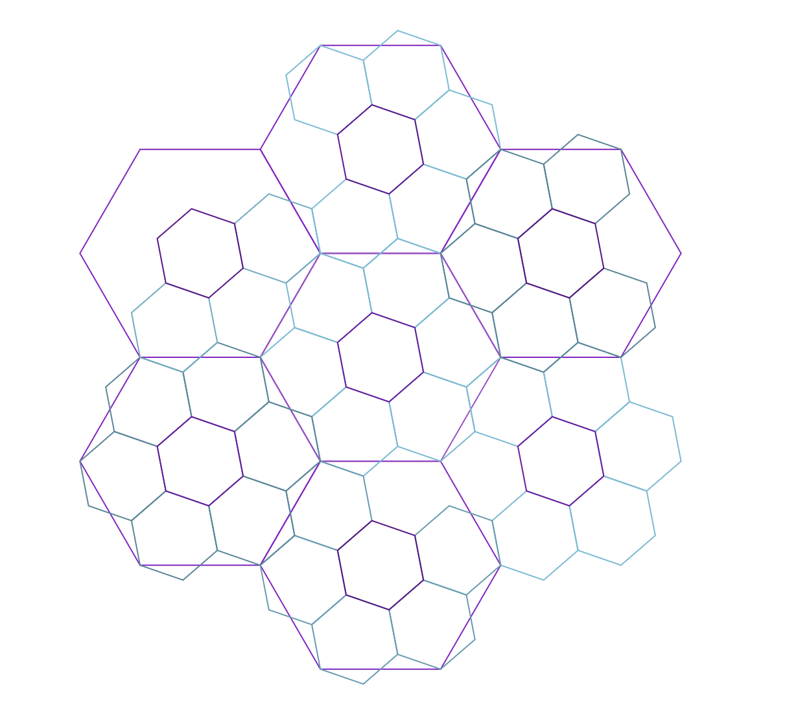

# Абстракция

Код с лишними деталями «шумит», его сложно читать и держать в голове. Шумный код пересыщен информацией и делает так много, что сложно понять, где заканчивается один осмысленный шаг и начинается другой.

Как правило, шумный код описывает сложное действие с большим количеством этапов. Чем сложнее действие, тем больше деталей приходится учитывать, тем больше вспомогательных шагов нужно описать. Сваленные в кучу, эти детали начинают шуметь и перегружать голову читателя.

В этой главе мы обсудим, как уменьшать количество шума в коде с помощью абстракции и выявлять детали, важные «снаружи» и «внутри» функций.

## Намерение и реализация

> Абстракция — это устранение неважного и усиление существенного[^abstractionquote]

В главе об именах в одном из примеров мы выделяли в имени функции детали, которые «важны снаружи» и «важны внутри». Так мы упрощали имя и находили баланс между количеством информации в имени функции и её теле. Самые важные детали мы отражали в имени, а менее важные — прятали в реализации. Такое деление деталей «по уровням» — и есть абстракция.

Абстракция помогает укрощать сложность, разделяя _намерение_ и _реализацию_. Намерение описывает, _что_ мы собираемся делать, а реализация — _как_. Намерение важно на «верхнем» уровне при описании сущности «в общих чертах» и её взаимодействии с окружением. Детали реализации важны на уровне ниже, когда мы фокусируемся на работе этой сущности и её внутренних процессах.

```js
// Название и сигнатура функции отражают намерение...
function isChild(user) {
  // ...А тело функции — реализацию.
  return user.age < 18;
}

// Когда мы используем эту функцию с другими,
// нам важны её цель и назначение, а не детали реализации:
if (isChild(user)) toggleParentControl();
```

Наш мозг может работать только с ограниченным количеством информации одновременно. Абстракция помогает фокусироваться на деталях, которые важны _сейчас_. Необходимость такой фокусировки заметна в коде, детали из «разных уровней» смешаны.

Рассмотрим пример. Представим, что у нас есть функция подписки на рассылку `subscribeToFeed`, которая проверяет валидность почты перед началом работы:

```js
function subscribeToFeed(email) {
  if (!email.includes("@") || !email.includes(".")) return false;

  const recipients = addRecipient(email);
  confirmFeedSubscription(recipients);
}
```

Если мы сравним валидацию почты с остальными действиями (`addRecipient`, `confirmFeedSubscription`), то увидим, что она «изъясняется слишком примитивными терминами» для этой задачи.

Пока другие функции говорят о «почте», «подписках» и «ленте», валидация говорит о символах `"@"` и `"."`. Из-за этого нам будто приходится при чтении «прыгать» между деталями проверки почты и целью этой проверки.

Функция `subscribeToFeed` действительно хочет знать, валиден ли переданный адрес. Но как именно почта будет проверена, этой функции не важно. Отсюда мы можем сделать вывод, что _детали_ проверки здесь лишние.

Чтобы решить эту проблему, мы можем вынести (абстрагировать) проверку почты в отдельную функцию `isValidEmail`:

```js
function isValidEmail(email) {
  return email.includes("@") && email.includes(".");
}

function subscribeToFeed(email) {
  if (!isValidEmail(email)) return false;

  const recipients = addRecipient(email);
  confirmFeedSubscription(recipients);
}
```

Теперь имя функции `isValidEmail` «упаковывает» целый набор действий в одну фразу. Имя при этом выражается терминами, близкими к тем, что используют имена функций вокруг неё. Такая близость помогает фокусироваться на целях «упакованных» действий, а не их внутренних процессах.

| К слову 👀                                                                                    |
| :-------------------------------------------------------------------------------------------- |
| Этого добиться чуть сложнее в коде с сайд-эффектами, но о них мы поговорим в отдельной главе. |

Когда мы _вызываем_ функцию `isValidEmail`, мы фокусируемся на её имени и намерении. В этот момент нам важно, как эта функция взаимодействует с сущностями вокруг — «что происходит, если почта не валидна».

Если же нам важны правила проверки, то мы заглянем в тело функции — реализацию. В этот момент нам будет важно, как функция решает, что вернуть: `true` или `false`.

| К слову 🤖                                                                                                                                           |
| :--------------------------------------------------------------------------------------------------------------------------------------------------- |
| В языках со статической типизацией намерение удобно выражать и через сигнатуру функции. Об этом поговорим подробнее в главе о статической типизации. |

Абстракция помогает «погружаться» в сложные понятия и процессы постепенно, выдаёт информацию о системе дозировано. На каждом «уровне детализации» нам доступно ровно столько информации, сколько нужно для понимания процессов на этом уровне. Марк Симанн называет это фрактальной архитектурой, и эта метафора мне кажется полезной при рефакторинге кода.[^codethatfits]

## Фрактальная архитектура

По сравнению с компьютером наш мозг вычислительно слаб. Нам трудно перемножать в уме большие числа, представлять в деталях сложные схемы или держать в голове одновременно много понятий.

При рефакторинге нам стоит следить за тем, насколько сложно «держать кусок кода в голове». Если приходится напрягаться, чтобы помнить обо всех деталях — в коде есть проблема.

В хорошем коде на экране ровно столько информации, сколько нужно читателю в конкретный момент. Марк Симанн предлагает писать программы так, чтобы на каждом «уровне детализации» количество составных частей не превышало некоторый лимит. Мы можем использовать эту эвристику, чтобы проверять, насколько код пересыщен деталями.[^codethatfits]

| К слову 🧠                                                                                                                                                                                                                                                    |
| :------------------------------------------------------------------------------------------------------------------------------------------------------------------------------------------------------------------------------------------------------------ |
| В качестве лимита Марк предлагает число 7. Он опирается на предпосылки, что мы можем держать в голове 7±2 объекта.[^shorttermmemory][^thinkingfastandslow] При этом он оговаривается, что конкретное число не принципиально, главное — наличие такого лимита. |

Для визуализации «уровней» он предлагает использовать сетку из шестигранников. Каждый шестигранник — это часть системы, которая может быть детализирована глубже, на такие же шестигранники.

На каждом из уровней детализации мы будем видеть не больше N составных частей, важных для этого уровня. Если нам требуется узнать, как работает конкретная часть, то мы можем «провалиться» на уровень ниже и увидеть, из чего она состоит.



| Копирайт нотис ©                                                                  |
| :-------------------------------------------------------------------------------- |
| Картинка сгенерирована инструментом из статьи о Fractal Hex Flowers.[^hexflowers] |

Чтобы понять, как это помогает рефакторить код, рассмотрим пример. Допустим, у нас есть приложение, в котором для залогиненных пользователей мы показываем дашборд, а для остальных — страницу входа.

Входная точка приложения (верхний уровень детализации) может выглядеть как-то так:

```js
const App = () => {
  const user = currentUser();
  const isManager = hasManagerRole(user);
  const isPromoAccount = checkPromoAccount(location);

  const [email, setEmail] = useState("");
  const [password, setPassword] = useState("");
  const handleSubmit = () => {
    /*...*/
  };

  return isManager || isPromoAccount ? (
    <Dashboard />
  ) : (
    <form onSubmit={handleSubmit}>
      <input
        type="email"
        value={email}
        onChange={({ target }) => setEmail(target.value)}
      />
      <input
        type="password"
        password={password}
        onChange={({ target }) => setPassword(target.value)}
      />
      <button>Login</button>
    </form>
  );
};
```

Понять такой код вполне реально, но из-за количества деталей на это уйдёт сравнительно больше времени. Количество информации в этом куске кода подбирается к пределам рабочей памяти нашего мозга.

Если выразить этот код на диаграмме детализации, можно заметить, что некоторые части на ней не помещаются:


Код будет значительно проще исследовать, если на верхнем уровне мы «подготовим» читателя и расскажем, _что_ делает компонент `App`. Имена переменных и подкомпонентов выразят намерение и сложатся в «историю»:

```js
const App = () => {
  const hasAccess = useHasAccess();
  return hasAccess ? <Dashboard /> : <Login />;
};

/**
 * Если пользователям разрешён доступ (`hasAccess`) к панели управления,
 * приложение покажет им компонент панели управления (`Dashboard`),
 * в обратном случае им предложат залогиниться (`Login`).
 */
```

Подробности «истории» мы представим через реализацию соответствующих функций и компонентов. Например, мы расскажем, как определить, есть ли у пользователя доступ к панели управления, через реализацию хука `useHasAccess`:

```js
function useHasAccess() {
  const user = currentUser();
  const isManager = hasManagerRole(user);
  const isPromoAccount = checkPromoAccount(location);
  return isManager || isPromoAccount;
}

/**
 * Мы проверим, является ли текущий пользователь (`currentUser`)
 * менеджером (`hasManagerRole`),
 * а также запущено ли приложение под промо-аккаунтом,
 * в котором панель управления доступна всем подряд (`checkPromoAccount`).
 */
```

Так на верхнем уровне детализации мы видим всего лишь 3 составные части: `hasAccess`, `Dashboard` и `Login`. Такую схему нам гораздо проще «загрузить» в голову и вникать в отношения между частями.


Если нам требуется детализировать часть «истории», мы можем «приблизиться» в одну из ячеек и рассмотреть её устройство.

Например, в `useHasAccess` мы видим, как её 4 составные части работают друг с другом. На этом уровне уже не так важно, что происходит «выше», мы сосредотачиваемся на устройстве `useHasAccess`.


Польза _фрактальности_ в том, что мы можем вкладывать один уровень в другой:


...И переключать внимание между уровнями в любой момент:


Мы можем приблизить любой шестигранник, чтобы рассмотреть его части. И также мы можем приблизить любую из его частей, погружаясь в детали системы глубже и глубже, но _контролируя их количество_.

На каждом из уровней нас будет ждать ограниченный _комфортный_ объём информации, которую нужно «загрузить в оперативную память» мозга. Исследовать и читать такой код значительно проще.

Абстракция «вшита» в этот подход. Мы можем «отзумиться» на уровень вверх, чтобы посмотреть на взаимодействие модуля с другими либо, наоборот, «провалиться» на уровень вниз, чтобы разглядеть детали его работы.

| К слову 📚                                                                                                                      |
| :------------------------------------------------------------------------------------------------------------------------------ |
| Фрактальная архитектура чем-то напоминает концепцию Zoom World из книги “The Humane Interface” Джефа Раскина.[^humaneinterface] |

## Разделение ответственности

Абстракция заставляет делить код на части, но не всегда очевидно, по каким признакам это делать. Для облегчения этой задачи мы можем использовать принцип _разделения ответственности (Separation of Concerns, SoC)_ — то есть деления системы на такие части, каждая из которых отвечает только за одну область или задачу.[^soc]

«Ответственность», «область» и «задача» — довольно размытые термины. Я привык их понимать, как ограниченный набор данных и процессов, которые связаны _друг с другом сильнее, чем с другими задачами_.

| К слову 🔗                                                                                                                       |
| :------------------------------------------------------------------------------------------------------------------------------- |
| Кто-то мог в этом описании увидеть термин связность.[^cohesion] О ней мы поговорим чуть подробнее в главе об интеграции модулей. |

Части хорошо разделённого кода в идеале не перекрывают и не повторяют функциональность друг друга. Работа такой системы строится на результате композиции её частей. При проектировании и рефакторинге такое разделение подталкивает к декомпозиции сложных задач на более простые.

### Декомпозиция задач

Когда мы видим большой кусок кода, нам в первую очередь стоит подумать, сколько в нём разных задач. Для этого мы можем посчитать, сколько в этом фрагменте _наборов данных и операций_.

Например, посмотрим на функцию отправки формы логина:

```js
async function submitLoginForm(event) {
  const form = event.target;
  const data = {};

  if (!form.email.value || !form.password.value) return;
  data.email = form.email.value;
  data.password = form.password.value;

  const response = await fetch("/api/login", {
    method: "POST",
    body: JSON.stringify(data),
  });
  return response.json();
}
```

Она компактная, всего 13 строк, но в ней можно насчитать 3 задачи:

- сериализация формы;
- валидация данных;
- работа с сетью.

Мы также можем посчитать задачи, изменив условия каждой, и посмотрев, _какой код из-за этого поменяется_. Например, если в форму добавить чекбокс «Запомнить меня», то изменится код сериализации формы:

```js
async function submitLoginForm(event) {
  // ...

  data.email = form.email.value;
  data.password = form.password.value;

  // Добавится новое поле в объекте с данными:
  data.rememberMe = form.rememberMe.checked;

  // ...
}
```

А если изменить URL отправки данных, то изменится только часть с API:

```js
async function submitLoginForm(event) {
  // ...

  // Обновится аргумент у `fetch`:
  const response = await fetch("/api/v2/login", {
    method: "POST",
    body: JSON.stringify(data),
  });

  // ...
}
```

Такая проверка помогает связывать фрагменты кода и _причины для их изменения_. Количество разных причин подскажет, сколько на самом деле задач решает код.

| К слову 🧶                                                                                                                                                                                                     |
| :------------------------------------------------------------------------------------------------------------------------------------------------------------------------------------------------------------- |
| Не всегда в большом куске кода много задач. Реализация сложного алгоритма вполне может быть объёмной, но решать всего одну задачу. Это также можно проверить, поменяв условия и посмотрев, какой код меняется. |

### Принцип единственной ответственности

Код, который меняется по разным причинам, лучше держать отдельно, а который меняется по одинаковой причине — вместе. Это также известно, как _принцип единственной ответственности (Single Responsibility Principle, SRP)_.[^srp][^singleresponsibility]

Мы можем применить этот принцип, чтобы отрефакторить функцию `submitLoginForm` из примера выше. Выделим каждую задачу в отдельную функцию и посмотрим, как изменится код `submitLoginForm`. Начнём с сериализации:

```js
// Вынесем задачу сериализации в отдельную функцию.
// Теперь вся сериализация собрана здесь, и мы точно знаем,
// куда «приблизиться», если нужно узнать детали.
function serializeForm(form) {
  const data = {};

  data.email = form.email.value;
  data.password = form.password.value;

  return data;
}

async function submitLoginForm(event) {
  const form = event.target;

  // Внутри `submitLoginForm` мы теперь фокусируемся
  // только на использовании сериализованных данных.
  const data = serializeForm(form);

  if (!form.email.value || !form.password.value) return;

  const response = await fetch("/api/login", {
    method: "POST",
    body: JSON.stringify(data),
  });
  return response.json();
}
```

Дальше подумаем о валидации. Мы увидим, что валидировать DOM-объект, как раньше, смысла нет. Нам важно проверить данные, но не важно, откуда мы их получаем. Так разделяя ответственность, мы можем избавиться от лишних зависимостей между задачами.

```js
// Теперь вся валидация собрана в функции `isValidLogin`.
// Внутри неё проверяем данные, а не свойства DOM-объекта:
function isValidLogin({ email, password }) {
  return !!email && !!password;
}

async function submitLoginForm(event) {
  const form = event.target;
  const data = serializeForm(form);
  if (!isValidLogin(data)) return;

  const response = await fetch("/api/login", {
    method: "POST",
    body: JSON.stringify(data),
  });
  return response.json();
}
```

Отправку данных и обработку ответа сервера тоже можно выделить в отдельную функцию:

```js
// Теперь вся работа с сетью собрана в функции `loginUser`.
async function loginUser(data) {
  const method = "POST";
  const body = JSON.stringify(data);

  const response = await fetch("/api/login", { method, body });
  return await response.json();
}

async function submitLoginForm(event) {
  const form = event.target;
  const data = serializeForm(form);
  if (!isValidLogin(data)) return;

  return await loginUser();
}
```

Получившийся в итоге код проще изменять, потому что выделенные функции ограничивают «зоны ответственности» между задачами. Изменения внутри одной из функций с меньшей вероятностью будут приводить к изменениям в других. Например, при обновлении правил валидации, поменяется только код функции `isValidLogin`:

```js
function isValidLogin({ email, password }) {
  // Теперь проверяем, что адрес почты содержит `@`:
  return email.includes("@") && !!password;
}

// Функции `serializeForm`, `loginUser` и `submitLoginForm`
// останутся нетронутыми.
```

Такое разделение делает тестирование и работу функций в изоляции друг от друга проще. А чем выше изоляция, тем меньше шансов допустить случайную ошибку во время изменения кода.

## Инкапсуляция

Принцип единственной ответственности помогает думать о частях кода (функциях, модулях, объектах), как о единицах смысла. То есть как о самостоятельных и осмысленных частях какой-то общей идеи.

Части общаются между собой через API (протокол, контракт, интерфейс) и не лезут во внутренние дела друг друга, чтобы ничего у соседа не сломать. Такое отношение между сущностями мы можем назвать _инкапсуляцией_.[^encapsulation]

Инкапсуляцию часто воспринимают как «просто сокрытие данных» или ограничение доступа к ним, но...

> Главная идея [инкапсуляции] в том, чтобы объект гарантировал, что никогда не будет в невалидном состоянии... [Инкапсулированный] объект сам лучше всех знает, что для него означает «валидность» и как её гарантировать[^codethatfits]

Плохая инкапсуляция ведёт к повторяющимся проверкам в коде и ошибкам из-за невалидных состояний данных. Её можно обнаружить по «протёкшим» абстракциям и высокому зацеплению между модулями. О зацеплении мы ещё подробно поговорим в одной из следующих глав, а сейчас остановимся на протёкших абстракциях. Попробуем определить, чем плоха функция `makePurchase` из примера ниже:

```js
// purchase.js
import { createOrder } from "./order";

async function makePurchase(user, cart, coupon) {
  if (!cart.products.length) throw new Error("Cart is empty!");

  const order = createOrder(user, cart);
  order.discount = coupon === "HAPPY_FRIDAY" ? order.total * 0.2 : 0;

  await sendOrder(order);
}
```

Главная проблема этого кода в отсутствии гарантий, что в функцию `sendOrder` попадёт _валидный_ заказ. Функция `makePurchase` _меняет_ состояние объекта `order`, который был создан _другим_ модулем. Она ведёт себя так, будто знает, какое состояние для объекта `order` валидно, а какое нет. Но...

---

**❗️ Гарантии валидности данных — внутренняя задача конкретного модуля**

---

Проще говоря, применить скидку к заказу может тот модуль, который знает, как это сделать _правильно_. В нашем случае это `order.js`: заказ создан в нём, поэтому и применение скидки стоит вынести туда же:

```js
// order.js
export function createOrder() {
  /*...*/
}

export function applyDiscount(order) {
  const discount = coupon === "HAPPY_FRIDAY" ? order.total * 0.2 : 0;
  return { ...order, discount };
}

// purchase.js
import { createOrder, applyDiscount } from "./order";

async function makePurchase(user, cart, coupon) {
  if (!cart.products.length) throw new Error("Cart is empty!");

  const order = createOrder(user, cart);
  const discounted = applyDiscount(order, coupon);
  await sendOrder(discounted);
}

// Теперь гарантии валидности данных заказа —
// это внутренняя задача модуля `order`,
// а не ответственность вызывающего его кода.
```

| К слову 🥶                                                                                                                                                                                      |
| :---------------------------------------------------------------------------------------------------------------------------------------------------------------------------------------------- |
| Во многих языках мы можем запретить менять данные после создания с помощью иммутабельных структур. Тогда привести их в неправильное состояние снаружи не получится.                             |
| В JavaScript мы можем делать объекты неизменяемыми с помощью `Object.freeze`,[^objectfreeze] но зачастую это оверхед. Обычно достаточно воспринимать _воспринимать_ данные, как с неизменяемые. |

Те же проблемы касаются и проверки корзины на пустоту. И хоть функция `makePurchase` данных корзины не меняет, она всё ещё ведёт себя так, будто знает, какая корзина валидна для покупки, а какая нет.

Проверку на пустоту лучше отдать модулю, который корзину создаёт и знает, какое состояние для неё валидно:

```js
// cart.js
export function isEmpty(cart) {
  return !cart.products.length;
}

// purchase.js
import { isEmpty } from "./cart";
import { createOrder, applyDiscount } from "./order";

async function makePurchase(user, cart, coupon) {
  if (isEmpty(cart)) throw new Error("Cart is empty!");

  const order = createOrder(user, cart);
  const discounted = applyDiscount(order, coupon);
  await sendOrder(discounted);
}
```

В обновлённом коде функция `makePurchase` не меняет состояния заказа напрямую и не решает, валидна ли корзина. Вместо этого она полагается на _публичные API_ других модулей.

Это не значит, что после такого изменения автоматически исчезнут все ошибки — в конце концов другие модули могут содержать ошибки и сами. Но по крайней мере мы точно будем знать, где искать проблему, если появится ошибка с данными заказа или валидацией корзины.

Также мы ограничили распространение изменений по кодовой базе в будущем. Пока публичное API модулей не меняется, изменения и правки этих модулей не выйдут за их пределы.

Ну и помимо прочего, такой код проще покрыть тестами и проверять на соответствие проектным требованиям.

[^abstractionquote]: “Agile Principles, Patterns, and Practices in C#” by Robert C. Martin, https://www.goodreads.com/quotes/8806618-abstraction-is-the-elimination-of-the-irrelevant-and-the-amplification
[^codethatfits]: “Code That Fits in Your Head” by Mark Seemann, https://www.goodreads.com/book/show/57345272-code-that-fits-in-your-head
[^shorttermmemory]: Оценка емкости рабочей памяти, Википедия, https://ru.wikipedia.org/wiki/Рабочая_память#Оценка_емкости_рабочей_памяти
[^thinkingfastandslow]: “Thinking, Fast and Slow” by Daniel Kahneman, https://www.goodreads.com/book/show/11468377-thinking-fast-and-slow
[^hexflowers]: “Fractal hex flowers” by Mark Seemann, https://observablehq.com/@ploeh/fractal-hex-flowers
[^humaneinterface]: “The Humane Interface” by Jef Raskin, https://www.goodreads.com/book/show/344726.The_Humane_Interface
[^soc]: Разделение ответственности, Википедия, https://ru.wikipedia.org/wiki/Разделение_ответственности
[^cohesion]: Связность в программировании, Википедия, https://ru.wikipedia.org/wiki/Связность_(программирование)
[^singleresponsibility]: Принцип единственности ответственности, https://97-things-every-x-should-know.gitbooks.io/97-things-every-programmer-should-know/content/ru/thing_68/
[^srp]: Single Responsibility Principle, Principles of OOD, http://www.butunclebob.com/ArticleS.UncleBob.PrinciplesOfOod
[^encapsulation]: Инкапсуляция в программировании, Википедия, https://ru.wikipedia.org/wiki/Инкапсуляция_(программирование)
[^objectfreeze]: `Object.freeze()`, MDN, https://developer.mozilla.org/ru/docs/Web/JavaScript/Reference/Global_Objects/Object/freeze
