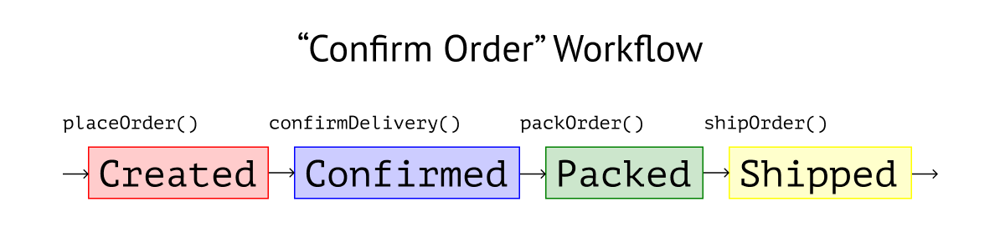
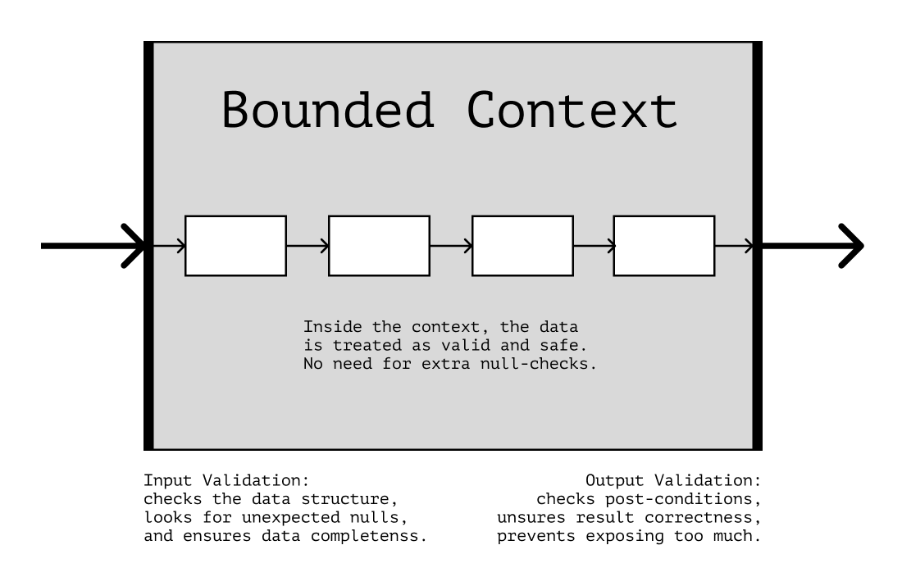

# Функциональный пайплайн

Как мы увидели в предыдущей главе, абстракция помогает делить программу на «уровни детализации». На каждом из уровней мы уделяем внимание только самым важным деталям и объясняемся подходящими терминами.

В пользовательских приложениях один из уровней абстракции описывает _бизнес-логику_ — процессы предметной области, которые делают приложение уникальным и приносят прибыль. Иначе говоря, те задачи, за решением которых бизнес обращается к разработке.

| Например 👀                                                                                                                                                                       |
| :-------------------------------------------------------------------------------------------------------------------------------------------------------------------------------- |
| В случае интернет-магазина бизнес-логикой будет создание и оплата заказов. Для транспортной компании — логистические задачи типа оптимизации маршрутов и загруженности перевозок. |

Язык бизнес-логики — это язык предметной области. Процессы в нём описываются как последовательность событий и их последствий: «Когда пользователь вводит купон на скидку, приложение проверит валидность купона и уменьшит сумму заказа».

Такой язык «далёк от кода». Из-за высокого уровня абстракции представить бизнес-процессы в коде может быть сложно. Функциональный пайплайн, о котором мы поговорим в этой главе, помогает описывать бизнес-процессы понятнее и ближе к реальности.

## Преобразования данных

Процессы в бизнес-логике — это преобразования данных. Продолжая пример с интернет-магазином, применение скидки к заказу можно выразить в виде перехода от одного состояния данных к другому:

```
«Применение купона»:

[Созданный заказ] + [Валидный купон] -> [Заказ со скидкой]
```

В больших приложениях преобразования могут быть длиннее, а данные в них могут проходить через несколько этапов:

```
«Подбор рекомендаций к корзине»:

[Корзина с товарами] + [История покупок] ->
  [Категории товаров] + [Веса рекомендаций] ->
  [Список рекомендаций]
```

В плохо организованном коде бизнес-процессы на такие цепочки не похожи. Они запутаны, неочевидны и часто не говорят на языке предметной области. В итоге вместо последовательного описания бизнес-процесса мы получаем нечто вроде:

```
«Подбор рекомендаций к корзине»:

[Корзина с товарами] + ... + [Магия 🔮] -> [Список рекомендаций]
```

В хорошо организованном коде процессы выглядят линейно, а данные в них поочерёдно проходят через несколько этапов. Конечное состояние данных — это желаемый результат всего бизнес-процесса.



Такая организация кода называется _функциональным пайплайном_. При рефакторинге бизнес-логики мы можем ориентироваться не него, чтобы сделать код понятнее и очевиднее.

## Состояния данных

В “Domain Modeling Made Functional” Скотт Влашин рассказывает, как спроектировать программу, опираясь на бизнес-процессы и данные в них.[^dmmf] Он предлагает представлять шаги процессов отдельными функциями. Мы можем использовать эту идею, как основу для рефакторинга.

Для этого в коде нам первым делом потребуется выделить состояния, через которые проходят данные. Эти состояния помогут понять, на какие шаги можно разделить бизнес-процесс, который мы рефакторим.

Разберём подход на примере интернет-магазина. Допустим, функция `makeOrder` составляет объект заказа, учитывая купоны на скидку и промо-акции:

```js
function makeOrder(user, products, coupon) {
  if (!user || !products.length) throw new InvalidOrderDataError();
  const data = {
    createdAt: Date.now(),
    products,
    total: totalPrice(products),
    discount: selectDiscount(data, coupon),
  };

  if (!selectDiscount(data, coupon)) data.discount = 0;
  if (data.total >= 2000 && isPromoParticipant(user)) {
    data.products.push(FREE_PRODUCT_OF_THE_DAY);
  }

  data.id = generateId();
  data.user = user.id;
  return data;
}
```

Функция небольшая, но делает довольно много:

- валидирует пользователя и список товаров;
- создаёт объект заказа;
- применяет скидку по переданному купону;
- добавляет товары по акции, если подходят условия.

С первого взгляда выделить каждый из этих пунктов в коде функции трудно. Код пестрит деталями, которые мешают увидеть отдельные шаги. Из-за этого сложно проследить за изменениями данных и выделить функции для их преобразований.

| Кроме этого 💊                                                                                                                                                                                                          |
| :---------------------------------------------------------------------------------------------------------------------------------------------------------------------------------------------------------------------- |
| Объект заказа меняется внутри функции хаотически. И хоть формально его инкапсуляция не нарушена — он создан в этой функции и меняется в ней же — есть ощущение, будто `makeOrder` «лезет в чужую зону ответственности». |

Попробуем выделить шаги процесса и состояния, через которые проходят данные:

```
«Показать заказ на экране»:

- «Проверить входные данные»:
  [Непроверенные входные данные] -> [Пользователь] + [Список товаров]

- «Создать заказ»:
  [Пользователь] + [Список товаров] -> [Созданный заказ]

- «Применить скидку»:
  [Заказ] + [Купон] -> [Заказ со скидкой]

- «Применить акции»:
  [Заказ] + [Пользователь] -> [Заказ с акциями]
```

При рефакторинге будем стремиться к тому, чтобы код функции `makeOrder` стал похож на этот список. Начать можно с группирования кода по «кучкам», каждая из которых будет отвечать за отдельный шаг из него:

```js
function makeOrder(user, products, coupon) {
  // Валидация:
  if (!user || !products.length) throw new InvalidOrderDataError();

  // Создание заказа:
  const data = {
    createdAt: Date.now(),
    products,
    total: totalPrice(products),
  };
  data.id = generateId();
  data.user = user.id;

  // Применение скидки:
  const discount = selectDiscount(data, coupon);
  data.discount = discount ?? 0;

  // Применение акций:
  if (data.total >= 2000 && isPromoParticipant(user)) {
    data.products.push(FREE_PRODUCT_OF_THE_DAY);
  }

  return data;
}
```

Группировка шагов поможет найти в коде проблемы с абстракцией: если мы можем придумать для шага осмысленное имя, вероятно, его код можно вынести в функцию. В примере выше это именно так — комментарии с названиями шагов полностью отражают их намерение. Выделим шаги в отдельные функции:

```js
// Создание объекта:
function createOrder(user, products) {
  return {
    id: generateId(),
    createdAt: Date.now(),
    user: user.id,

    products,
    total: totalPrice(products),
  };
}

// Применение купона на скидку:
function applyCoupon(order, coupon) {
  const discount = selectDiscount(order, coupon) ?? 0;
  return { ...order, discount };
}

// Применение подходящей акции:
function applyPromo(order, user) {
  if (!isPromoParticipant(user) || order.total < 2000) return order;

  const products = [...data.products, FREE_PRODUCT_OF_THE_DAY];
  return { ...order, products };
}
```

Функция `makeOrder` тогда начала бы выглядеть так:

```js
function makeOrder(user, products, coupon) {
  if (!user || !products.length) throw new InvalidOrderDataError();

  const created = createOrder(user, products);
  const withDiscount = applyCoupon(created, coupon);
  const order = applyPromo(withDiscount, user);

  return order;
}
```

После изменений шаги процесса оказались инкапсулированы в отдельных функциях. Единственная задача этих функций — изменить объект заказа, сохранив его валидным. Функция `makeOrder` перестала бесконтрольно менять данные сама и лишь вызывает другие функции. Всё это делает появление невалидного заказа менее вероятным, а тестирование преобразований — проще.

Код функции `makeOrder` теперь напоминает список шагов процесса, с которого мы начинали рефакторинг. Детали каждого из них скрыты за именем соответствующей функции, название которой описывает весь шаг целиком. Это делает код проще для чтения.

Также при добавлении в процесс нового шага нам теперь достаточно вписать его в правильное место. Другие преобразования останутся неизменными:

```js
function makeOrder(user, products, coupon, shipDate) {
  if (!user || !products.length) throw new InvalidOrderDataError();

  const created = createOrder(user, products);
  const withDiscount = applyCoupon(created, coupon);
  const withPromo = applyPromo(withDiscount, user);
  const order = addShipment(withPromo, shipDate); // Новый шаг процесса.

  return order;
}
```

А при удалении какого-то шага — проще найти функцию, которую нужно убрать. Убрав вызов функции, мы гарантированно удалим весь код, связанный с этим шагом процесса.

| К слову 🕵️                                                                                                                                                                                                                                       |
| :----------------------------------------------------------------------------------------------------------------------------------------------------------------------------------------------------------------------------------------------- |
| Не всегда пайплайн бывает просто заметить. Преобразования данных могут быть «размазаны» по кодовой базе. В таких случаях может быть полезно составить на бумажке схему общения частей приложения друг с другом, чтобы обнаружить закономерности. |

## Невыразимость неправильного

Некоторым бизнес-процессам для работы нужны данные только в определённых состояниях. Например, мы не хотим начинать отгрузку заказа, пока он не оплачен или у него не хватает адреса доставки. Такие заказы для этого процесса — невалидны.

Мы можем сделать код надёжнее, если «запретим» передачу невалидных данных. То есть если спроектируем код так, что их передача будет невозможна или значительно сложнее, чем передача валидных данных.

Например, в языках со статической типизацией это можно сделать с помощью типов. Мы можем описать каждое состояние данных отдельным типом и указать, какой тип для какого процесса валиден. Такой код _добавит ограничения предметной области прямо в сигнатуру_ функций и методов.

| К слову 👀                                                                                                                                                                                                                                                                                                      |
| :-------------------------------------------------------------------------------------------------------------------------------------------------------------------------------------------------------------------------------------------------------------------------------------------------------------- |
| Понятно, что тут надо делать скидку на особенности и ограничения конкретного языка. Например, в TypeScript добиться «настоящей валидации в сигнатуре» сложнее, и она будет ограничена JS-рантаймом. Тем не менее даже без неё такая техника помогает отражать больше знаний из предметной области прямо в коде. |

Для примера посмотрим на тип `CustomerEmail`, который описывает адрес электронной почты пользователя нашего магазина:

```ts
type CustomerEmail = {
  value: EmailAddress;
  verified: boolean;
};
```

У типа есть флаг `verified`, который показывает, верифицирована ли почта. Проблема флага в том, что он не объясняет, при _каких условиях_ будет иметь значение `true`. Из-за этого в типе недостаточно знаний о нюансах верификации почты.

---

**❗️ Недостаток этих знаний придётся как-то восполнять, чаще всего — в рантайме с помощью условий**

---

Для примера представим, что в магазине есть ссылка на восстановление аккаунта. При клике она должна отправить пользователя на страницу со сбросом пароля, но только если его почта верифицирована:

```ts
function restoreAccount(email: CustomerEmail): void {
  if (email.verified) {
    // Отправить пользователя на страницу сброса пароля.
  } else {
    return;
  }
}
```

Из-за текущей реализации `CustomerEmail` функция `restoreAccount` будет принимать данные, которые в половине случаев для неё невалидны.

Это может быть нестрашно, пока тип содержит только один такой флаг. Но чем больше подобных флагов, тем больше разных состояний в этом типе будет находиться одновременно, тем выше вероятность ошибок из-за передачи невалидных данных.

От этого можно перестраховаться, если выделить разные состояния данных в разные типы:

```ts
// Неверифицированные адреса будут обозначены одним типом:
type UnverifiedEmail = EmailAddress;

// ...Верифицированные — другим:
type VerifiedEmail = EmailAddress;

// Общий тип обозначим как выбор между первым и вторым:
type CustomerEmail = UnverifiedEmail | VerifiedEmail;
```

Тогда для разных процессов мы можем требовать разные типы данных:

```ts
// Если функции важно, верифицирована почта или нет,
// она может в сигнатуре указать конкретный тип:

function restorePassword(email: VerifiedEmail): void {}
function verifyEmail(email: UnverifiedEmail): void {}

// Если функция готова работать с любой почтой, то может использовать общий тип —
// так сигнатура сама скажет, что верификация для этой функции не важна:

function isValidEmail(email: CustomerEmail): boolean {}
```

Сигнатуры функций стали точнее описывать предметную область, потому что передают больше знаний о предметной области. Функции `restorePassword` и `verifyEmail` предупреждают об ограничениях на входные данные. Функция `isValidEmail` сообщает, что готова работать с любой почтой, и верификация ей не важна.

| Однако 🚧                                                                                                                                                                           |
| :---------------------------------------------------------------------------------------------------------------------------------------------------------------------------------- |
| В случае с TypeScript тип-алиасов, конечно, может оказаться мало. Может потребоваться проследить, чтобы создать неверифицированный адрес почты с типом `VerifiedEmail` было нельзя. |
| Мы можем использовать для этого брендирование типов[^typebranding] или договориться создавать сущности только с помощью специальных классов или фабрик.                             |
| Однако, для описательных целей — передачи знаний о предметной области — алиасов может быть вполне достаточно.                                                                       |

## Валидация данных

Функциональный пайплайн опирается на линейное выполнение кода. Шаги внутри процесса выполняются один за другим и передают данные по цепочке друг другу.

Чтобы эта идея работала, данные внутри процессов должны быть проверенными, безопасными и не ломать пайплайн. Однако, мы не можем гарантировать, что любые данные «извне» будут безопасны. Поэтому в коде мы будем разделять зоны, где данным доверять можно, а где — нет.

| Островки безопасности 🏝                                                                                                |
| :--------------------------------------------------------------------------------------------------------------------- |
| Бизнес-процесс в идеале должен стать таким «островком», данные внутри которого проверены и безопасны, а снаружи — нет. |

В DDD есть аналог таких островков — _ограниченные контексты (Bounded Context)_.[^boundedcontext][^ddd][^dmmf] Если сильно упростить, то ограниченный контекст — набор функций, которые относятся к некоторой части приложения.

По DDD данные удобнее всего валидировать _на границах_ контекстов, например, на входе в контекст перед началом работы. В этом случае «внутри» контекста дополнительные проверки будут не нужны, потому что данные уже будут проверены.



Мы можем использовать это правило в своём коде, чтобы избавиться от лишних перепроверок во время работы. Проверив данные единожды в начале процесса, мы можем считать, что они соответствуют нашим требованиям.

Тогда, например, в компоненте корзины `Cart` вместо ad-hoc проверок на существование товаров и их свойств внутри рендера:

```js
function Cart({ items }) {
  return (
    !!items && (
      <ul>
        {items.map((item) =>
          item ? <li key={item.id}>{item.name ?? "—"}</li> : null
        )}
      </ul>
    )
  );
}
```

...Мы бы один раз проверили данные на входе:

```js
function validateCart(cart) {
  if (!exists(cart)) return [];
  if (hasInvalidItem(cart)) return [];

  return cart;
}
```

...И использовали бы их без дополнительных проверок:

```js
function Cart({ items }) {
  return (
    <ul>
      {items.map((item) => (
        <li key={item.id}>{item.name}</li>
      ))}
    </ul>
  );
}

// ...

const cart = validateCart(serverCart);
<Cart items={cart} />;
```

Валидировать перед началом работы полезно ещё и потому, что они могут повредиться при сериализации или десериализации.[^serialization]

Как правило, информация между частями системы передаётся в виде _объектов передачи данных (Data Transfer Object, DTO)_.[^dto][^ddd] Это такие «пакеты с информацией», которые путешествуют от одной части приложения другой — например, от сервера к клиенту.

Структура и формат DTO намеренно просты: строки, числа, массивы и объекты. Например, у JSON, который часто используют для общения между сервером и клиентом, нет никаких сложных типов или структур.

Во время «перевода» между сложными доменными типами и намеренно простыми DTO что-то может пойти не так, и данные могут оказаться невалидными. Они могут сломать работу процесса, если не проверить их перед использованием.

| Подробнее 📚                                                                                                                                                                                             |
| :------------------------------------------------------------------------------------------------------------------------------------------------------------------------------------------------------- |
| Подробнее о функциональном пайплайне, бизнес-процессах, ограниченных контекстах, валидации данных и DDD писал Скотт Влашин в “Domain Modeling Made Functional”.[^dmmf] Отличная книга, очень рекомендую. |

## Проекции и маппинг данных

Одни и те же данные могут быть нужны для различных задач. Например, UI может по-разному показывать на экране список товаров или корзину в зависимости от настроек пользователя.

Функциональный пайплайн предлагает «готовить» данные для таких ситуаций заранее. Например, заранее выбирать необходимые фрагменты из исходных данных, трансформировать одни наборы данных в другие или даже сливать несколько наборов в один.

| Упрощение 🚧                                                                                                                                                                                                                                                                                       |
| :------------------------------------------------------------------------------------------------------------------------------------------------------------------------------------------------------------------------------------------------------------------------------------------------- |
| По описанию выше вы могли вспомнить какой-то из терминов: маппинг, проекция, слайс, линза, отображение.[^mappers][^projections][^slices][^lenses]                                                                                                                                                  |
| Я решил не уделять в этой книге внимание их различиям, чтобы сократить текст и не вводить слишком много новых понятий. Вместо этого я далее по тексту буду использовать слово «выборка» как общий синоним для всех этих терминов, точное значение которого будет зависеть от контекста применения. |

Выборки данных помогают «расцепить» модули, которые используют схожие, но слегка отличающиеся данные. Например, посмотрим на компонент `Cart`, который рендерит корзину товаров:

```js
function Cart({ serverCart }) {
  return (
    <ul>
      {serverCart.map((item) => (
        <li key={item.id}>
          {item.product.name}: {item.product.price} × {item.count}
        </li>
      ))}
    </ul>
  );
}
```

Сейчас он полагается на структуру данных корзины, которая приходит с сервера. Если структура изменится — придётся менять и компонент:

```js
// Если продукты начнут приходить отдельно,
// то искать конкретный продукт придётся
// прямо во время рендера пункта корзины.

function Cart({ serverCart, serverProducts }) {
  return (
    <ul>
      {serverCart.map((item) => {
        const product = serverProducts.find(
          (product) => item.productId === product.id
        ).name;

        return (
          <li key={item.id}>
            {product.name}:{product.price} × {item.count}
          </li>
        );
      })}
    </ul>
  );
}
```

Выборки данных могут помочь нам «расцепить» ответ сервера и структуру, которую мы используем для рендера. Оформим такую выборку, как отдельную функцию:

```js
// Функция `toClientCart` превращает данные от сервера в структуру,
// которой будут пользоваться компоненты приложения.

function toClientCart(cart, products) {
  return cart.map(({ productId, ...item }) => {
    const product = products.find(({ id }) => productId === id);
    return { ...item, product };
  });
}
```

...И будем прогонять данные через эту функцию перед тем, как рендерить их в компоненте:

```js
const serverCart = await fetchCart(userId)
const cart = toClientCart(serverCart, serverProducts)

// ...

<Cart items={cart} />
```

Компонент тогда будет полагаться на структуру, которую _определяем мы сами_:

```js
function Cart({ items }) {
  return (
    <ul>
      {items.map(({ id, count, product }) => (
        <li key={id}>
          {product.name} {product.price} × {count}
        </li>
      ))}
    </ul>
  );
}
```

Это значит, что если ответ API поменяется, нам не потребуется обновлять все компоненты, которые используют эти данные. Нам будет достаточно обновить только выборку.

| К слову 🔌                                                                                                                                                       |
| :--------------------------------------------------------------------------------------------------------------------------------------------------------------- |
| Это особенно полезно, если сервер часто ломает обратную совместимость с клиентским кодом. Эу технику можно считать частным случаем паттерна «Адаптер».[^adapter] |

Ещё использовать выборки удобно, если в UI могут быть разные представления одних и тех же данных. Например, кроме самой корзины в магазине может быть список всех доступных товаров с отметками об уже выбранных пользователем.

Для рендера такого списка мы можем переиспользовать уже имеющиеся данные, но слегка иначе их подготовив:

```js
// Используем имеющиеся серверные данные,
// но немного по-другому их готовим:

function toClientShowcase(products, cart) {
  return products.map((product) => ({
    ...product,
    inCart: !!cart.find(({ productId }) => productId === product.id),
  }));
}
```

Компоненту `Showcase` ничего не нужно знать об ответе сервера. Он будет работать с результатом выборки:

```js
function Showcase({ items }) {
  return (
    <ul>
      {items.map(({ product, inCart }) => {
        <li key={product.id}>
          {product.name} <input type="checkbox" checked={inCart} disabled />
        </li>;
      })}
    </ul>
  );
}
```

Такой подход помогает чётче делить ответственность между кодом: компоненты занимаются только рендером, выборки — подготовкой данных.

Компоненты становятся менее привязанными к остальному коду, потому что полагаются на структуры, которые мы полностью контролируем. Так нам, например, будет проще заменить один компонент другим, если потребуется обновить UI.

Тестировать изменения данных становится проще, потому что любая выборка — это обычная функция, для её тестирования не нужна сложная инфраструктура. Изменение данных внутри компонента, к примеру, потребовало бы его рендера при тестировании.

У нас появляется больше контроля над данными, которые мы хотим (или не хотим) включить в результат выборки. Мы можем оставлять только те поля, которые использует конкретный компонент и фильтровать всё остальное.

Применять выборки, как правило, удобнее всего сразу после валидации. В этом месте мы _уже уверены_, что данные безопасны, но _ещё нигде не полагаемся_ на их структуру. Это даёт возможность решать, как адаптировать данные под конкретную задачу.

| Обратите внимание 🔗                                                                                                                                                                                                                     |
| :--------------------------------------------------------------------------------------------------------------------------------------------------------------------------------------------------------------------------------------- |
| Данные в этом примере как бы проходят по цепочке «Непроверенные» → «Валидные» → «Подготовленные» → «Отображённые в UI».                                                                                                                  |
| Функциональный пайплайн помогает расписывать _любую_ задачу в виде подобной цепочки. Это облегчает декомпозицию и делает код проще, потому что цепочки помогают выстроить чёткую ментальную модель процесса, который мы выражаем в коде. |

[^dmmf]: “Domain Modeling Made Functional” by Scott Wlaschin, https://www.goodreads.com/book/show/34921689-domain-modeling-made-functional
[^typebranding]: “Branding and Type-Tagging” by Kevin B. Greene, https://medium.com/@KevinBGreene/surviving-the-typescript-ecosystem-branding-and-type-tagging-6cf6e516523d
[^boundedcontext]: “Bounded Context in DDD” by Martin Fowler, https://www.martinfowler.com/bliki/BoundedContext.html
[^dto]: Объект передачи данных, DTO, Википедия, https://ru.wikipedia.org/wiki/DTO
[^ddd]: “Domain-Driven Design” by Eric Evans, https://www.goodreads.com/book/show/179133.Domain_Driven_Design
[^projections]: Projection operations (C#), https://docs.microsoft.com/en-us/dotnet/csharp/programming-guide/concepts/linq/projection-operations
[^mappers]: Data Mapper, https://martinfowler.com/eaaCatalog/dataMapper.html
[^slices]: API Slice Overview, Redux Toolkit Docs, https://redux-toolkit.js.org/rtk-query/api/created-api/overview#api-slice-overview
[^lenses]: “Lenses in Functional Programming” by Albert Steckermeier, https://sinusoid.es/misc/lager/lenses.pdf
[^adapter]: Adapter Pattern, Refactoring Guru, https://refactoring.guru/design-patterns/adapter
[^serialization]: Сериализация, Википедия, https://ru.wikipedia.org/wiki/Сериализация
