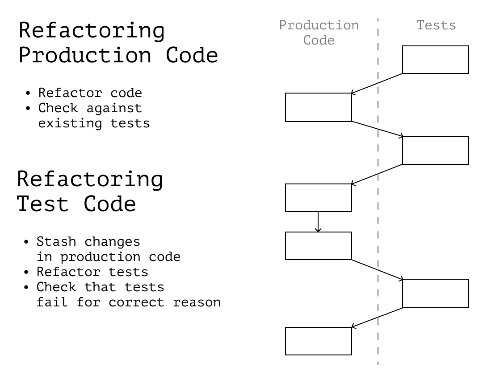

# Рефакторинг тестового кода

Тесты помогают рефакторить код приложения, указывая на ошибки, которые мы могли допустить. Но сами тесты — это тоже код, поэтому их также нужно держать в порядке и время от времени рефакторить.

В этой главе поговорим о том, как не поломать тесты и не снизить их надёжность во время рефакторинга и на что обращать внимание при поиске проблем с тестовым кодом.

## «Тесты» для тестов

Надёжный тест падает, когда код работает не так, как ожидается. Тесты будто «прикрывают нам спину» во время изменения кода приложения, потому что ошибка в поведении отразится в тестах. Самим же тестам «прикрывает спину» продакшен-код, потому что именно в нём мы проверяем, что тесты падают по указанным причинах.

Когда тесты меняются вместе с кодом приложения, у нас не остаётся способов проверить, что всё работает _как раньше_. Обновлённые тесты могут содержать ошибку или проверять что-то _отличное_ от оригинальной функциональности. Если код, по которому мы раньше могли проверить работу теста, тоже изменился, эта ошибка может остаться незамеченной.

В итоге в проекте могут появиться тесты, которым мы доверяем, но которые не работают или работают неправильно. Чтобы этого не допустить, во время рефакторинга тестового кода нам стоит следовать правилу:

---

**❗️ Не рефакторить тесты одновременно с кодом приложения. Лучше делать это по очереди**

---

Если во время рефакторинга мы понимаем, что хотим отрефакторить тестовый код, то нам стоит:

- Положить на полочку изменения кода с последнего комита (с помощью `git stash`);
- Оытрефакторить код теста;
- Проверить, что он падает по указанной причине;
- Закомитить изменения тестов;
- Достать с полочки изменения кода приложения;
- Продолжить рефакторинг.

Это правило превращает рефакторинг в «пинг-понг» между тестами и кодом приложения. Когда мы меняем код, поведение фиксируют и проверяют тесты. Когда мы меняем тесты, поведение фиксирует код приложения.

<figure>
  
  <figcaption><em>Когда мы меняем код, поведение фиксируют и проверяют тесты. Когда мы меняем тесты, поведение фиксирует код приложения</em><br><br></figcaption>
</figure>

Эта техника не гарантирует, что мы не допустим никаких ошибок, но уменьшает их вероятность. При её использовании на каждом этапе есть как минимум одна часть, которая _не изменилась с последнего рабочего состояния_. Поэтому мы более уверены, что всё работает как раньше.

| К слову 📚                                                                                                                                                                                                                    |
| :---------------------------------------------------------------------------------------------------------------------------------------------------------------------------------------------------------------------------- |
| Таким же образом рекомендует поступать и Марк Симанн в “Code That Fits in Your Head”.[^codethatfits] Кроме самой техники в книге он также рассказывает, как не допустить ослабления тестовых критериев во время рефакторинга. |

## «Хрупкие» тесты

Во время работы с тестами стоит обращать внимание на свои ощущения. Если в тестах чувствуется «хрупкость» и ненадёжность, вероятно, их можно улучшить. Ощущение «дунешь, и всё развалится» — отличный индикатор хрупких тестов.

Чаще всего хрупкими тесты делают _моки_. Они требовательны к внутренней структуре, порядку и способу их вызова и результату, который они должны вернуть. В запущенных случаях приложение может стать «сверх-замоканным» — когда работа почти всех модулей в тестах имитируется моками.

В таких случаях любые изменения кода приложения, даже самые незначительные, приводят к большому количеству правок в тестах. Тесты требуют больше ресурсов на поддержку, и разработка приложения замедляется. Такой эффект называют _уроном от тестов (test-induced damage)_.[^testinduceddamage]

В отличие от моков _стабы и простые тестовые данные_ помогают писать более устойчивые к изменениям тесты. Стабы и тестовые данные прощают нам при их использовании гораздо больше, чем требуют. Они помогают избегать урона от тестов и тратить меньше времени на их обновление.

| Подробнее 🥸                                                                                                  |
| :------------------------------------------------------------------------------------------------------------ |
| О разнице между стабами, моками и другими фейковыми объектами, хорошо написано у Microsoft.[^unittestsdotnet] |

Для уменьшения хрупкости тестов мы можем руководствоваться эвристикой:

---

**❗️ Меньше моков; проще стабы и тестовые данные**

---

Например, бизнес-логику мы можем тестировать без моков в принципе. Это сложно, когда логика перемешана с эффектами; но проще, если она описана чистыми функциями.

Чистые функции тестируемы по своей природе. Они не требуют замороченной тестовой инфраструктуры, тесты для них могут быть запущены параллельно с разработкой. (Такие функции можно протестировать даже без тест-раннеров, сравнивая настоящий результат с желаемым — они настолько просты в тестировании.)

Посмотрим на разницу между кодом, где логика и эффекты перемешаны, и кодом, где они разделены. Обратим внимание, насколько «хрупкими» кажутся их тесты. В первом случае логика и эффекты смешаны:

```js
function fetchPostList(kind) {
  const directory = path.resolve("content", kind);
  const onlyMdx = fs.readDirSync(directory).filter((f) => f.endsWith(".mdx"));
  const postNames = onlyMdx.map((f) => f.replace(/\.mdx$/, ""));
  return postNames;
}

// Для юнит-теста такой функции нам потребуется замокать `fs`,
// описать работу нужного метода,
// указать, что метод должен вернуть,
// сбросить мок после окончания теста:

it("should return a list of post names with the given kind", () => {
  jest.spyOn(fs, "readDirSync").mockImplementation(() => testFileList);
  const result = fetchPostList("blogPost");
  expect(result).toEqual(expected);
  jest.restoreAllMocks();
});
```

Во втором случае логика отделена от эффектов. Преобразование можно протестировать используя только стабы и тестовые данные:

```ts
function namesFromFiles(fileList) {
  return fileList
    .filter((f) => f.endsWith(".mdx"))
    .map((f) => f.replace(/\.mdx$/, ""));
}

// Для сравнения достаточно тестовых данных
// и желаемого результата работы функции:

it("should convert file list into a list of post names", () => {
  const result = namesFromFiles(testList);
  expect(result).toEqual(expected);
});
```

Структура теста становится проще, а обновление тестовых данных не отнимает большого количества ресурсов. С такой организацией кода мы даже можем полностью отказаться от статических тестовых данных и генерировать их автоматически по заранее определённым свойствам. Такое тестирование будет называться _атрибутным (property-based)_.

| К слову 🧪                                                                                                                                                                                                                                                                      |
| :------------------------------------------------------------------------------------------------------------------------------------------------------------------------------------------------------------------------------------------------------------------------------ |
| Для генерации тестовых данных в property-based тестах обычно удобно использовать дополнительные инструменты.[^codethatfits] Например, в JS-экосистеме существуют библиотеки типа faker.js,[^faker] которые создают объекты со случайными данными по заранее описанным шаблонам. |

Выделенные эффекты можно протестировать отдельно интеграционными или E2E тестами. В зависимости оттого, как в нашем проекте устроена работа зависимостями типа `fs`, нам может быть достаточно протестировать только адаптеры к ним. Как правило, сложность и требовательность моков в таком случае будет ниже.

Например, в тестах подобного адаптера для `fs` нам достаточно будет проверить, что был вызван правильный метод с нужным аргументом:

```ts
function postsByType(kind) {
  const directory = path.resolve("content", kind);
  const fileList = fs.readDirSync(directory);
  return fileList;
}

// Нам уже не нужно мокать реализацию «сервиса»,
// достаточно предоставить нужное публичное API.
// Такой мок гораздо более устойчив к изменениям
// кода приложения и наносит меньше «урона от тестов».

describe("when called with a post kind", () => {
  it("should read file list from the correct directory", () => {
    const spy = jest.spyOn(fs, "readDirSync");
    postsByType("blogPost");
    expect(spy).toHaveBeenCalledWith("/content/blogPost/");
  });
});
```

Тогда сама функция `fetchPostList` превратится в «композицию» логики с эффектами:

```ts
function fetchPostList(kind) {
  // Чтение данных, эффект:
  const fileList = postsByType(kind);

  // Логика, чистые функции:
  return namesFromFiles(fileList);
}
```

Такую функцию проверять юнит-тестами уже может оказаться не нужно. Она объединяет функциональность разных модулей (юнитов), поэтому мы можем подумать об интеграционном или E2E-тестировании.

| Подробнее 🧩                                                                                                                                           |
| :----------------------------------------------------------------------------------------------------------------------------------------------------- |
| Более подробно о том, какие бывают стратегии работы с зависимостями и организации эффектов, мы говорили ранее в главах об архитектуре и сайд-эффектах. |

### Тесты-дубликаты

Урон от тестов замедляет разработку, потому что после каждого изменения код приходится тратить много ресурсов на исправление тестов. Одной из причин такого замедления могут быть тесты, которые тестируют одну и ту же функциональность несколько раз.

В идеале мы хотим, чтобы за одну часть кода отвечал _один_ тест. Когда тестов становится больше, мы начинаем тратить лишнее время на их обновление. Чем больше дубликатов, тем больше временной «налог».

Например, если бы в примере выше мы написали дополнительный юнит-тест для функции `fetchPostList`, скорее всего, он бы оказался лишним и дублировал тесты функций `postsByType` и `namesFromFiles`. Тогда на каждое изменение `postsByType` или `namesFromFiles` нам бы пришлось обновлять не один тест, а два.

Тесты-дубликаты могут намекнуть на одну из нескольких проблем:

1. В коде приложения действительно может быть дублирование. Это повод провести ревью и устранить повторяющуюся функциональность. (Подробнее о том, как разделять дублирование и недостаток информации о системе мы говорили в одной из предыдущих глав.)
1. В коде нечётко разделена ответственность между модулями; тесты одного модуля частично перекрывают функциональность другого. Например, один тест может проверять то, что уже проверено другими. Это может быть поводом пересмотреть стратегию тестирования и чётче определить границы модулей.

| Уточнение 🧪                                                                                                                                                                                               |
| :--------------------------------------------------------------------------------------------------------------------------------------------------------------------------------------------------------- |
| Тесты _разных видов_ для надёжности могут перекрывать друг друга. Например, интеграционный тест может захватить часть функциональности, проверенной юнит-тестами, если так удобнее тестировать приложение. |
| Лично я стараюсь держать количество и таких перекрываний минимальным, но в разных проектах стратегия тестирования может отличаться, поэтому дать общие рекомендации здесь сложно.                          |

### Тесты, которые никогда не ломаются

Тест должен отвечать за конкретную проблему, при появлении которой обязан упасть. Если тест никогда не падает, он вреден: пользы не приносит, но отнимает ресурсы на поддержку. Такой тест стоит удалить или переписать так, чтобы он начал падать в описанных обстоятельствах.

| К слову 🙃                                                                                                                                                                                                                                                       |
| :--------------------------------------------------------------------------------------------------------------------------------------------------------------------------------------------------------------------------------------------------------------- |
| Чаще всего никогда-не-падающие тесты я встречал в сверх-замоканных системах, где инфраструктура и подготовка к тесту почти полностью состояли из вызова моков. Такие тесты часто передают результат работы одного мока в другой — и в итоге не проверяют ничего. |

### Тесты простых функций

При выборе что и как тестировать, нам стоит сравнивать пользу от теста и его издержки. Например, можно обратить внимание на цикломатическую сложность функции, которую этот тест проверяет.

Если сложность функции равна единице, а тест приносит больше дополнительной работы, чем реальной пользы, то от теста можно отказаться. Например, отдельный юнит-тест для функции `fullName` может быть лишним:

```js
const fullName = (user) => `${user.firstName} ${user.lastName}`;
```

| Уточнение 🚧                                                                                                                                                                                                                                   |
| :--------------------------------------------------------------------------------------------------------------------------------------------------------------------------------------------------------------------------------------------- |
| Мы здесь не утверждаем, что несложным функциям тесты не нужны вовсе. Решение, тестировать или нет, зависит от конкретной ситуации. Главная идея в том, что если тест приносит больше издержек, чем пользы, стоит подумать о его необходимости. |

### Регрессии

Иногда простые функции всё же _надо_ тестировать: например, если в функции когда-то была регрессия. Регрессии обращают внимание не на потенциальные, а на настоящие баги в коде, которые _действительно могут случиться и однажды случились_.

Всё, что всплыло во время регрессий, надо закрыть тестами. Если кажется, что тест слишком простой, и кто-то посчитает его бесполезным и удалит, то можно добавить аннотацию в комментарий со ссылкой на регрессию.

```js
/**
 * @regression JIRA-420: Users had full names in an incorrect format where last name came before first.
 * @see https://some-project.atlassian.com/...
 */
describe("when called with a user object", () => {
  it("should return a full name representation with first name at start", () => {
    const name = fullName(42);
    expect(name).toEqual(expected);
  });
});
```

[^codethatfits]: “Code That Fits in Your Head” by Mark Seemann, https://www.goodreads.com/book/show/57345272-code-that-fits-in-your-head
[^testinduceddamage]: “Test-Induced Design Damage” by David Heinemeier Hansson, https://dhh.dk/2014/test-induced-design-damage.html
[^unittestsdotnet]: Unit testing best practices with .NET Core and .NET Standard, https://docs.microsoft.com/en-us/dotnet/core/testing/unit-testing-best-practices
[^faker]: Faker, Generate fake (but realistic) data for testing and development, https://fakerjs.dev
